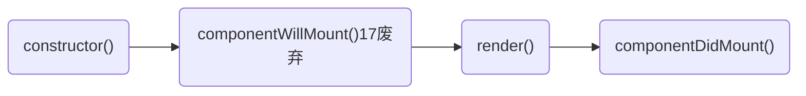
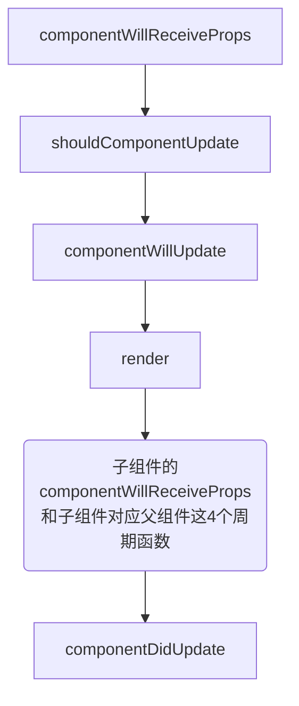

import Mermaid from '../../components/mermaid';
import CodeBlock from '../../components/codeBlock';
import HighlightText from '../HighlightText';
import CodePannel from '../CodePannel';

## A.生命周期

## A-1.useEffect 模拟生命周期
```js
// 第一个useEffect会在第二个useEffect之前执行。
// 第一个useEffect中的函数会在组件挂载时执行，因为它没有依赖项，所以只会执行一次。 
useEffect(() => {
  console.log('Sub=副作用-useEffect-->运行');
}, [])

// 第二个useEffect中的函数会在每次组件渲染时执行，包括挂载时，因为它没有依赖项，所以也会执行一次。
useEffect(() => {
  console.log('Sub=useEffect不依赖-模拟组件更新-->运行');
})
```

- 第二个参数传递一个空数组, 模拟 componentDidMount
- 第二个参数传递依赖项，模拟 componentDidUpdate
- 第二个参数传递一个空数组，并且里面通过 return 的形式去调用一个方法，模拟 componentWillUnmount

<CodeBlock>
```js
// 1. componentDidMount 和 componentWillUnmount
// 通过使用 Hook，你可以把组件内相关的副作用组织在一起（例如创建订阅及取消订阅），而不要把它们拆分到不同的生命周期函数里
useEffect(() => {
  console.log("componentDidMount");
  return () => {
    console.log("will unmount");
  };
}, []);

// 2. componentDidUpdate 1
useEffect(() => {
  document.title = `You clicked ${count} times`;
  return () => {
    // componentWillUnmount 执行的内容
  };
}, [count]);

// 3. componentDidUpdate 2
useEffect(() => console.log("mounted or updated"));

// shouldComponentUpdate, 只有 Parent 组件中的 count state 更新了，Child 才会重新渲染，否则不会。
/*
 * React.memo 包裹一个组件来对它的 props 进行浅比较,但这不是一个 hooks，因为它的写法和 hooks 不同,其实React.memo 等效于 PureComponent，但它只比较 props。
 * */
function Parent() {
  const [count, setCount] = useState(0);
  const child = useMemo(() => <Child count={count} />, [count]);

  return <>{count}</>;
}

function Child(props) {
  return <div>Count:{props.count}</div>;
}
```
</CodeBlock>

## A-2.类组件生命周期

初始化：
<Mermaid>

</Mermaid>

父组件的 state 改变:
<Mermaid>

</Mermaid>

## A-3.React 15 中的生命周期调用
1. `getDefaultProps()`：此方法用于获取组件的默认属性值。这个方法只会在组件的创建阶段被调用一次。

2. `getInitialState()`：此方法用于获取组件的初始状态值。这个方法只会在组件的创建阶段被调用一次。

3. `componentWillMount()`：此方法在组件即将被挂载到 DOM 上时被调用，可以进行一些组件的初始化操作。

4. `render()`：此方法用于渲染组件，返回一个虚拟 DOM 树。

5. `componentDidMount()`：此方法在组件挂载到 DOM 上之后被调用，可以进行一些操作，例如设置定时器等。

6. `componentWillReceiveProps(nextProps)`：此方法在组件接收到新的属性值时被调用。

7. `shouldComponentUpdate(nextProps, nextState)`：此方法在组件接收到新的属性值或状态值时被调用，用于判断是否需要重新渲染组件。

8. `componentWillUpdate(nextProps, nextState)`：此方法在组件即将被重新渲染时被调用，可以进行一些操作，例如记录当前滚动位置等。

9. `render()`：此方法用于重新渲染组件，返回一个新的虚拟 DOM 树。

10. `componentDidUpdate(prevProps, prevState)`：此方法在组件重新渲染之后被调用，可以进行一些操作，例如更新滚动位置等。

11. `componentWillUnmount()`：此方法在组件被卸载之前被调用，可以进行一些清理操作，例如清除定时器、取消网络请求等。

## A-4.react17生命周期调用流程
React 17 的生命周期包括以下方法：

1. constructor(props)

   - 在组件被创建时调用，用于初始化组件的状态和绑定方法。

2. static getDerivedStateFromProps(props, state)

   - 在组件接收到新的 props 时被调用，用于根据 props 更新组件的状态。这个方法返回一个对象，用于更新组件的 state，或者返回 null 表示不需要更新。

3. render()

   - 根据组件的 props 和 state 来渲染组件的 UI。

4. componentDidMount()

   - 在组件挂载到 DOM 后被调用，可以进行一些副作用操作，如向服务器请求数据、添加事件监听器等。

5. shouldComponentUpdate(nextProps, nextState)

   - 在组件接收到新的 props 或 state 时被调用，用于判断是否需要重新渲染组件。如果返回 true，则会继续执行后面的生命周期方法，如果返回 false，则组件不会被更新。

6. getSnapshotBeforeUpdate(prevProps, prevState)

   - 在组件更新之前被调用，可以用来获取更新前的 DOM 信息，比如滚动位置等。这个方法返回的值会传递给 componentDidUpdate 方法。

7. componentDidUpdate(prevProps, prevState, snapshot)

   - 在组件更新后被调用，可以进行一些副作用操作，如向服务器请求数据、添加事件监听器等。snapshot 参数是 getSnapshotBeforeUpdate 方法返回的值。

8. componentWillUnmount()
   - 在组件卸载之前被调用，可以进行一些清理工作，如取消事件监听器、清除定时器等。

注意：在 React 17 中，已经将 UNSAFE 前缀的生命周期方法移除了，所以不再需要使用 UNSAFE_componentWillMount、UNSAFE_componentWillUpdate 和 UNSAFE_componentWillReceiveProps 等生命周期方法。

<HighlightText>
**React 17/React 16.3 开始废弃三个钩子函数:**
</HighlightText>
```
componentWillMount
componentWillReceiveProps-->使用static getDerivedStateFromProps()来替代
componentWillUpdate
```

<HighlightText>
**constructor()**
</HighlightText>
组件创建时调用，通常用于初始化 state 和绑定事件处理程序。

<HighlightText>
**static getDerivedStateFromProps(props, state)**
</HighlightText>

当组件实例化或接收到新 props 时调用，用于更新 state。

此生命周期方法在组件实例化和更新时都会被调用，用于计算和返回新的状态值。当我们接收到新的属性想去修改我们 state，可以使用 getDerivedStateFromProps

<HighlightText>
**render()**
</HighlightText>
必须实现的方法，返回要在页面上呈现的 JSX。此生命周期方法在组件实例化和更新时都会被调用，用于渲染组件。

react 重要的步骤，创建虚拟 dom，进行 diff 算法，更新 dom 树都在此进行。

<HighlightText>
**componentDidMount()**
</HighlightText>
组件已经渲染到 DOM 中后调用，通常用于发起网络请求或订阅事件等。

<HighlightText>
**shouldComponentUpdate(nextProps, nextState)**
</HighlightText>

在组件接收到新 props 或 state 更新时调用，在组件更新前调用，true 表示会触发重新渲染，false 表示不会触发重新渲染，默认返回 true。

<HighlightText>
**getSnapshotBeforeUpdate(prevProps, prevState)**
</HighlightText>

在组件更新前调用，可以获取当前 DOM 信息，通常用于实现 scroll 位置的保存和恢复。

```
该方法自React 17.0版本开始已被废弃。如果您尝试在React应用程序中使用getSnapshotBeforeUpdate方法，将会收到一个警告。

在React 17.0版本之后，建议使用componentDidUpdate生命周期方法替代getSnapshotBeforeUpdate方法，因为这个方法有更好的可读性和更清晰的用法。

如果您在React 17.0版本之前编写了代码，并且仍然需要使用getSnapshotBeforeUpdate方法，则可以继续使用它。然而，建议在未来的版本中尽早更新代码，以避免可能的问题和错误。
```

<HighlightText>
**componentDidUpdate(prevProps, prevState, snapshot)**
</HighlightText>

在组件更新后调用，通常用于更新 DOM 或执行一些副作用操作。

<HighlightText>
componentWillUnmount()
</HighlightText>

在组件卸载时调用，通常用于清理副作用操作，比如取消订阅或清除定时器等。

<HighlightText>
getDerivedStateFromProps /dəˈrīv/
</HighlightText>

父组件是否传递 props，getDerivedStateFromProps()都会被执行。Derived，英文翻译为“衍生的”。顾名思义，就是对 props 进行加工，然后生成新的 state 数据。

在 React 17 中，官方推荐使用静态方法 getDerivedStateFromProps 替代原来的生命周期方法 componentWillReceiveProps。而在 React 18 中，官方已经将 getDerivedStateFromProps 标记为弃用方法，建议使用其他替代方案，如组合、状态提升或钩子函数等。

```js
import React, { useState, useEffect } from "react";

function MyComponent(props) {
  const [state, setState] = useState(props.initialState);

  useEffect(() => {
    setState(props.initialState);
  }, [props.initialState]);
}
```

在挂载角度来看的话，排在 render 之前。

```js
(constructor) => (getDerivedStateFromProps) => (render) => componentDidMount;
```

在更新角度（无论 state/props 引起的更新）来看的话，排在 shouldComponentUpdate 之前。

```js
(getDerivedStateFromProps) =>
  (shouldComponentUpdate) =>
  (render) =>
  (getSnapshotBeforeUpdate) =>
    componentDidUpdate;
```

使用例子：组件会根据传入的 props 更新内部的 state 状态。在 getDerivedStateFromProps 方法中，检查 props.count 是否与 state.count 相同，如果不同，则返回一个新的状态对象，将 props.count 更新到组件的状态中。在 render 方法中，组件会根据最新的 state 状态来渲染组件。

如果 props 传入的内容不需要影响到你的 state，那么就需要返回一个 null
```js
class MyComponent extends React.Component {
  static getDerivedStateFromProps(props, state) {
    // 根据props更新state中的count状态
    if (props.count !== state.count) {
      return {
        count: props.count,
      };
    }
    return null;
  }

  constructor(props) {
    super(props);
    this.state = {
      count: props.count,
    };
  }

  render() {
    return <div>Count: {this.state.count}</div>;
  }
}
```

## B.自定义hooks
在组件之间重用一些状态逻辑。有两种主流方案来解决这个问题：
* 高阶组件
* 自定义 Hook 可以让你在不增加组件的情况下达到同样的目的。

**通过使用自定义 Hook，我们可以更加方便地实现类似于 HOC 的功能，从而避免了 HOC 带来的一些问题，例如：命名冲突、props 的传递问题等。同时，自定义 Hook 也可以更加方便地复用逻辑代码，使得代码更加简洁、易于维护和重用。**
<CodeBlock>
```js
function FriendListItem(props) {
  const isOnline = useFriendStatus(props.friend.id);

  return (
    <li style={{ color: isOnline ? 'green' : 'black' }}>
      {props.friend.name}
    </li>
  );
}
```
</CodeBlock>

**使用自定义hooks 传递兄弟组件状态**
传递兄弟组件状态通常需要使用上下文（Context）来实现。
<CodeBlock>
```js
import React, { createContext, useContext, useState } from 'react';

const StateContext = createContext();

export function useStateProvider() {
  const [state, setState] = useState(initialState);

  return { state, setState };
}

export function StateProvider({ children }) {
  const value = useStateProvider();
  return <StateContext.Provider value={value}>{children}</StateContext.Provider>;
}

export function useStateValue() {
  return useContext(StateContext);
}

// 在组件中使用自定义钩子
function App() {
  return (
    <div>
      <StateProvider>
        <ComponentA />
        <ComponentB />
      </StateProvider>
    </div>
  );
}

// 在子组件中使用共享状态:
import React from 'react';
import { useStateValue } from './YourStateProvider';

function ComponentA() {
  const { state, setState } = useStateValue();

  // 在 ComponentA 中使用 state 和 setState
  return (
    <div>
      <button onClick={() => setState(newState)}>Update State</button>
    </div>
  );
}

function ComponentB() {
  const { state } = useStateValue();

  // 在 ComponentB 中使用 state
  return <div>{state}</div>;
}
```
</CodeBlock>

## C.forwardRef
**ref必须指向dom元素而不是React组件**
```js
// 应用到React组件的错误示例：
const A=React.forwardRef((props,ref)=><B {...props} ref={ref}/>)

// 前面提到ref必须指向dom元素，那么正确方法就是：
const A = React.forwardRef((props,ref)=>(
  <div ref={ref}>
    <B {...props} />
  </div>
))
```

React.forwardRef 接受渲染函数作为参数。React 将使用 props 和 ref 作为参数来调用此函数。此函数应返回 React 节点。

用于将父组件创建的 ref 引用关联到子组件中的任意元素上，也可以理解为子组件向父组件暴露 DOM 引用。

除此之外，因为 ref 是为了获取某个节点的实例，但是函数式组件是没有实例的，不存在 this 的，这种时候是拿不到函数式组件的 ref 的，而 React.forwardRef 也能解决这个问题。

应用场景：
- 获取深层次子孙组件的 DOM 元素
- 获取直接 ref 引用的子组件为非 class 声明的函数式组件
- 传递 refs 到高阶组件

### C-1.例子-forwardRef 获取子组件的Dom
```js
// 父组件：
export function TemplateModal(props: TemplateModalProps) {
  const formRef: any = useRef()
	// 调用子组件的方法
  const handleCancel = () => {
    formRef.current.resetForm()
  }

  return <AddForm ref={formRef} formValues={formValues} />
}

// 子组件
export function AddForm(props: AddFormPrps, ref: any) {
  const [form] = Form.useForm()

	// 暴露组件的方法
  useImperativeHandle(ref, () => ({
    submitForm: () => {
      const values = form.getFieldsValue()
      return values
    },
    resetForm: () => {
      form.resetFields()
    }
  }))

	return <Form form={form} initialValues={{ title: '', type: 0, tags: [] }} />
}

const WrappedAddForm = forwardRef(AddForm)

export default WrappedAddForm
```

## D.useRef
一个常见的用例便是命令式地访问子组件：
```js
function TextInputWithFocusButton() {
  const inputEl = useRef(null);
  const onButtonClick = () => {
    // `current` 指向已挂载到 DOM 上的文本输入元素
    inputEl.current.focus();
  };
  return (
    <>
      <input ref={inputEl} type="text" />
      <button onClick={onButtonClick}>Focus the input</button>
    </>
  );
}
```

## E.memo和shouldComponentUpdate
<HighlightText>
注意：shouldComponentUpdate return true 就会render
</HighlightText>
在render函数调用前判断：如果前后state中Number不变，通过return false阻止render调用
```js
shouldComponentUpdate(nextProps,nextState){
    if(nextState.Number == this.state.Number){
      return false
    }
}
```

<HighlightText>
**memo返回true时，不会触发render**
</HighlightText>
React.memo，React将跳过渲染组件的操作并直接复用最近一次渲染的结果。

注意，React.memo 仅检查 props 的变更，React.memo包裹的组件其实现中拥有useState或useContext的 hook，当context/state变化时，它仍会重新渲染。

注意：memo 的第二个参数isEqual初次渲染不会执行,再次更新才会执行逻辑判断
```js
import React from "react";

function Child({seconds}){
    console.log('I am rendering');
    return (
        <div>I am update every {seconds} seconds</div>
    )
};

function isEqual(prevProps, nextProps) {
  if(prevProps.seconds===nextProps.seconds){
    // isEqual 返回 true 时，不会触发 render
    return true
  }else {
    // false render
    return false
  }
}

export default React.memo(Child,isEqual)
```

### E-1.memo源码
传入两个参数，第一个是 React 组件，第二个是一个比较函数，函数参数是旧的 props 和新的 props，返回值如果为 false 表示重新渲染该组件。
<CodeBlock>
```js
function memo(type, compare) {
{
    if (!isValidElementType(type)) {
    error('memo: The first argument must be a component. Instead ' + 'received: %s', type === null ? 'null' : typeof type);
    }
}

var elementType = {
    $$typeof: REACT_MEMO_TYPE,
    type: type,
    compare: compare === undefined ? null : compare
};

{
    var ownName;
    Object.defineProperty(elementType, 'displayName', {
    enumerable: false,
    configurable: true,
    get: function () {
        return ownName;
    },
    set: function (name) {
        ownName = name; // The inner component shouldn't inherit this display name in most cases,
        // because the component may be used elsewhere.
        // But it's nice for anonymous functions to inherit the name,
        // so that our component-stack generation logic will display their frames.
        // An anonymous function generally suggests a pattern like:
        //   React.memo((props) => {...});
        // This kind of inner function is not used elsewhere so the side effect is okay.

        if (!type.name && !type.displayName) {
        type.displayName = name;
        }
    }
    });
}

return elementType;
}
```
</CodeBlock>

### E-2.在beginWork中, 通过updateMemoComponent对`REACT_MEMO_TYPE`类型的元素 进行处理
初次渲染:updateMemoComponent 或者 updateSimpleMemoComponent 进行处理

updateMemoComponent和updateSimpleMemoComponent内部根据`compare`或者`shallowEqual`对比 props, 来确定memo包裹的组件是否命中 bailoutOnAlreadyFinishedWork.

* 如果compare === null 并且 isSimpleFunctionComponent===true(即sampleMemoComponent) 
> 则修改fiber.tag === SimpleMemoComponent,在更新阶段使用 updateSimpleMemoComponent 更新

* 如果不满足上面的条件, 则使用createFiberFromTypeAndProps创建子fiber,继续向下调和子树:

可见在beginWork中，compare 为true 不执行更新:
```js
if (compare(prevProps, nextProps) && current.ref === workInProgress.ref) {
    // 不用更新
    return bailoutOnAlreadyFinishedWork(current, workInProgress, renderLanes);
}
```

<CodeBlock>
```js
function updateMemoComponent(current, workInProgress, Component, nextProps, renderLanes) {
if (current === null) {
    var type = Component.type;

    if (isSimpleFunctionComponent(type) && Component.compare === null && // SimpleMemoComponent codepath doesn't resolve outer props either.
    Component.defaultProps === undefined) {
    var resolvedType = type;

    {
        resolvedType = resolveFunctionForHotReloading(type);
    } // If this is a plain function component without default props,
    // and with only the default shallow comparison, we upgrade it
    // to a SimpleMemoComponent to allow fast path updates.


    workInProgress.tag = SimpleMemoComponent;
    workInProgress.type = resolvedType;

    {
        validateFunctionComponentInDev(workInProgress, type);
    }

    return updateSimpleMemoComponent(current, workInProgress, resolvedType, nextProps, renderLanes);
    }

    {
    var innerPropTypes = type.propTypes;

    if (innerPropTypes) {
        // Inner memo component props aren't currently validated in createElement.
        // We could move it there, but we'd still need this for lazy code path.
        checkPropTypes(innerPropTypes, nextProps, // Resolved props
        'prop', getComponentNameFromType(type));
    }
    }

    console.log('%c=updateMemoComponent 调用createFiberFromTypeAndProps-->return', 'color:yellow', { child });
    var child = createFiberFromTypeAndProps(Component.type, null, nextProps, workInProgress, workInProgress.mode, renderLanes);
    child.ref = workInProgress.ref;
    child.return = workInProgress;
    workInProgress.child = child;
    return child;
}

{
    var _type = Component.type;
    var _innerPropTypes = _type.propTypes;

    if (_innerPropTypes) {
    // Inner memo component props aren't currently validated in createElement.
    // We could move it there, but we'd still need this for lazy code path.
    checkPropTypes(_innerPropTypes, nextProps, // Resolved props
        'prop', getComponentNameFromType(_type));
    }
}

var currentChild = current.child; // This is always exactly one child

var hasScheduledUpdateOrContext = checkScheduledUpdateOrContext(current, renderLanes);

if (!hasScheduledUpdateOrContext) {
    // This will be the props with resolved defaultProps,
    // unlike current.memoizedProps which will be the unresolved ones.
    var prevProps = currentChild.memoizedProps; // Default to shallow comparison

    var compare = Component.compare;
    compare = compare !== null ? compare : shallowEqual;

    if (compare(prevProps, nextProps) && current.ref === workInProgress.ref) {
    return bailoutOnAlreadyFinishedWork(current, workInProgress, renderLanes);
    }
} // React DevTools reads this flag.


workInProgress.flags |= PerformedWork;
var newChild = createWorkInProgress(currentChild, nextProps);
newChild.ref = workInProgress.ref;
newChild.return = workInProgress;
workInProgress.child = newChild;
return newChild;
}
```
</CodeBlock>

## F.useCallback/useMemo
useMemo和useCallback都会在组件第一次渲染的时候执行，之后会在其依赖的变量发生改变时再次执行；

并且这两个hooks都返回缓存的值，useMemo返回缓存的变量，useCallback返回缓存的函数。

**reRender 次数，是不是高频渲染组件，是的话可以使用**

主要区别是:
* React.useMemo 将调用 fn 函数并返回其结果，而 React.useCallback 将返回 fn 函数而不调用它。

useCallback() 起到了缓存的作用，即便父组件渲染了，useCallback() 包裹的函数也不会重新生成，会返回上一次的函数引用。

通过源码不难发现，useCallback 实现是通过暂存定义的函数，根据前后依赖比较是否更新暂存的函数，最后返回这个函数，从而产生闭包达到记忆化的目的。 这就直接导致了我想使用 useCallback 获取最新 state 则必须要将这个 state 加入依赖，从而产生新的函数。
<CodeBlock>
```js
// 装载阶段
function mountCallback(callback, deps) {
  // 获取对应的 hook 节点
  var hook = mountWorkInProgressHook();
  // 依赖为 undefined，则设置为 null
  var nextDeps = deps === undefined ? null : deps;
  // 将当前的函数和依赖暂存
  hook.memoizedState = [callback, nextDeps];
  return callback;
}

// 更新阶段
function updateCallback(callback, deps) {
  var hook = updateWorkInProgressHook();
  var nextDeps = deps === undefined ? null : deps;
  // 获取上次暂存的 callback 和依赖
  var prevState = hook.memoizedState;

  if (prevState !== null) {
    if (nextDeps !== null) {
      var prevDeps = prevState[1];
      // 将上次依赖和当前依赖进行浅层比较，相同的话则返回上次暂存的函数
      if (areHookInputsEqual(nextDeps, prevDeps)) {
        return prevState[0];
      }
    }
  }

  // 否则则返回最新的函数
  hook.memoizedState = [callback, nextDeps];
  return callback;
}
```
</CodeBlock>

### F-1.useCallback配合memo()使用
momo()一般配合useCallback()：useMemo()起到了缓存的作用，即便父组件渲染了，useCallback() 包裹的函数也不会重新生成，会返回上一次的函数引用。

React.memo的默认第二参数是浅对比（shallow compare）上次渲染的props和这次渲染的props，如果你的组件的props中包含一个回调函数，并且这个函数是在父组件渲染的过程中创建的（见下例），那么每次父组件（下例中的MyComponent）渲染时，React是认为你的子组件（下例中的Button）props是有变化的，不管你是否对这个子组件用了React.memo，都无法阻止重复渲染。这时就只能用useCallback来缓存这个回调函数，才会让React（或者说js）认为这个prop和上次是相同的。
<CodeBlock>
```js
import React, { useCallback } from 'react'
 
// 父组件
function ParentComp () {
  const [ name, setName ] = useState('hi~')
  // 每次父组件渲染，返回的是同一个函数引用
  const changeName = useCallback((newName) => setName(newName), [])  
 
  return (
    <div>
      <button onClick={increment}>点击次数：{count}</button>
      <ChildComp name={name} onClick={changeName}/>
    </div>
  );
}

// 子
import React, { memo } from 'react'
const ChildComp = memo(function ({ name, onClick }) {

return <>
  <div>Child Comp ... {name}</div>
  <button onClick={() => onClick('hello')}>改变 name 值</button>
</>
})
```
</CodeBlock>

## G.useReducer
useState的替代方案。它接收一个形如 `(state, action) => newState` 的 reducer，并返回当前的 state 以及与其配套的 `dispatch` 方法。（如果你熟悉 Redux 的话，就已经知道它如何工作了。）

在某些场景下，`useReducer` 会比 `useState` 更适用，例如 state 逻辑较复杂且包含多个子值，或者下一个 state 依赖于之前的 state 等。并且，使用 `useReducer` 还能给那些会触发深更新的组件做性能优化，因为你可以向子组件传递 `dispatch` 而不是回调函数

### G-1.第一种初始化，将初始 state 作为第二个参数传入 `useReducer` 是最简单的方法：
```js
const initialState = {count: 0};

function reducer(state, action) {
  switch (action.type) {
    case 'increment':
      return {count: state.count + 1};
    case 'decrement':
      return {count: state.count - 1};
    default:
      throw new Error();
  }
}

function Counter() {
  const [state, dispatch] = useReducer(reducer, initialState);
  return (
    <>
      Count: {state.count}
      <button onClick={() => dispatch({type: 'increment'})}>+</button>
      <button onClick={() => dispatch({type: 'decrement'})}>-</button>
    </>
  );
}
/*
注意
React 会确保 dispatch 函数的标识是稳定的，并且不会在组件重新渲染时改变。这就是为什么可以安全地从 useEffect 或 useCallback 的依赖列表中省略 dispatch。
*/
```

### G-2.第二种初始化,惰性初始化
你可以选择惰性地创建初始 state。为此，需要将 `init` 函数作为 `useReducer` 的第三个参数传入,这么做可以将用于计算 state 的逻辑提取到 reducer 外部，这也为将来对重置 state 的 action 做处理提供了便利：
```js
function init(initialCount) {
  return {count: initialCount};
}

function reducer(state, action) {
  switch (action.type) {
    case 'increment':
      return {count: state.count + 1};
    case 'decrement':
      return {count: state.count - 1};
    case 'reset':
      return init(action.payload);
    default:
      throw new Error();
  }
}

function Counter({initialCount}) {
  const [state, dispatch] = useReducer(reducer, initialCount, init);
  return (
    <>
      Count: {state.count}
      <button
        onClick={() => dispatch({type: 'reset', payload: initialCount})}>
        Reset
      </button>
      <button onClick={() => dispatch({type: 'increment'})}>+</button>
      <button onClick={() => dispatch({type: 'decrement'})}>-</button>
    </>
  );
}
```