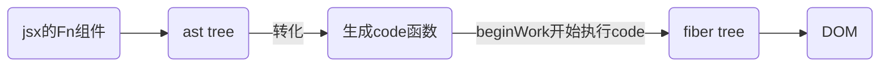
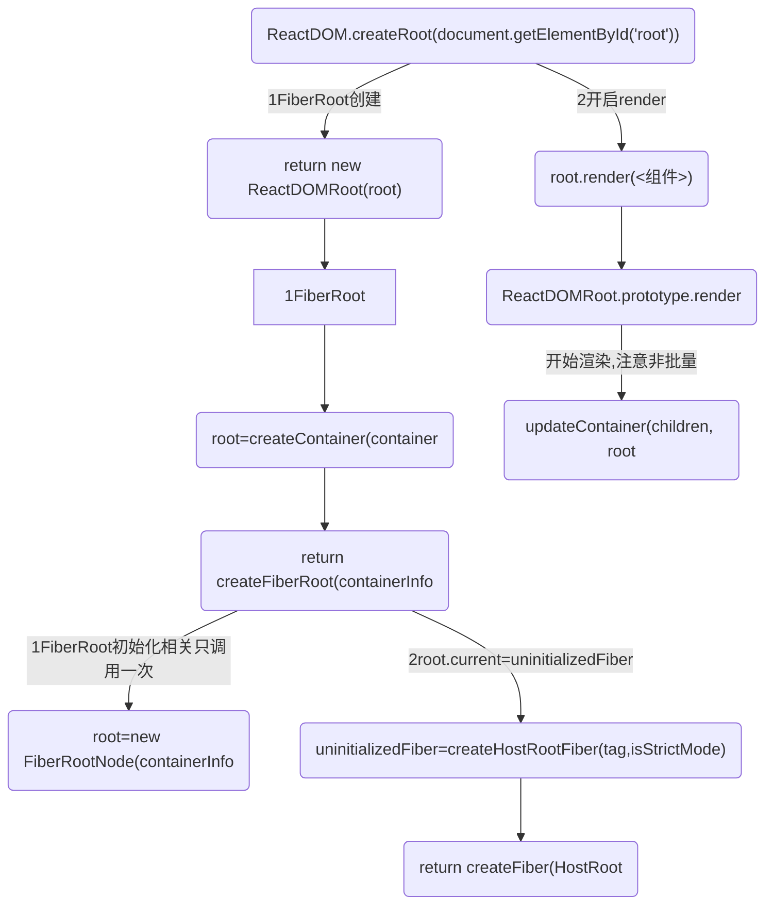
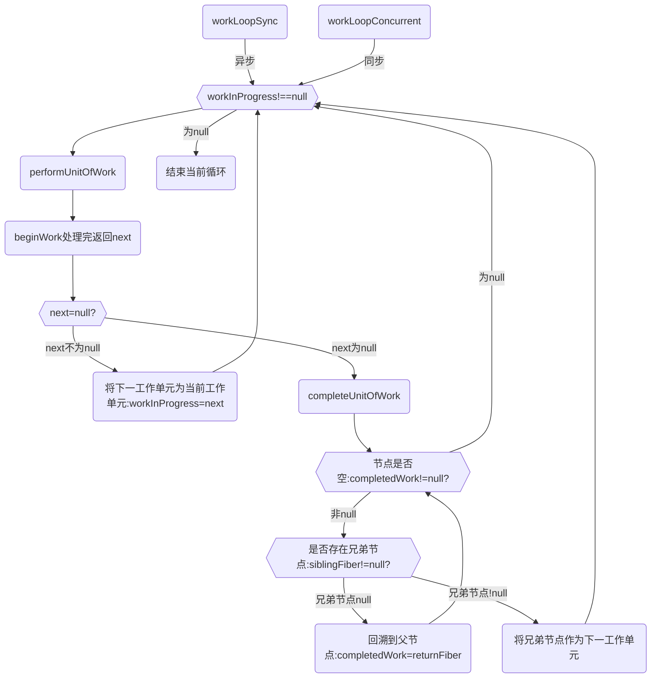

import Mermaid from '../../components/mermaid';
import CodeBlock from '../../components/codeBlock';
import { reactJsxAstR17,reactRenderCommit18 } from '../reactTestCode';
import CodePannel from '../CodePannel';
import HighlightText from '../HighlightText';

## A.构建AST
### 1.jsx语法的html结构通过babel解析转换为ast语法树结构
react 初始化的时候使用 babel 处理 jsx 模板组件，得到 ast 树的结构树,并转化为 code 函数；<br/>
jsx 转换为了浏览器能够识别的原生 js 语法，为 react 后续对状态改变、事件响应以及页面更新等奠定了基础。

注意: 
* react 18中：使用 babel将jsx代码转换为root.render()调用,此时得到转化后的Ast树结构
* react17中 使用 babel将jsx代码转换为React.createElement()调用,此时得到转化后的Ast树结构

<Mermaid>

</Mermaid>

<HighlightText>请看后文-`编译阶段-jsx-ast`</HighlightText>

## vue 和 react 异同

### 其他

1. 配合 ts 比较友好,函数式编程是用函数的组合来进行编程,组件化开发
   1. 比如区分容器组件和展示组件
   2. react 提倡把业务拆分更小的组件，使用`shouldComponentUpdate(){return true}`重新渲染组件或则`React.memo():{return true}`不会渲染,进行深层比较去控制组件的渲染
2. react 渲染/更新方式
3. 丰富的技术生态圈,灵活的语法，很多大型 web 应用都是`react(notion,figma,twitter)`

### 异同

1.  虚拟 dom,以数据为驱动的开发模式;vue 和 react 同样采用的是虚拟 dom,渲染时找出差异修改;vue:vnode,react:fiber tree。

    > 单向数据流，单向数据流就是 model 的更新会触发 view 的更新，view 的更新不会触发 model 的更新，它们的作用是单向的

2.  vue 模版引擎：Vue 使用 template 模版进行编译的，所以在编译的时候可以很好对静态节点进行分析然后进行打补丁标记，然后在 Diff 的时候，Vue2 是判断如果是静态节点则跳过过循环对比，而 Vue3 则是把整个静态节点进行提升处理，Diff 的时候是不过进入循环的，所以 Vue3 比 Vue2 的 Diff 性能更高效。

    > react 模版引擎：React 使用 JSX 进行编译的，是无法进行静态节点分析的

        * React使用的是babel
        * vue @vue/compiler-core

3.  渲染/更新方式:
    在 Vue 中，一个组件在渲染期间依赖于自动追踪，因此 vue 框架知道提前哪一个组件需要渲染当组件状态发生改变时。每个组件可以被认为具有自动为你实现 react shouldComponentUpdate。

    > react 改变 state,react 不允许直接更改状态，需要 setState(),并且批量地对 state 进行更新以提高性能的,减少渲染次数,react 采用函数式更新。

4.  Vue2 和 Vue3 的比对和更新是同步进行的，这个跟 React15 是相同的，就是在比对的过程中，如果发现了那些节点需要移动或者更新或删除，是立即执行的，也就是 React 中常讲的不可中断的更新，如果比对量过大的话，就会造成卡顿，所以 React16 起就更改为了比对和更新是异步进行的，所以 React16 以后的 Diff 是可以中断，Diff 和任务调度都是在内存中进行的，所以即便中断了，用户也不会知道。

5.  Vue2 和 Vue3 都使用了双端对比算法，而 React 的 Fiber 由于是单向链表的结构，所以在 React 不设置由右向左的链表之前，都无法实现双端对比。

# 二.两大阶段:render 和 commit

## 二-A.render构建fiber树:beginWork阶段和completeWork阶段
render 阶段是在内存中构建一棵新的 fiber 树（称为 workInProgress 树）,构建过程是依照现有 fiber 树（current 树）从 root 开始深度优先遍历再回溯到 root 的过程，这个过程中每个 fiber 节点都会经历两个阶段：**beginWork 和 completeWork**。

workLoopSync 负责以递归方式调用 performUnitOfWork，从根组件开始一直到叶子组件，然后再返回到根组件，直到整个组件树中没有工作单元需要处理

**流程图-应用入口:** 基于18
<Mermaid>

</Mermaid>

## 二-A-1.入口流程r18-此时还不是fiber树,没有开启render阶段
<CodeBlock>
```js
// 01:入口
<script type="text/babel">
  const root = ReactDOM.createRoot(document.getElementById('root'))
  root.render(<Test />);
</script>

// 02:createRoot-->ReactDOMRoot
function createRoot(container, options) {
  return new ReactDOMRoot(root);
}

ReactDOMHydrationRoot.prototype.render = ReactDOMRoot.prototype.render = function (children) {
    console.log('%c ==一切开始3:', 'color:red', 'ReactDOMRoot.prototype.render调用updateContainer()开启render阶段==', children);
    var root = this._internalRoot;
}
```
</CodeBlock>

## C.r18入口函数
<CodeBlock>
```html
<script type="text/babel">
  function Test() {
    const [data, setData] = React.useState('改变我')

    const onClickText = () => {
      console.log('onClick');
      setData('努力')
    }

    return (
      <div>
        <button onClick={onClickText} className="btn">Click Me</button>
        <span>{data}</span>
      </div>
    )
  }

  // 17 写法
  // ReactDOM.render(<Test />, document.getElementById('root'))

  // 18 写法
  const root = ReactDOM.createRoot(document.getElementById('root'))
  root.render(<Test />);
</script>
```
</CodeBlock>

### C-1.第一步：createRoot
<CodeBlock>
```js
function createRoot(container, options) {
  if (!isValidContainer(container)) {
    throw new Error('createRoot(...): Target container is not a DOM element.');
  }

  warnIfReactDOMContainerInDEV(container);
  var isStrictMode = false;
  var concurrentUpdatesByDefaultOverride = false;
  var identifierPrefix = '';
  var onRecoverableError = defaultOnRecoverableError;
  var transitionCallbacks = null;

  if (options !== null && options !== undefined) {
    {
      if (options.hydrate) {
        warn('hydrate through createRoot is deprecated. Use ReactDOMClient.hydrateRoot(container, <App />) instead.');
      } else {
        if (typeof options === 'object' && options !== null && options.$$typeof === REACT_ELEMENT_TYPE) {
          error('You passed a JSX element to createRoot. You probably meant to ' + 'call root.render instead. ' + 'Example usage:\n\n' + '  let root = createRoot(domContainer);\n' + '  root.render(<App />);');
        }
      }
    }

    if (options.unstable_strictMode === true) {
      isStrictMode = true;
    }

    if (options.identifierPrefix !== undefined) {
      identifierPrefix = options.identifierPrefix;
    }

    if (options.onRecoverableError !== undefined) {
      onRecoverableError = options.onRecoverableError;
    }

    if (options.transitionCallbacks !== undefined) {
      transitionCallbacks = options.transitionCallbacks;
    }
  }

  console.log('初始-->createRoot')
  var root = createContainer(container, ConcurrentRoot, null, isStrictMode, concurrentUpdatesByDefaultOverride, identifierPrefix, onRecoverableError);
  markContainerAsRoot(root.current, container);
  var rootContainerElement = container.nodeType === COMMENT_NODE ? container.parentNode : container;
  listenToAllSupportedEvents(rootContainerElement);
  return new ReactDOMRoot(root);
}
```
</CodeBlock>

### C-2.第二步：在 return new ReactDOMRoot(root) 调用下面函数
<CodeBlock>
```js
ReactDOMHydrationRoot.prototype.render = ReactDOMRoot.prototype.render = function (children) {
  var root = this._internalRoot;

  if (root === null) {
    throw new Error('Cannot update an unmounted root.');
  }

  {
    if (typeof arguments[1] === 'function') {
      error('render(...): does not support the second callback argument. ' + 'To execute a side effect after rendering, declare it in a component body with useEffect().');
    } else if (isValidContainer(arguments[1])) {
      error('You passed a container to the second argument of root.render(...). ' + "You don't need to pass it again since you already passed it to create the root.");
    } else if (typeof arguments[1] !== 'undefined') {
      error('You passed a second argument to root.render(...) but it only accepts ' + 'one argument.');
    }

    var container = root.containerInfo;

    if (container.nodeType !== COMMENT_NODE) {
      var hostInstance = findHostInstanceWithNoPortals(root.current);

      if (hostInstance) {
        if (hostInstance.parentNode !== container) {
          error('render(...): It looks like the React-rendered content of the ' + 'root container was removed without using React. This is not ' + 'supported and will cause errors. Instead, call ' + "root.unmount() to empty a root's container.");
        }
      }
    }
  }

  console.log('初始-->ReactDOMRoot.prototype.render');
  console.log('update-Container 1');
  updateContainer(children, root, null, null);
};
```
</CodeBlock>

## D.17版本入口函数和18不一样
在18中直接调用以下函数，是不用走下面的流程的,18直接流程图的流程构建fiber和更新
```js
ReactDOM.createRoot(domRoot).render(Ast)
```

以下是17或则在18中调用ReactDOM.render(ast,domRoot)的流程

见： 
<HighlightText>
[react17-render阶段](/react/react17Render)
</HighlightText>

## 基础1-构建fiber 遍历流程
react把每个fiber当成生成fiber最小单元,只要迭代所有fiber则到顶级Fiber时生成整颗FiberTree。

### 遍历流程
Tree 构建的遍历顺序，它会以旧的fiber tree为蓝本，把每个fiber作为一个工作单元，自顶向下逐节点构造workInProgress tree（构建中的新fiber tree）:

深度优先遍历
1. 从顶点开始遍历
2. 如果有子节点，先遍历子节点；
3. 如果没有子节点，则看有没有兄弟节点，有则遍历兄弟节点，并把effect向上归并
4. 如果没有兄弟节点，则看有没有父兄弟节点，有则遍历父兄弟节点
5. 如果没有都没有了，那么遍历结束

<Mermaid>

</Mermaid>

## A. beginWork阶段:将ast树(或则code函数webpack模式下)转换为fiber树
>组件的状态计算、diff 的操作:通过 Diff 算法找出所有节点变更，例如节点新增、删除、属性变更等等, 获得需要更新的节点信息，以及 render 函数的执行，发生在 beginWork 阶段

参考 重点 beginWork 流程：[render阶段-mountIndeterminateComponent构建fiber树](./React/render阶段-mountIndeterminateComponent构建fiber树)

## B.completeWork:生成实例
completeWork阶段处在beginWork之后，commit之前，起到的是一个承上启下的作用。它接收到的是经过diff后的fiber节点,将DOM节点和effectList都准备好。
作用：
1. 为新增的 fiber 节点生成对应的DOM节点。
2. 更新DOM节点的属性。
3. 进行事件绑定。
4. 收集effectTag。
completeWork阶段处在beginWork之后，commit之前，起到的是一个承上启下的作用。它接收到的是经过diff后的fiber节点，然后要将DOM节点和effectList都准备好。

作用：
1. 为新增的 fiber 节点生成对应的DOM节点。
2. 更新DOM节点的属性。
3. 进行事件绑定。
4. 收集effectTag。

参考 1：[render阶段总览](./React/render阶段总览)

### 1-3.render可调度

在 render 阶段，一个庞大的更新任务被分解为了一个个的工作单元，这些工作单元有着不同的优先级，React 可以根据优先级的高低去实现工作单元的打断和恢复。

异步可中断更新，在构建 workInProgress 的过程中，如果有更高优先级的更新产生， React 会停止 workInProgress fiber tree 的构建，然后开始处理更高优先级的更新，重新构建 workInProgress fiber tree。

等更高优先级的更新处理完毕之后，才会处理原来被中断的更新。

React fiber 的构建的过程以每个 fiber 作为一个工作单元，进行工作循环，工作循环中每次处理一个任务（工作单元），处理完毕有一次喘息的机会：

<CodeBlock>
```js
while (nextUnitOfWork !== null && !shouldYieldToRenderer()) {
  nextUnitOfWork = performUnitOfWork(nextUnitOfWork);
}
```
</CodeBlock>

## 2.commit 阶段分为3个阶段

参考：[render 阶段结束后-进入 commit 阶段](./React/render阶段结束后-进入commit阶段)

在 render 阶段结束后，会进入 commit 阶段，该阶段不可中断,commit 阶段的调度优先级采用的是最高优先级，以保证 commit 阶段同步执行不可被打断。

相应的节点进行提交，渲染到页面上,在 commit 阶段就会操作真实节点，将它们插入到 dom 树中:

### 2-1.Before mutation 阶段（执行 DOM 操作前）；

  - 对于类组件，执行 getSnapshotBeforeUpdate 生命周期
  - 对于函数组件，异步调用 useEffect

### 2-2.mutation 阶段（执行 DOM 操作）；

  - 进行真实的 DOM 操作

### 2-3.layout 阶段（执行 DOM 操作后）
  - 对于类组件，会执行 setState 的 callback
  - 对于函数组件，会执行 useLayoutEffect

主要是去依据 workInProgress 树中有变化的那些节点（render 阶段的 completeWork 过程收集到的 effect 链表）,去完成 DOM 操作，将更新应用到页面上，除此之外，还会异步调度 useEffect 以及同步执行 useLayoutEffect。

complete 阶段 workInProgress 节点都是经过 diff 算法调和过的，也就意味着对于某个节点来说它 fiber 的形态已经基本确定了，但除此之外还有两点：

- 目前只有 fiber 形态变了，对于原生 DOM 组件（HostComponent）和文本节点（HostText）的 fiber 来说，对应的 DOM 节点（fiber.stateNode）并未变化。
- 经过 Diff 生成的新的 workInProgress 节点持有了 flag(即 effectTag)

workInProgress 节点的 completeWork 阶段主要做的:

- 真实 DOM 节点的创建以及挂载

<CodeBlock>
```text
构建过程中，会自下而上将子节点的第一层第一层插入到当前节点。
更新过程中，会计算DOM节点的属性，一旦属性需要更新，会为DOM节点对应的workInProgress节点标记Update的effectTag
```
</CodeBlock>

- effectList 的收集

```
执行beginWork后会创建子 Fiber 节点，节点上可能存在effectTag。
```

- DOM 属性的处理,次要理解
- 错误处理,次要理解

## 3.hooks 初始化

参考：[hooks 的初始化和 setState 组件更新-流程图-初始化 hook-state-接上面 beginWork](./React/setState组件更新和hooks的初始化)

## 4. 执行 setState(xx)组件更新,重点在 dispatchSetState

参考：[hooks 的初始化和 setState 组件更新-流程图-data 更新之后-获取 state-调度更新](./React/setState组件更新和hooks的初始化)

## 5. 优化.useState 同步还是异步?

参考：[React/setState 的异步和同步问题](./React/setState异步-同步)

## useEffect
useEffect的执行是在commit之后，React的commit阶段简单来说，就是将DOM渲染到页面上。

useEffect 需要先调度，在Layout 阶段完成后再异步执行。
请记得 React 会等待浏览器完成画面渲染之后才会延迟调用 `useEffect`，因此会使得额外操作很方便

### useEffect的执行顺序问题，如果父组件和子组件同时存在useEffect执行先后？

子组件的useEffect先走

解析：按照这个执行逻辑来看的话：
* 父组件进入commit阶段，发现有子组件组件需要渲染。

* 开始进行子组件的生命周期, 子组件进入commit阶段，执行子组件的useEffect，子组件渲染结束

* 父组件进行commit阶段，渲染完成，执行useEffect

## react 父组件子组件的渲染先后顺序和深度优先搜索
父组件和子组件的渲染顺序通常遵循深度优先搜索（DFS）的原则。
>深度优先搜索是一种遍历树结构的算法，它首先沿着树的深度尽可能远的分支向下遍历，然后返回并探索未遍历的分支。在React中，组件树也可以视为一个树结构，其中每个组件可以有多个子组件。

当React应用加载时，首先会渲染根组件(最顶层组件),然后React会递归地渲染子组件，直到整个组件树被遍历完。这个过程遵循深度优先搜索的原则，即React会首先渲染当前组件的一个子组件，然后再继续渲染这个子组件的子组件，以此类推，直到所有子组件都被渲染完。

### 子组件的componentDidMount先执行,父组件的后执行
正确的渲染顺序如下：
```
渲染父组件。--> 父组件render()执行
渲染子组件。--> 子组件render()执行
调用子组件的 componentDidMount/useEffect
调用父组件的 componentDidMount/useEffect
```

### 总结父子组件生命周期执行顺序
父子组件初始化
* 父组件 constructor
* 父组件 getDerivedStateFromProps
* 父组件 render
* 子组件 constructor
* 子组件 getDerivedStateFromProps
* 子组件 render
* 子组件 componentDidMount
* 父组件 componentDidMount

子组件修改自身state
* 子组件 getDerivedStateFromProps
* 子组件 shouldComponentUpdate
* 子组件 render
* 子组件 getSnapShotBeforeUpdate
* 子组件 componentDidUpdate

父组件修改props
* 父组件 getDerivedStateFromProps
* 父组件 shouldComponentUpdate
* 父组件 render
* 子组件 getDerivedStateFromProps
* 子组件 shouldComponentUpdate
* 子组件 render
* 子组件 getSnapShotBeforeUpdate
* 父组件 getSnapShotBeforeUpdate
* 子组件 componentDidUpdate
* 父组件 componentDidUpdate

卸载子组件
* 父组件 getDerivedStateFromProps
* 父组件 shouldComponentUpdate
* 父组件 render
* 父组件 getSnapShotBeforeUpdate
* 子组件 componentWillUnmount
* 父组件 componentDidUpdate

## A.接开头：编译阶段-jsx-ast
### A-1.简单实例1:babel将jsx代码转换为React.createElement()调用
测试：https://www.babeljs.cn/repl
<CodeBlock>
```jsx
// jsx
const element = <h1 style = {{"color": "red"}}>123
    <div>test</div>
</h1>

// babel 编译过后生成的代码
const element = /*#__PURE__*/React.createElement("h1", {
  style: {
    "color": "red"
  }
}, "123", /*#__PURE__*/React.createElement("div", null, "test"));
```
</CodeBlock>

### A-2.简单实例2:直接用转化后的代码去调用React.createElement

<CodePannel code={reactJsxAstR17} name='reactJsxAstR17' height='500px' language='html' />

### A-3.简单实例3：使用babel
例子基于react18,先看babel 的执行函数
<CodeBlock>
```js
function transform(code, options) {
  console.log('=Babel-transform-参数:', { code })
  const babel_transform = Babel.transform(code, processOptions(options));
  console.log('=Babel-返回:', babel_transform)
  return babel_transform
}
```
</CodeBlock>

<CodePannel code={reactRenderCommit18} name='reactRenderCommit18' height='500px' language='html' />

### A-4.render阶段-babel生成的AST.json
[00-编译阶段-babel生成的AST.json]()

<CodeBlock>
```json
{
"metadata":"",
"options":"",
"ignored":"",
"code":"",
"ast":"",
"map":""
}
```
</CodeBlock>

### A-5.code函数
每个节点都调用createElement(),并且嵌套结构都是和html节点一样
<CodeBlock>
```js
'use strict';

var _slicedToArray = function () { function sliceIterator(arr, i) { var _arr = []; var _n = true; var _d = false; var _e = undefined; try { for (var _i = arr[Symbol.iterator](), _s; !(_n = (_s = _i.next()).done); _n = true) { _arr.push(_s.value); if (i && _arr.length === i) break; } } catch (err) { _d = true; _e = err; } finally { try { if (!_n && _i["return"]) _i["return"](); } finally { if (_d) throw _e; } } return _arr; } return function (arr, i) { if (Array.isArray(arr)) { return arr; } else if (Symbol.iterator in Object(arr)) { return sliceIterator(arr, i); } else { throw new TypeError("Invalid attempt to destructure non-iterable instance"); } }; }();

console.log('=Babel:', Babel);
function Test() {
  console.log('test-render');

  var _React$useState = React.useState('改变我'),
    _React$useState2 = _slicedToArray(_React$useState, 2),
    data = _React$useState2[0],
    setData = _React$useState2[1];

  var _React$useState3 = React.useState(false),
    _React$useState4 = _slicedToArray(_React$useState3, 2),
    showDiv = _React$useState4[0],
    setShowDiv = _React$useState4[1];

  var onClickText = function onClickText() {
    console.log('=useState=onClick');
    setData('努力哦');
    setShowDiv(!showDiv);
  };

  var onClickText2 = function onClickText2() {
    console.log('=useState=onClick:', data);
  };

  React.useEffect(function () {
    console.log('=副作用-useEffect-->运行');
  }, []);

  React.useLayoutEffect(function () {
    console.log('=副作用-useLayoutEffect-->运行');
  }, []);

  return React.createElement(
    'div',
    { id: 'div1', className: 'c1' },
    React.createElement(
      'button',
      { onClick: onClickText, className: 'btn' },
      'Hello world,Click me'
    ),
    React.createElement(
      'span',
      null,
      data
    ),
    showDiv && React.createElement(
      'div',
      null,
      '\u88AB\u4F60\u53D1\u73B0\u4E86'
    ),
    React.createElement(
      'div',
      { id: 'div2', className: 'c2' },
      React.createElement(
        'p',
        null,
        '\u6D4B\u8BD5\u5B50\u8282\u70B9'
      )
    )
  );
}

var root = ReactDOM.createRoot(document.getElementById('root'));
console.log("=app=root:", root);
root.render(React.createElement(Test, null));
```
</CodeBlock>

### A-6.createElement()
<CodeBlock>
```js
function createElement(type, config, children) {
  // console.log('=development调用createElement构建Ast树:', { type, config, children })
  console.log('%c=development调用createElement-1:type', 'color:blueviolet', type, { config, children })
  var propName; // Reserved names are extracted

  var props = {};
  var key = null;
  var ref = null;
  var self = null;
  var source = null;

  if (config != null) {
    if (hasValidRef(config)) {
      ref = config.ref;

      {
        warnIfStringRefCannotBeAutoConverted(config);
      }
    }

    if (hasValidKey(config)) {
      {
        checkKeyStringCoercion(config.key);
      }

      key = '' + config.key;
    }

    self = config.__self === undefined ? null : config.__self;
    source = config.__source === undefined ? null : config.__source; // Remaining properties are added to a new props object

    for (propName in config) {
      if (hasOwnProperty.call(config, propName) && !RESERVED_PROPS.hasOwnProperty(propName)) {
        props[propName] = config[propName];
      }
    }
  } // Children can be more than one argument, and those are transferred onto
  // the newly allocated props object.


  var childrenLength = arguments.length - 2;

  if (childrenLength === 1) {
    props.children = children;
  } else if (childrenLength > 1) {
    var childArray = Array(childrenLength);

    for (var i = 0; i < childrenLength; i++) {
      childArray[i] = arguments[i + 2];
    }

    {
      if (Object.freeze) {
        Object.freeze(childArray);
      }
    }

    props.children = childArray;
  } // Resolve default props


  if (type && type.defaultProps) {
    var defaultProps = type.defaultProps;

    for (propName in defaultProps) {
      if (props[propName] === undefined) {
        props[propName] = defaultProps[propName];
      }
    }
  }

  {
    if (key || ref) {
      var displayName = typeof type === 'function' ? type.displayName || type.name || 'Unknown' : type;

      if (key) {
        defineKeyPropWarningGetter(props, displayName);
      }

      if (ref) {
        defineRefPropWarningGetter(props, displayName);
      }
    }
  }
  const reactElementRes = ReactElement(type, key, ref, self, source, ReactCurrentOwner.current, props);
  console.log('=development调用createElement-2:返回:', reactElementRes)
  return reactElementRes
}
```
</CodeBlock>


## D.react17-18对比
### B-1.setState自动批处理
* 在React17默认情况下，在promise、setTimeout、原生事件处理函数中、或任何其它事件内的更新都不会进行批处理。

* 在React18以后,所有更新都会自动进行批处理。多次更新将会合并成一次更新，从而降低渲染次数提高性能。
```js
// 退出批处理，需要使用flushSync
import React, { useState } from 'react';
import { flushSync } from 'react-dom';

const App: React.FC = () => {
  const [count1, setCount1] = useState(0);
  const [count2, setCount2] = useState(0);
  return (
    <div
      onClick={() => {
        flushSync(() => {
          setCount1(count => count + 1);
        });
        // 第一次更新
        flushSync(() => {
          setCount2(count => count + 1);
        });
        // 第二次更新
      }}
    >
      <div>count1： {count1}</div>
      <div>count2： {count2}</div>
    </div>
  );
};

export default App;
```

### B-2.Concurrent Mode(并发模式)
在React18中提供了新的root Api，我们只需要把render改成`ReactDOM.createRoot(root).render(<App />)`就可以开启并发模式。
并发特性是开启并发模式才能使用的特性:
* startTranstion
* useTranstion
* useDeferredValue

在视图更新的时startTransition 能够保持页面有响应，这个 api 能够把 React 更新标记成一个特殊的更新类型 transitions ，在这种特殊的更新下，React 能够保持视觉反馈和浏览器的正常响应。
1. startTransition:
startTransition(scope)

scope 是一个回调函数，里面的更新任务都会被标记成过渡更新任务，过渡更新任务在渲染并发场景下，会被降级更新优先级，中断更新。
```js
// startTranstion的回调包裹的setState触发的渲染标记为不紧急渲染。这些渲染可能被其他紧急渲染所抢占。
startTransition(()=>{
   /* 更新任务 */
  func（）
})
```

2. useTranstion
在低优先级还没执行的时候，怎么知道过渡任务处于什么状态，这时候就可以使用useTranstion这个Hooks。useTranstion执行返回一个数组，数组有两个状态值。

第一个状态值： 当处于过渡状态的标记。

第二个状态值： 可以理解为startTranstion，将任务标记为过渡任务。
```js
import { useTranstion } from 'react';

const [isPending, startTrastion] = useTranstion();
```

3. useDeferredValue
返回一个延时响应的值可以让一个state延时生效，只有当前没有紧急更新的任务时，该值才会变为最新的值。和startttanstion一样都是标记为非紧急更新。

useTranstion和useDeferredValue异同：
相同点： useDeferredValue本质上和内部实现与useTranstion一样都是标记成了过度更新任务。

不同点：useTranstion是把startTranstion内部的更新任务变成了过度任务transtion，而useDeferredValue是把原值通过过度任务得到新的值，这个值作为延时状态，一个是处理逻辑，一个是生产一个新的状态。

### B-3.useId
```js
const id = useId();
```
支持同一个组件在客户端和服务端生成相同的唯一的 ID，避免 hydration 的不兼容，这解决了在 React 17 及 17 以下版本中已经存在的问题。

### B-4.useInsertionEffect
在dom生成之后，useLayoutEffect之前，它的工作原理大致合useLayoutEffect相同，只是此时无法访问DOM节点的引用，一般用于提前注入`<style>`脚本。

## 其他：为什么React 18 的组件定义要大写
Sat Mar 23 18:44:58 CST 2024

在React中，组件定义要求组件名称必须以大写字母开头。这是为了让React能够区分组件和HTML标签。

在JSX中，如果你使用小写字母开头定义一个组件，比如 `<myComponent />`，React会将它视为HTML标签而不是React组件。而如果你使用大写字母开头定义一个组件，比如`<MyComponent />`，React会将它视为一个自定义的React组件。

这个约定有助于提高代码的可读性，并且使得开发者能够清楚地区分哪些是React组件，哪些是HTML标签。