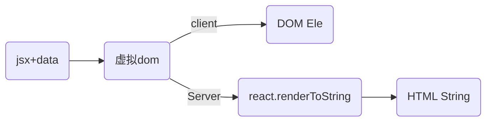
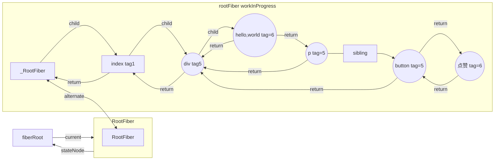
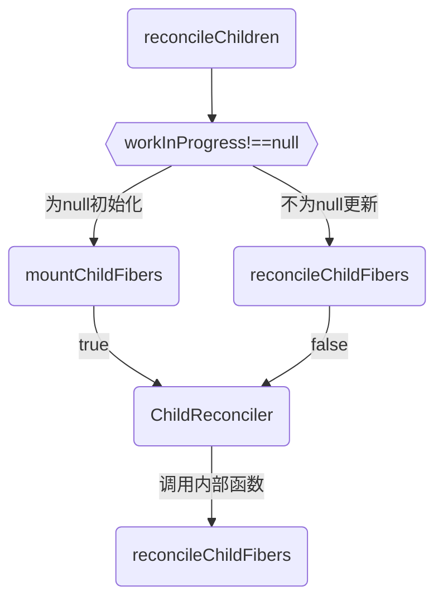

import Mermaid from '../../components/mermaid';
import CodeBlock from '../../components/codeBlock';
import HighlightText from '../HighlightText';
import CodePannel from '../CodePannel';
import ImageRender from '../ImageRender';
import { reactRenderCommit18,requestIdleCallbackApi } from '../reactTestCode';

# 虚拟dom
## 1.手动操作DOM带来的性能缺陷
在使用原生的js api或者jquery等一些方法直接去操作dom的时候，可能会引起页面的reflow-回流，而页面的回流耗时和消耗性能。

复杂一点的页面 ，对 DOM 的操作是非常综合的，CRUD都有。频繁的去操作dom，会引起页面的卡顿，影响用户的体验。虚拟DOM就是为了解决频繁操作DOM的性能问题创造出来的。

React 帮助在复杂的界面环境下，如何尽量降低 DOM Reflow 的成本。

而一旦出现了频繁变化，DOM Reflow 的开销就变得非常大。React 的 Diff 就是解决这个最痛的问题的。

### 2.虚拟dom作用,`提升页面的更新渲染的性能,这也是虚拟dom重要作用,注意首屏渲染的性能并不能靠虚拟dom提升`
* 1.`如果是首次渲染，VirtualDom不具有任何优势，甚至它要进行更多的计算，消耗更多的内存。`
* 2.VirtualDom的优势在于React的Diff算法和批处理策略，React在页面更新之前，提前计算好了如何进行更新和渲染DOM。

实际上，这个计算过程我们在直接操作DOM时，也是可以自己判断和实现的，但是一定会耗费非常多的精力和时间，而且往往我们自己做的是不如React好的。
所以，在这个过程中React帮助我们"提升了性能"。VirtualDom帮助我们提高了开发效率，在重复渲染时它帮助我们计算如何更高效的更新，而不是它比DOM操作更快。

假如使用原生api去操作一个会导致回流的DOM操作10次，那么浏览器会每次都会重新走一次上面的全流程，包括一些没变化的位置计算。

浏览器没有如此智能，收到第一个更新DOM请求后，并不知道后续还有9次更新操作，因此会马上执行流程，最终执行10次流程。显然例如计算DOM节点的坐标值等都是白白浪费性能，可能这次计算完，紧接着下一个DOM更新请求，节点值就会改变，前面的计算就是浪费。

`理想的状态是一次性构建完DOM树，再执行后续操作。`
而虚拟DOM不会立即去操作DOM，而是将这10次更新的diff内容保存到本地的一个js对象中，最终将这个js对象一次性attach到DOM树上，通知浏览器去执行绘制工作，这样可以避免大量的无谓的计算量。

### 简单理解:跨浏览器兼容
* 1.React基于VirtualDom自己实现了一套自己的事件机制，自己模拟了事件冒泡和捕获的过程，采用了事件代理，批量更新等方法，抹平了各个浏览器的事件兼容性问题。

* 2.跨平台兼容:VirtualDom为React带来了跨平台渲染的能力
只需要告诉React你想让视图处于什么状态，React则通过VirtualDom确保DOM与该状态相匹配。你不必自己去完成属性操作、事件处理、DOM更新，React会替你完成这一切。

* 3.虚拟dom存在内存，可以在不同js环境生成,React 的虚拟DOM以对象树的形式保存在内存中，并且是可以在浏览器和 Node 中生成，这是前后端同构提供了先决条件，也是react服务端渲染的前提;
虚拟 Dom 在前后端都是以对象树的形式存在的，但在展露原型的方式服务端和客户端是不一样的:
<CodeBlock>

</CodeBlock>

## 相关概念
<HighlightText>
Fiber 架构:
</HighlightText>
Fiber 是一种数据结构，用于表示组件树，并且允许 React 在执行渲染和协调工作时更好地控制任务的中断和继续。这允许 React 在不同优先级之间切换工作，以便及时响应用户操作。

<HighlightText>
增量更新:
</HighlightText>
在 React 17 中，Diff 算法的一个重要变化是引入了增量更新。传统的 Diff 算法是一次性遍历整个虚拟 DOM 树，找到需要更新的节点，然后一次性更新它们。这在大型应用中可能会导致性能问题。在增量更新中，React 可以中断渲染和协调工作，以响应更高优先级的任务。这使得 React 能够更好地将工作分散到多个帧中，从而提高了用户界面的响应性。

<HighlightText>
Batching（批处理）:
</HighlightText>

在 Concurrent Mode 中，React 会将多个状态更新合并为一个批处理，然后一次性更新虚拟 DOM。这可以减少渲染的次数，提高性能。React 会根据浏览器的空闲时间来安排批处理的执行。

<HighlightText>
**在更新的时候可能会更新大量的dom，所以react在应用层和dom层之间增加了一层Fiber，而Fiber是在内存中工作的，所以在更新的时候只需要在内存中进行dom更新的比较，最后再应用到需要更新真实节点上**
</HighlightText>

另外，把任务拆分成一个个细小的工作单元，随着任务调度抽空执行，直到整颗树构建完成。所以react fiber所谓的性能提升只是将reconciliation中diff过程的优先级往后调了，只在浏览器空闲时执行，从而提升了用户交互、动画渲染相关的优先级，使浏览器能够更快反馈用户操作，使页面减少卡顿感，但并不会减少react渲染所需的工作量，因此想要真正提升应用性能还是得靠写好代码，减少不必要的渲染才行。

## U.相关概念-Fiber
react fiber的任务:
* 1.把渲染/更新过程拆分为更小的、可中断的工作单元
* 2.在浏览器空闲时执行工作循环
* 3.将所有执行结果汇总patch到真实DOM上

通过Fiber架构， 实现了可中断与恢复，适时地让出CPU执行权，中间可以返回至主进程控制执行其他任务,恢复后也可以复用之前的中间状态，并给不同的任务赋予不同的优先级，其中每个任务更新单元为React Element 对应的 Fiber 节点。

调和器允许渲染过程分段完成，而不必一次性完成，在渲染期间可返回到主线程控制执行其他任务。这是通过计算部分组件树的变更，并暂停渲染更新，询问主线程是否有更高需求的绘制或者更新任务需要执行，这些高需求的任务完成后再重新渲染。这一切的实现是在代码层引入了一个新的数据结构：Fiber对象，每一个组件实例对应有一个fiber实例，此fiber实例负责管理组件实例的更新，渲染任务及与其他fiber实例的通信，这个先进的调和器叫做调和器（Fiber Reconciler），它提供的新功能主要有：
* 1.把可中断的任务拆分成小任务；
* 2.可重用各分阶段任务，对正在做的工作调整优先次序；
* 3.可以在父子组件任务间前进后退切换任务，以支持React执行过程中的布局刷新；

fiber是一个工作单元, 对于工作单元来说，每个 Fiber 节点保存了本次更新中该组件改变的状态、要执行的工作。

<HighlightText>
**Fiber树是一种单向链表数据结构:**
</HighlightText>
React使用Fiber Tree来表示组件的层次结构，并且在进行DOM更新时使用它来实现高效的渲染。每个节点都是一个Fiber对象,代表了一个组件或DOM元素，其中包含有关该节点的信息，例如组件类型、props、state、子节点,优先级、updateQueue等等，并且包含了在渲染过程中所需的所有信息。

每个Fiber节点都包含了一个指向其第一个子节点的引用，以及一个指向其下一个兄弟节点的引用。通过这些引用，Fiber树形成了一条从根节点到叶节点的单向链表。

因为Fiber树是单向链表，所以它的节点只能访问其后继节点，而不能直接访问其前驱节点。

这意味着在执行某些操作时，需要从根节点开始遍历整个Fiber树，以便访问到之前的节点。

这也是Fiber树能够支持异步渲染和优先级调度的原因之一，因为单向链表比双向链表更适合用于分解和重新组合渲染任务。

这个链接的结构是怎么构成的呢?Fiber树的每个节点通过child、sibling、return来相互连接，最后构成一个虚拟DOM树:
```
// 单链表树结构
{
   return: Fiber | null, // 指向父节点
   child: Fiber | null,// 指向自己的第一个子节点
   sibling: Fiber | null,// 指向自己的兄弟结构，兄弟节点的return指向同一个父节点
}
```
树是图的特例,即当一棵树除叶子节点外的所有节点有且仅有一个直接子节点时，将构成链表结构。相比于传统的树形数据结构，链表可以更灵活地进行节点的添加、删除和移动，从而支持React的异步渲染。特点是任何一个位置的 Fiber 节点，都可以非常容易知道它的父 Fiber, 第一个子元素的 Fiber,和它的兄弟节点 Fiber。却不容易知道它前一个 Fiber 节点是谁，这就是 React 中单向链表 Fiber 节点的特点。也正是因为这些即便在协调的过程被中断了，再恢复协调的时候，依然知道当前的 父节点和孩子节点等信息。

<HighlightText>
查看fiber树,初始化阶段这个函数看log
</HighlightText>
<CodeBlock>
```js
// 重点函数performConcurrentWorkOnRoot,这个函数在render结束会开启commit阶段
function performConcurrentWorkOnRoot(root, didTimeout) {
    var exitStatus = shouldTimeSlice ? renderRootConcurrent(root, lanes) : renderRootSync(root, lanes);

    if (exitStatus === RootDidNotComplete) {
        markRootSuspended$1(root, lanes);
    } else {
        root.finishedWork = finishedWork;
        root.finishedLanes = lanes;

        console.log(`%c=commit阶段=前=render阶段结束=performConcurrentWorkOnRoot调用finishConcurrentRender-->commitRoot`, 'color:cyan', { root })
        finishConcurrentRender(root, exitStatus, lanes);
    }
}
```
</CodeBlock>

<HighlightText>
更新阶段这个函数看log
</HighlightText>

<CodeBlock>
```js
function commitRoot(root, recoverableErrors, transitions) {
// TODO: This no longer makes any sense. We already wrap the mutation and
// layout phases. Should be able to remove.
var previousUpdateLanePriority = getCurrentUpdatePriority();
var prevTransition = ReactCurrentBatchConfig$3.transition;
console.log(`%c=commit阶段=0=commit阶段开始`, 'color:cyan', { root })
try {
    ReactCurrentBatchConfig$3.transition = null;
    setCurrentUpdatePriority(DiscreteEventPriority);
    commitRootImpl(root, recoverableErrors, transitions, previousUpdateLanePriority);
} finally {
    ReactCurrentBatchConfig$3.transition = prevTransition;
    setCurrentUpdatePriority(previousUpdateLanePriority);
}

return null;
}
```
</CodeBlock>

<ImageRender alt='test5' path='/react/fiber树结构实例.png' />

### U-1.Fiber 数据结构:
React Fiber 树由多个 Fiber 节点组成，每个节点代表了一个组件。Fiber 节点包含了组件的相关信息，例如组件类型、props、state 等，同时还包括了与调度相关的信息，例如优先级、任务状态、父子关系等。
主要分下面几块：
* 1.节点基础信息的描述
* 2.描述与其它 fiber 节点连接的属性
* 3.状态更新相关的信息:hook
```
hook 关联比较大的主要是 memoizedState 和 updateQueue 属性。函数组件会将内部用到的所有的 hook 通过单向链表的形式，保存在组件对应 fiber 节点的 memoizedState 属性上。

useEffect：memoizedState保存包含useEffect回调函数、依赖项等的链表数据结构effect。effect链表同时会保存在fiber.updateQueue中。

updateQueue 是 useEffect 产生的 effect 连接成的环状单向链表。
```
* 4.优先级调度相关

在普通的HTML页面上，人为地将多个DOM元素整合在一起可以组成一个组件，HTML标签可以是组件（HostComponent），普通的文本节点也可以是组件（HostText）。每一个组件就对应着一个fiber节点，许多个fiber节点互相嵌套、关联，就组成了fiber树

一个DOM节点一定对应着一个Fiber节点，但一个Fiber节点却不一定有对应的DOM节点。
```
    Fiber树                    DOM树

   div#root                  div#root
      |                         |
    <App/>                     div
      |                       /   \
     div                     p     a
    /   ↖
   /      ↖
  p ----> <Child/>
             |
             a
```

结构：
* return： 指向父级 Fiber 节点。
* child：指向子 Fiber 节点。
* sibling：指向兄弟 fiber 节点。

注意FiberRootNode 和 FiberNode 的不同:
FiberRootNode是初始化 只调用一次
<CodeBlock>
```js
  function FiberRootNode(containerInfo, tag, hydrate) {
    console.log('==FiberRootNode 是初始化相关只调用一次===')
    this.tag = tag;
    this.containerInfo = containerInfo;
    this.pendingChildren = null;
    this.current = null;
    this.pingCache = null;
    this.finishedWork = null;
    this.timeoutHandle = noTimeout;
    this.context = null;
    this.pendingContext = null;
    this.hydrate = hydrate;
    this.callbackNode = null;
    this.callbackPriority = NoLanePriority;
    this.eventTimes = createLaneMap(NoLanes);
    this.expirationTimes = createLaneMap(NoTimestamp);
    this.pendingLanes = NoLanes;
    this.suspendedLanes = NoLanes;
    this.pingedLanes = NoLanes;
    this.expiredLanes = NoLanes;
    this.mutableReadLanes = NoLanes;
    this.finishedLanes = NoLanes;
    this.entangledLanes = NoLanes;
    this.entanglements = createLaneMap(NoLanes);
    ...
```
</CodeBlock>

<CodeBlock>
```js
function FiberNode(
  tag: WorkTag,
  pendingProps: mixed,
  key: null | string,
  mode: TypeOfMode,
) {
  // 用来表示当前Fiber对应的是那种类型的组件，如ClassComponent、FunctionComponent等
  this.tag = tag;      // Fiber对应组件的类型 Function/Class/Host...
  // 组件的key
  this.key = key;
  // 大部分情况同type，某些情况不同，比如FunctionComponent使用React.memo包裹
  this.elementType = null;
  // 对于 FunctionComponent，指函数本身，对于ClassComponent，指class，对于HostComponent，指DOM节点tagName
  // DOM元素的标签类型，div、p...
  this.type = null;
  this.stateNode = null;  // Fiber对应的真实DOM节点

  // 用于连接其他Fiber节点形成Fiber树
  // Fiber 链表相关
  this.return = null;  // 指向父级Fiber节点
  this.child = null;  // 指向子Fiber节点
  this.sibling = null; // 指向右边第一个兄弟Fiber节点
  this.index = 0;

  this.ref = null;

  // 作为动态的工作单元的属性 —— 保存本次更新造成的状态改变相关信息
  this.pendingProps = pendingProps;
  this.memoizedProps = null;
  this.updateQueue = null;  // class 组件 Fiber 节点上的多个 Update 会组成链表并被包含在 fiber.updateQueue 中。 函数组件则是存储 useEffect 的 effect 的环状链表。
  this.memoizedState = null; // hook 组成单向链表挂载的位置
  this.dependencies = null;

  this.mode = mode;

  // Effects
  this.flags = NoFlags;
  this.subtreeFlags = NoFlags;
  this.deletions = null;

  // 调度优先级相关
  // 该fiber中的优先级，它可以判断当前节点是否需要更新
  this.lanes = NoLanes;
  // 子树中的优先级，它可以判断当前节点的子树是否需要更新
  this.childLanes = NoLanes;

  // 指向该fiber在另一次更新时对应的fiber
  /*
  * 可以看成是workInProgress（或current）树中的和它一样的节点，
  * 可以通过这个字段是否为null判断当前这个fiber处在更新还是创建过程
  * */
  // 双缓存树，指向缓存的fiber。更新阶段，两颗树互相交替。
  // 指向当前fiber对应的一个拷贝,fiber的版本池，即记录fiber更新过程，便于恢复
  this.alternate = null;
}
```
</CodeBlock>

<HighlightText>
hook 的 memoizedState 存的是当前 hook 自己的值。
</HighlightText>

<CodeBlock>
```js
const hook: Hook = {
  memoizedState: null, // 当前需要保存的值

  baseState: null,
  baseQueue: null, // 由于之前某些高优先级任务导致更新中断，baseQueue 记录的就是尚未处理的最后一个 update
  queue: null, // 内部存储调用 setValue 产生的 update 更新信息，是个环状单向链表

  next: null,  // 下一个hook
};
```
</CodeBlock>

<CodePannel code={reactRenderCommit18} name='reactRenderCommit18' height='500px' language='html' />

圈起来1和2表示以下函数
<CodeBlock>
```js
React.useLayoutEffect(() => {
  console.log('=副作用-useLayoutEffect-->运行');
}, [])

React.useEffect(() => {
  console.log('=副作用-useEffect-->运行');
}, [])
```
</CodeBlock>

可以从截图中看到，代码中使用的 useState 和 useRef 两个 hook 通过 next 连接成链表。另外 useState 的 hook 对象的 queue 中存储了调用 setValue 时用到的函数。

<ImageRender alt='hook连接成链表' path='/react/hook连接成链表-实例.png' />


例子2:
<CodeBlock>
```js
export default class Index extends React.Component{
   state={ number:666 } 
   handleClick=()=>{
     this.setState({
         number:this.state.number + 1
     })
   }
   render(){
     return <div>
       hello，world
       <p>{this.state.number}</p>
       <button onClick={this.handleClick}>点赞</button>
     </div>
   }
}
```
</CodeBlock>

<Mermaid>

</Mermaid>

## **另外：配合requestIdleCallback API, 实现任务拆分、中断与恢复。**
**在浏览器中，页面是一帧一帧绘制出来的，渲染的帧率与设备的刷新率保持一致。**
一般情况下，设备的屏幕刷新率为 1s 60次，当每秒内绘制的帧数（FPS）超过60时，页面渲染是流畅的；而当 FPS 小于60时，会出现一定程度的卡顿现象。
> 为什么JS长时间执行会影响交互响应、动画？因为JavaScript在浏览器的主线程上运行，恰好与样式计算、布局以及许多情况下的绘制一起运行。如果JavaScript运行时间过长，就会阻塞这些其他工作，可能导致掉帧。

为了解决以上的痛点问题，React希望能够彻底解决主线程长时间占用问题，于是引入了 Fiber 来改变这种不可控的现状，把渲染/更新过程拆分为一个个小块的任务，通过合理的调度机制来调控时间，指定任务执行的时机，从而降低页面卡顿的概率，提升页面交互体验。通过Fiber架构，让reconcilation过程变得可被中断。适时地让出CPU执行权，可以让浏览器及时地响应用户的交互。

**下面来看完整的一帧中，具体做了哪些事情**
* 1.首先需要处理输入事件，能够让用户得到最早的反馈
* 2.接下来是处理定时器，需要检查定时器是否到时间，并执行对应的回调
* 3.接下来处理 Begin Frame（开始帧），即每一帧的事件，包括 window.resize、scroll、media query change 等
* 4.接下来执行请求动画帧 requestAnimationFrame（rAF），即在每次绘制之前，会执行 rAF 回调
* 5.紧接着进行 Layout 操作，包括计算布局和更新布局，即这个元素的样式是怎样的，它应该在页面如何展示
* 6.接着进行 Paint 操作，得到树中每个节点的尺寸与位置等信息，浏览器针对每个元素进行内容填充

到这时以上的六个阶段都已经完成了，接下来处于空闲阶段（Idle Peroid），可以在这时执行requestIdleCallback里注册的任务（它就是 React Fiber 任务调度实现的基础）

<HighlightText>
RequestIdleCallback是react Fiber实现的基础api
</HighlightText>
该方法将在浏览器的空闲时段内调用的函数排队，使开发者在主事件循环上执行后台和低优先级的工作，而不影响延迟关键事件，如动画和输入响应。正常帧任务完成后没超过16ms，说明有多余的空闲时间，此时就会执行requestIdleCallback里注册的任务。
* 1.低优先级任务由requestIdleCallback处理；
* 2.高优先级任务，如动画相关的由requestAnimationFrame处理；
* 3.requestIdleCallback可以在多个空闲期调用空闲期回调，执行任务；

window.requestIdleCallback(callback)的callback中会接收到默认参数deadline，其中包含了以下两个属性：
```
timeRamining 返回当前帧还剩多少时间供用户使用
didTimeout 返回 callback 任务是否超时
```
* 应该避免在requestIdleCallback中执行过长时间的任务，否则可能会阻塞页面渲染，以及页面交互。
* 当然也不建议在requestIdleCallback 里再操作 DOM，这样会导致页面再次重绘。DOM 操作建议在 rAF 中进行。同时，操作 DOM 所需要的耗时是不确定的，因为会导致重新计算布局和视图的绘制，所以这类操作不具备可预测性。
* Promise 也不建议在这里面进行，因为 Promise 的回调属性 Event loop 中优先级较高的一种微任务，会在 requestIdleCallback 结束时立即执行，不管此时是否还有富余的时间，这样有很大可能会让一帧超过 16 ms。

requestIdleCallback 的基本信息也介绍完了，后面开始重点讲讲react fiber是如何搭配requestIdleCallback构建出fiber tree的。

<CodePannel code={requestIdleCallbackApi} name='requestIdleCallbackApi' height='600px' />

* 1.实现的方式是requestIdleCallback这一 API，但 React 团队 polyfill 了这个 API，使其对比原生的浏览器兼容性更好且拓展了特性。
```
window.requestIdleCallback()方法将在浏览器的空闲时段内调用的函数排队。这使开发者能够在主事件循环上执行后台和低优先级工作，而不会影响延迟关键事件，
如动画和输入响应。函数一般会按先进先调用的顺序执行，然而，如果回调函数指定了执行超时时间 timeout，则有可能为了在超时前执行函数而打乱执行顺序。
```

requestIdleCallback回调的执行的前提条件是当前浏览器处于空闲状态。

即requestIdleCallback的作用是在浏览器一帧的剩余空闲时间内执行优先度相对较低的任务。首先 React 中任务切割为多个步骤，分批完成。在完成一部分任务之后，将控制权交回给浏览器，让浏览器有时间再进行页面的渲染。等浏览器忙完之后有剩余时间，再继续之前 React 未完成的任务，是一种合作式调度。

简而言之，由浏览器给我们分配执行时间片，我们要按照约定在这个时间内执行完毕，并将控制权还给浏览器。

* 2.基于Fiber节点实现，被称为 Fiber Reconciler。
作为静态的数据结构来说，每个 Fiber 节点对应一个 React element，保存了该组件的类型（函数组件/类组件/原生组件等等）、对应的 DOM 节点等信息。

**调度任务的优先级，高优任务优先进入 Reconciler:**
这个需要上面提到的requestIdleCallback，React 团队实现了功能更完备的 requestIdleCallback polyfill，这就是 Scheduler。

除了在空闲时触发回调的功能外，Scheduler 还提供了多种调度优先级供任务设置。

Reconciler可以中断的循环过程，每次循环都会调用shouldYield判断当前是否有剩余时间。
fiber 根据优先级暂停、继续、排列优先级：Fiber节点上保存了优先级，能通过不同节点优先级的对比，达到任务的暂停、继续、排列优先级等能力，也为上层实现批量更新、Suspense提供了基础
```js
function workLoopConcurrent() {
  // Perform work until Scheduler asks us to yield
  while (workInProgress !== null && !shouldYield()) {
    // workInProgress表示当前工作进度的树。
    workInProgress = performUnitOfWork(workInProgress)
  }
}
```

当Scheduler将任务交给Reconciler后，Reconciler会为变化的虚拟 DOM 打上的标记
<CodeBlock>
```js
export const Placement = /*             */ 0b0000000000010
export const Update = /*                */ 0b0000000000100
export const PlacementAndUpdate = /*    */ 0b0000000000110
export const Deletion = /*              */ 0b0000000001000
/*
Placement表示插入操作
PlacementAndUpdate表示替换操作
Update表示更新操作
Deletion表示删除操作

整个Scheduler与Reconciler的工作都在内存中进行，所以即使反复中断，用户也不会看见更新不完全的 DOM。只有当所有组件都完成Reconciler的工作，
才会统一交给Renderer。
* */
```
</CodeBlock>

# render阶段-completeWork中的diff

### 1.diff比较发生在什么时候？
diff算法发生在:beginWork 和 completeWork:
```js
reconcileChildFibers是React Diff真正的入口函数
```

* completeWork阶段:生成实例

## React Diff三大策略
* 1.tree diff;
* 2.component diff;
* 3.element diff;

开发遇到的State 更新但视图未更新的Bug就是element diff检测导致。解决方案：
* 1.两种业务场景下的DOM节点尽量避免雷同； 
* 2.两种业务场景下的DOM节点样式避免雷同；

当前存在一个DOM节点，触发了一次更新，那么在协调的过程中，会有四种节点和该节点相关联：
* 1.该DOM节点本身
* 2.workInProgress fiber，更新过程中产生的workInProgress Tree中的fiber节点（即current fiber.alternate）
* 3.current fiber，在页面中已经渲染了的DOM节点对应的fiber节点（即workInProgress fiber.alternate，也就是上
   一次更新中产生的workInProgress fiber）
* 4.ReactElement，更新过程中，ClassComponent的render方法或FunctionComponent的调用结果。 ReactElement中包含描述DOM节点的信息。

### 图
<Mermaid>

</Mermaid>

### effectTag用于保存要执行DOM操作的具体类型的
effectTag通过二进制表示：
<CodeBlock>
```js
//...
// 意味着该Fiber节点对应的DOM节点需要插入到页面中。
export const Placement = /*                    */ 0b000000000000010;
//意味着该Fiber节点需要更新。
export const Update = /*                       */ 0b000000000000100;
export const PlacementAndUpdate = /*           */ 0b000000000000110;
//意味着该Fiber节点对应的DOM节点需要从页面中删除。
export const Deletion = /*                     */ 0b000000000001000;
//...
```
</CodeBlock>

## U.workInProgress Fiber(内存中构建的树)和current Fiber-->双缓存
1. **workInProgress Fiber tree**:内存中构建的树
>更新过程中构建的 new fiber tree
2. **current Fiber tree正在视图层渲染的树**:真实dom对应在内存中的Fiber节点形成Fiber树
>old fiber tree，对应当前屏幕显示的内容，通过根节点 fiberRootNode 的 current 指针可以访问。

>workInProgress Fiber和current Fiber这两颗树的节点通过alternate相连.

performUnitOfWork 作用创建下一个 Fiber 节点，并赋值给 workInProgress，同时把 workInProgress 与已创建的 Fiber 节点连接起来构成 Fiber 树。

### U-1.性能优化之2:Fiber的存在使异步可中断的更新成为了可能
* 1.Fiber的存在使异步可中断的更新成为了可能，作为工作单元，可以在时间片内执行工作，没时间了交还执行权给浏览器，下次时间片继续执行之前暂停之后返回的Fiber
  * 从而使得浏览器处理时候可以将控制权交出去，避免了js线程过多占用而阻塞渲染线程，实现了更细粒度的调度，即为：协程和线程的调度
* 2.Fiber可以在reconcile的时候进行相应的diff更新，让最后的更新应用在真实节点上

### 双缓存:以current tree为主，workInProgress tree为辅
双缓存机制是React管理更新工作的一种手段，也是提升用户体验的重要机制。

当React开始更新工作之后，会有两个fiber树，一个current树，是当前显示在页面上内容对应的fiber树。另一个是workInProgress树，它是依据current树深度优先遍历构建出来的新的fiber树，所有的更新最终都会体现在workInProgress树上。

当更新未完成的时候，页面上始终展示current树对应的内容，当更新结束时（commit阶段的最后），页面内容对应的fiber树会由current树切换到workInProgress树，此时workInProgress树即成为新的current树。

最终commit阶段完成时，两棵树会进行切换。
在未更新完成时依旧展示旧内容，保持交互，当更新完成立即切换到新内容，这样可以做到新内容和旧内容无缝切换。

渲染流程中，先复用current树（rootFiber）的alternate 作为 workInProgress。
构建workInProgress Fiber发生在createWorkInProgress中，它能创建或者复用Fiber

<HighlightText>
**Fiber双缓存可以在构建好wip Fiber树之后切换成current Fiber，内存中直接一次性切换，提高了性能:**
</HighlightText>
React中，渲染机制就是React会调用render()函数构建一棵Dom树， 当我们需要对DOM进行事件监听时，首先对VirtualDom进行事件监听，VirtualDom会代理原生的DOM事件从而做出响应。

React中workingProgress Fiber树存在的意义是什么?
在React中最多会同时存在两棵Fiber树，当前显示在页面是current Fiber树，在内存中构建的Fiber树称为workInProgress Fiber树，workingProgress Fiber这棵树是在内存中构建的，构建完成才统一替换，这样不会产生不完全的真实dom。一旦更新完成，react会直接将current树替换成workingProgress Fiber树，以便快速完成DOM的更新。也是react提升性能的一部分

因为 workInProgress Fiber 在更新的过程中，是在内存中构建的，所有速度是非常快的，得到最终更新后的 Fiber，直接替换 Current Fiber。

current Fiber 树有一个 alternate 属性指向 workInProgress Fiber 树，workInProgress Fiber 树内也 有一个alternate 属性指向current Fiber 树

在state/props发生改变的时候，render()函数会被再次调用渲染出另外一棵树，重新渲染所有的节点，构造出新的虚拟Dom tree跟原来的Dom tree用Diff算法进行比较，找到需要更新的地方批量改动，再渲染到真实的DOM上，由于这样做就减少了对Dom的频繁操作，从而提升的性能。 

<CodeBlock>
```js
  function createWorkInProgress(current, pendingProps) {
    var workInProgress = current.alternate;
    // 区分是在mount时还是在update时
    if (workInProgress === null) {
      // We use a double buffering pooling technique because we know that we'll
      // only ever need at most two versions of a tree. We pool the "other" unused
      // node that we're free to reuse. This is lazily created to avoid allocating
      // extra objects for things that are never updated. It also allow us to
      // reclaim the extra memory if needed.
      console.log('==createWorkInProgress-->,没有就创建一个')
      workInProgress = createFiber(current.tag, pendingProps, current.key, current.mode);
      workInProgress.elementType = current.elementType;
      workInProgress.type = current.type;
      workInProgress.stateNode = current.stateNode;

      {
        // DEV-only fields
        workInProgress._debugSource = current._debugSource;
        workInProgress._debugOwner = current._debugOwner;
        workInProgress._debugHookTypes = current._debugHookTypes;
      }
      console.log('==createWorkInProgress-->,workInProgress.alternate指定为current')
      workInProgress.alternate = current;
      current.alternate = workInProgress;
    } else {
      // 复用属性
      workInProgress.pendingProps = pendingProps; // Needed because Blocks store data on type.

      workInProgress.type = current.type; // We already have an alternate.
      // Reset the effect tag.

      workInProgress.flags = NoFlags; // The effects are no longer valid.

      workInProgress.subtreeFlags = NoFlags;
      workInProgress.deletions = null;

      {
        // We intentionally reset, rather than copy, actualDuration & actualStartTime.
        // This prevents time from endlessly accumulating in new commits.
        // This has the downside of resetting values for different priority renders,
        // But works for yielding (the common case) and should support resuming.
        workInProgress.actualDuration = 0;
        workInProgress.actualStartTime = -1;
      }
    } // Reset all effects except static ones.
    // Static effects are not specific to a render.


    workInProgress.flags = current.flags & StaticMask;
    // 复用属性
    workInProgress.childLanes = current.childLanes;
    workInProgress.lanes = current.lanes;
    workInProgress.child = current.child;
    workInProgress.memoizedProps = current.memoizedProps;
    workInProgress.memoizedState = current.memoizedState;
    workInProgress.updateQueue = current.updateQueue; // Clone the dependencies object. This is mutated during the render phase, so
    // it cannot be shared with the current fiber.

    var currentDependencies = current.dependencies;
    workInProgress.dependencies = currentDependencies === null ? null : {
      lanes: currentDependencies.lanes,
      firstContext: currentDependencies.firstContext
    }; // These will be overridden during the parent's reconciliation

    workInProgress.sibling = current.sibling;
    workInProgress.index = current.index;
    workInProgress.ref = current.ref;

    {
      workInProgress.selfBaseDuration = current.selfBaseDuration;
      workInProgress.treeBaseDuration = current.treeBaseDuration;
    }

    {
      workInProgress._debugNeedsRemount = current._debugNeedsRemount;

      switch (workInProgress.tag) {
        case IndeterminateComponent:
        case FunctionComponent:
        case SimpleMemoComponent:
          workInProgress.type = resolveFunctionForHotReloading(current.type);
          break;

        case ClassComponent:
          workInProgress.type = resolveClassForHotReloading(current.type);
          break;

        case ForwardRef:
          workInProgress.type = resolveForwardRefForHotReloading(current.type);
          break;
      }
    }

    return workInProgress;
  } // Used to reuse a Fiber for a second pass.
```
</CodeBlock>

## A.diff总结
diff 比较，在构建 workInProgress fiber tree 的过程中，判断 current fiber tree 中的 fiber node 是否可以被 workInProgress fiber tree 复用。

* 能被复用，意味在本次更新中，需要做: 组件的 update 以及 dom 节点的 move、update 等操作；
* 不可复用，则意味着需要做: 组件的 mount、unmount 以及 dom 节点的 insert、delete 等操作。

diff的过程，也就是effect的收集过程，此过程会找出所有节点的变更，如节点新增、删除、属性变更等，这些变更 react 统称为副作用（effect），随着所有的节点（工作单元）在帧空闲时间逐个执行完毕，最后产出的结果是effect list，从中可以知道哪些节点更新、哪些节点增加、哪些节点删除了。

当更新完成以后，fiberRootNode 的 current 指针会指向 workInProgress fiber tree，作为下一次更新的 current fiber tree

最后，深度调和子节点，渲染视图
遍历fiber树，以workInProgress 作为最新的渲染树，即current Fiber 树。

<HighlightText>
diff逻辑:
</HighlightText>
* 1.判断当前节点的更新属于哪种情况
* 2.如果是新增，执行新增逻辑
* 3.如果是删除，执行删除逻辑
* 4.如果是更新，执行更新逻辑

<HighlightText>
为了降低算法复杂度，React 的 diff 会预设三个限制：
</HighlightText>
* 1.只进行同层比较。
  * tree 层级
  * component 层级
  * element 层级
* 2.新、旧节点的 type 不同，直接删除旧节点，创建新节点。如：元素由 div 变为 p，React会销毁div及其子孙节点，并新建p及其子孙节点。
* 3.通过 key 来复用节点。

## B.单节点和多节点
从 Diff 的入口函数 reconcileChildFibers 出发，判断子元素的类型，若不是数组进入单节点diff，否则进入多节点diff

### B-1.单节点先判断 key 是否相同
* 1.如果 key 相同，再看 type
  * type 相同，复用；
  *  type 不同，全部删掉（包括它和它的兄弟元素，因为既然 key 一样，唯一的可能性都不能复用，则剩下的 fiber 都没有机会了）；
* 2.如果 key 不同，只删除该child，再找到它的兄弟节点（child.silbing）的 key，直到找到key相同的节点，再同上操作

### B-2.多节点diff
归纳只有 3 种情况，更新节点、增减节点、位置变化，由于是单向的链表（newChildren[0]与fiber比较，newChildren[1]与fiber.sibling比较），所以不能像 vue 一样用双指针遍历，所以这里逻辑要经过两轮遍历：
1. 第一轮遍历：比较 key，
  * 可复用，继续遍历 (新节点 i++，老节点child.silbing)，
  * 不可复用，就停止第一轮遍历，进入第二轮遍历，有 2 种不可复用的情况
```
key 不同，直接停止

key 相同，type 不同，标记删除，停止
```

2. 第二轮遍历：
* 老节点遍历完了，新节点还有，则将剩下的新节点插入
* 新节点遍历完了，老节点还有，则将剩下的老节点删除
* 新老节点都还有，则移动顺序，这是 diff 算法最精髓也是最难懂的部分，规则：遍历新节点，每个新节点有 2 个 index，一个 index 表示它在旧节点的位置，另一个 index 表示遍历中遇到的最大旧节点的位置，用 oldIndex 和 maxIndex 表示
```
当 oldIndex>maxIndex 时，将 oldIndex 的值赋值给 maxIndex

当 oldIndex=maxIndex 时，不操作

当 oldIndex<maxIndex 时，将当前节点移动到 index 的位置
```

## C.例子:diff算法-比较两颗DOM树的差异
生成将一棵树转换成另一棵树的最小操作次数。即使使用最优的算法，该算法的复杂程度仍为 O(n^3 )，其中 n 是树中元素的数量。

<HighlightText>
**步骤1-在组件状态数据发生变更的时候，会根据最新的状态数据先会生成新的虚拟DOM，再去构建一棵新的workInProgress Fiber树，重新协调构建新的Fiber树的过程也就是Diff发生的地方**
</HighlightText>

`用新的树和旧的树进行比较，记录两棵树的差异。算法：深度优先遍历:`
有子节点，就遍历子节点，没有子节点，就找兄弟节点，没有兄弟节点，就找叔叔节点，叔叔节点也没有的话，就继续往上找，它爷爷的兄弟，如果一直没找到，就代表所有的更新任务都更新完毕了

重点是在更新自己的同时需要去协调子节点,这个Diff 发生的地方

进入协调的时候它自己就是父 Fiber，它的子节点在协调之前，是刚刚通过更新的状态数据生成的最新的虚拟DOM数据，是个数组结构的元素数据。

那么要进行更新，就肯定是以为最新的节点数据为准了，又因为最新的节点数据是一个数组，所以可以进行循环对比每一个节点

第一轮，常见情况的比对
那么第一个节点的老 Fiber 怎么拿到呢？可以通过 父 Fiber 的 child 属性拿到，这样第一个节点的老 Fiber 就拿到了，那么第二节点的老 Fiber，很明显可以通过第一个节点的老 Fiber 节点的 sibling 属性拿到，后面的以此类推。
怎么比对呢？

在循环的新节点虚拟DOM数据的时候，拿到新节点虚拟DOM信息，然后就去和老 Fiber 节点进行比对，如果两个节点相同则创建一个新的 Fiber 节点并复用一些老 Fiber 节点的信息，比如真实 DOM，并给这个新的 Fiber 节点打上一个 Update 的标记，代表这个节点需要更新即可。
接着去更新协调位置信息。

接着去更新协调位置信息。

在循环的最后进行 Fiber 链表的处理：
如果是头节点，则把新 Fiber 设置为父 Fiber 的 child 属性的值；如果不是头节点，则把新 Fiber 设置为上一轮循环的创建的 Fiber 节点的 sibing 属性的值；更新上一轮 Fiber 变量的值，就是把这一轮的 Fiber 设置成下一轮的 Fiber;更新比对的老 Fiber 的值。如果新节点都能找到能复用的节点，则判断是否还存在老节点，有则删除。

**React Diff 算法分以下几个步骤：**
* 1.第一轮，从左向右新老节点进行比对查找能复用的旧节点，如果有新老节点比对不成功的，则停止这一轮的比对，并记录了停止的位置。
* 2.如果第一轮比对，能把所有的新节点都比对完毕，则删除旧节点还没进行比对的节点。
* 3.如果第一轮的比对，没能将所有的新节点都比对完毕，则继续从第一轮比对停止的位置继续开始循环新节点，拿每一个新节点去老节点里面进行查找，有匹配成功的则复用，没匹配成功的则在协调位置的时候打上 Placement 的标记。
* 4.在所有新节点比对完毕之后，检查还有没有没进行复用的旧节点，如果有，则全部删除。

<HighlightText>
**步骤2-把步骤2所记录的差异应用到步骤1所构建的真实DOM树上，更新视图**
</HighlightText>
Virtual DOM 本质上, DOM 这么慢，我们就在它们 JS 和 DOM 之间加个缓存。
CPU（JS）只操作内存（Virtual DOM），最后的时候再把变更写入硬盘（DOM）。

### C-1.基于条件下的 O(n)
两个树的完全的 diff 算法是一个时间复杂度为 O(n^3) 的问题。但是在前端当中，你很少会跨越层级地移动 DOM 元素。
所以 Virtual DOM 只会对同一个层级的元素进行对比：
下面的 div 只会和同一层级的 div 对比，第二层级的只会跟第二层级对比。这样算法复杂度就可以达到O(n)。

<ImageRender alt='diff图例1' path='/react/diff图例1.png' />

React 在以下三个假设的基础之上提出了一套 O(n) :
* 1.只对同级元素进行Diff；
* 2.两个不同类型的元素会产生出不同的树；
* 3.开发者可以通过设置 key 属性，来告知渲染哪些子元素在不同的渲染下可以保存不变；

<HighlightText>
diff算法复杂度达到 O(n),必须保持Virtual DOM 只会对同一个层级的元素进行对比：
</HighlightText>

<ImageRender alt='test1' path='/react/diff比较例子.png' />

例子中：**div只会和同一层级的div对比，第二层级的只会跟第二层级对比。**

但是要注意的是，因为tagName是可重复的，不能用这个来进行对比。

所以需要给子节点加上唯一标识key，列表对比的时候，使用key进行对比，这样才能复用老的 DOM 树上的节点。

这样，我们就可以通过深度优先遍历两棵树，每层的节点进行对比，记录下每个节点的差异了

### C-2.深度优先遍历，记录差异
在实际的代码中，会对新旧两棵树进行一个深度优先的遍历，这样每个节点都会有一个唯一的标记：

<ImageRender alt='diff图例2' path='/react/diff图例2.png' />

在深度优先遍历的时候，每遍历到一个节点就把该节点和新的的树进行对比。如果有差异的话就记录到一个对象里面。

对新旧两棵树进行一个深度优先的遍历，这样每个节点都会有一个唯一的标记：
在深度优先遍历的时候，每遍历到一个节点就把该节点和新的的树进行对比。如果有差异的话就记录到一个对象里面。

<ImageRender alt='test2' path='/react/diff深度遍历.png' />

<CodeBlock>
```js
// diff函数,对比两棵树
function diff(oldTree,newTree){
    let index = 0;  // 当前节点的标志
    let patches = {};   //记录每个节点的差异对象
    dfsWalk(oldTree, newTree, index, patches);
    return patches;
}

// 对两棵树进行深度优先遍历
function dfsWalk(oldNode,newNode,index,patches){
    // 对比oldNode和newNode的不同,记录下来
    patches[index] = [...]
    diffChildren(oldNode.children, newNode.children, index, patches)
}

// 遍历子节点
function diffChildren(oldChildren, newChildren, index, patches){
    let leftNode = null;
    let currentNodeIndex = index;
    oldChildren.forEach(function(child,i){
        let newChild = newChildren[i];
        currentNodeIndex = (leftNode && leftNode.count) // 计算节点的标识
      ? currentNodeIndex + leftNode.count + 1
      : currentNodeIndex + 1
        dfsWalk(child, newChild, currentNodeIndex, patches) // 深度遍历子节点
        leftNode = child
    });
}
```
</CodeBlock>

例如，上面的div和新的div有差异，当前的标记是0，那么：
<CodeBlock>
```js
patches[0] = [{difference}, {difference}, ...] // 用数组存储新旧节点的不同
// 同理p是patches[1]，ul是patches[3]，类推。
```
</CodeBlock>

### C-3.只考虑相同等级diff，可以分为下面4中情况：
* 1.替换掉原来的节点，例如把上面的div换成了section
* 2.修改了节点的属性
* 3.移动、删除、新增子节点，例如上面div的子节点，把p和ul顺序互换
* 4.对于文本节点，文本内容可能会改变。例如修改上面的文本节点2内容为Virtual DOM 2。

1. 第一种。如果节点类型变了，比如下面的p标签变成了h3标签，则直接卸载旧节点装载新节点，这个过程称为REPLACE。
```
renderA: <ul>
renderB: <ul class: 'marginLeft10'>
=> [addAttribute class "marginLeft10"]
```

2. 第二种情况。节点类型一样，仅仅是属性变化了，这一过程叫PROPS。比如

这一过程只会执行节点的更新操作，不会触发节点的卸载和装载操作。
```
renderA: <ul>
renderB: <ul class: 'marginLeft10'>
=> [addAttribute class "marginLeft10"]
```
3. 第三种。节点发生了移动，增加，或者删除操作。该过程称为REOREDR。虚拟DOM Diff算法解析
4. 第四种。只是文本变化了，TEXT过程。该过程只会替换文本。
<HighlightText>
5. 如果在一些节点中间插入一个F节点，简单粗暴的做法是：卸载C，装载F，卸载D，装载C，卸载E，装载D，装载E。如下图：
这种方法显然是不高效的。 而如果给每个节点唯一的标识(key)，那么就能找到正确的位置去插入新的节点。
</HighlightText>

### C-4.差异类型
假设定义如下：
<CodeBlock>
```js
var REPLACE = 0
var REORDER = 1
var PROPS = 2
var TEXT = 3
```
</CodeBlock>

对于节点替换，很简单。判断新旧节点的tagName和是不是一样的，如果不一样的说明需要替换掉。如div换成section，就记录下：
<CodeBlock>
```js
patches[0] = [{
  type: REPALCE,
  node: newNode // el('section', props, children)
}]
```
</CodeBlock>

如果给div新增了属性id为container，就记录下：
<CodeBlock>
```js
patches[0] = [{
  type: REPALCE,
  node: newNode // el('section', props, children)
}, {
  type: PROPS,
  props: {
    id: "container"
  }
}]
```
</CodeBlock>

如果是文本节点，如上面的文本节点2，就记录下：
<CodeBlock>
```js
patches[2] = [{
  type: TEXT,
  content: "Virtual DOM2"
}]
```
</CodeBlock>

那如果把我div的子节点重新排序呢？例如p, ul, div的顺序换成了div, p, ul。这个该怎么对比？

如果按照同层级进行顺序对比的话，它们都会被替换掉。如p和div的tagName不同，p会被div所替代。
最终，三个节点都会被替换，这样DOM开销就非常大。
而实际上是不需要替换节点，而只需要经过节点移动就可以达到，我们只需知道怎么进行移动。

### C-5.最后把差异应用到真正的DOM树上
因为步骤一所构建的 JavaScript 对象树和render出来真正的DOM树的信息、结构是一样的。

所以我们可以对那棵DOM树也进行深度优先的遍历，遍历的时候从步骤二生成的patches对象中找出当前遍历的节点差异，然后进行 DOM 操作
<CodeBlock>
```js
function patch (node, patches) {
  var walker = {index: 0}
  dfsWalk(node, walker, patches)
}

function dfsWalk (node, walker, patches) {
  var currentPatches = patches[walker.index] // 从patches拿出当前节点的差异

  var len = node.childNodes
    ? node.childNodes.length
    : 0
  for (var i = 0; i < len; i++) { // 深度遍历子节点
    var child = node.childNodes[i]
    walker.index++
    dfsWalk(child, walker, patches)
  }

  if (currentPatches) {
    applyPatches(node, currentPatches) // 对当前节点进行DOM操作
  }
}
```
</CodeBlock>


<HighlightText>
applyPatches，根据不同类型的差异对当前节点进行 DOM 操作：
</HighlightText>
<CodeBlock>
```js
function applyPatches (node, currentPatches) {
  currentPatches.forEach(function (currentPatch) {
    switch (currentPatch.type) {
      case REPLACE:
        node.parentNode.replaceChild(currentPatch.node.render(), node)
        break
      case REORDER:
        reorderChildren(node, currentPatch.moves)
        break
      case PROPS:
        setProps(node, currentPatch.props)
        break
      case TEXT:
        node.textContent = currentPatch.content
        break
      default:
        throw new Error('Unknown patch type ' + currentPatch.type)
    }
  })
}
```
</CodeBlock>

# Diff代码
## A.Diff的入口函数为 reconcileChildren
ChildReconciler内部定义了许多协调相关的函数，并将reconcileChildFibers作为函数的返回值。

<HighlightText>
内部会通过current === null 区分当前fiber节点是mount还是update:
</HighlightText>
```
mount-->mountChildFibers

update-->reconcileChildFibers
```

<CodeBlock>
```js
/*
* shouldTrackSideEffects为true时会为生成的fiber节点收集effectTag属性，反之不会进行收集effectTag属性。
* */
export const reconcileChildFibers = ChildReconciler(true);
export const mountChildFibers = ChildReconciler(false);

function ChildReconciler(shouldTrackSideEffects) {
    //...

    function reconcileChildrenArray(
        returnFiber: Fiber,
        currentFirstChild: Fiber | null,
        newChildren: Array<*>,
        lanes: Lanes,
    ): Fiber | null {
        //...
    }

    function reconcileChildrenIterator(
        returnFiber: Fiber,
        currentFirstChild: Fiber | null,
        newChildrenIterable: Iterable<*>,
        lanes: Lanes,
    ): Fiber | null {
        //...
    }

    function reconcileSingleTextNode(
        returnFiber: Fiber,
        currentFirstChild: Fiber | null,
        textContent: string,
        lanes: Lanes,
    ): Fiber {
        //...
    }

    function reconcileSingleElement(
        returnFiber: Fiber,
        currentFirstChild: Fiber | null,
        element: ReactElement,
        lanes: Lanes,
    ): Fiber {
        //...
    }

    function reconcileSinglePortal(
        returnFiber: Fiber,
        currentFirstChild: Fiber | null,
        portal: ReactPortal,
        lanes: Lanes,
    ): Fiber {
        //...
    }

    // This API will tag the children with the side-effect of the reconciliation
    // itself. They will be added to the side-effect list as we pass through the
    // children and the parent.
    function reconcileChildFibers(
        returnFiber: Fiber,
        currentFirstChild: Fiber | null,
        newChild: any,
        lanes: Lanes,
    ): Fiber | null {
        //...
    }

    return reconcileChildFibers;
}
```
</CodeBlock>

## B.reconcileChildFibers是React Diff真正的入口函数
reconcileChildFibers内部会根据newChild（即新生成的ReactElement）的类型和$$typeof属性调用不同的处理函数。

据newChild中节点的数量把Diff分为两种类型：
* 1.当newChild只有一个节点，也即newChild类型为object、number、string时，我们会进入单节点的Diff
* 2.当newChild有多个节点，也即类型为Array时，进入多节点的Diff

<CodeBlock>
```js
// 根据newChild进入不同Diff函数处理
function reconcileChildFibers(
  returnFiber: Fiber,
  currentFirstChild: Fiber | null,
  newChild: any,
): Fiber | null {
  //...

  if (typeof newChild === 'object' && newChild !== null) {
    // object类型，可能是 REACT_ELEMENT_TYPE 或 REACT_PORTAL_TYPE
    switch (newChild.$$typeof) {
      case REACT_ELEMENT_TYPE:
        // 调用 reconcileSingleElement 处理
      // ...
    }
  }

  if (typeof newChild === 'string' || typeof newChild === 'number') {
    // 调用 reconcileSingleTextNode 处理
    // ...
  }

  if (isArray(newChild)) {
    // 调用 reconcileChildrenArray 处理
    // ...
  }

  if (getIteratorFn(newChild)) {
    // 调用 reconcileChildrenIterator处理
    // ... 
  }

  // ...

  // 如果以上分支都没有命中，则删除节点
  return deleteRemainingChildren(returnFiber, currentFirstChild);
}
```
</CodeBlock>

## C.单节点的Diff
根据newChild（即新生成的ReactElement）为单一节点，但此节点在current fiber tree中对应的层级具有多少个节点我们是不确定的，
因此我们可以根据此节点在current fiber tree中对应的层级的节点数量分为三种场景：
1. 对应层级存在单个旧节点
```
旧： A
新： A'
```
2. 对应层级存在多个旧节点
```
旧： A -> B -> C
新： A'
```
3. 对应层级无旧节点
```
旧： null
新： A'
```
场景1和场景2我们可以归为一类（即在当前层级中，current fiber在sibling方向的链表中至少存在一个节点），
场景3单独为一类（当前层级无current fiber节点）。

### C-1.当前层级的current fiber在sibling方向的链表不为空
此时我们需要循环遍历当前层级在sibling方向的链表的所有current fiber节点，判断是否可以复用（key相同且type相同）.

当前层级的current fiber节点的stateNode（即复用fiber节点对应的DOM节点）,可以则以current fiber作为副本生成

workInProgress fiber。当前层级所有的current fiber节点都无法复用时，直接生成一个新的fiber节点作为workInProgress fiber。

### C-2.当前层级的current fiber在sibling方向的链表为空
由于不存在对应的current fiber节点，所以直接生成一个新的fiber节点作为workInProgress fiber。

### C-3.reconcileSingleElement的具体实现
<CodeBlock>
```js
function reconcileSingleElement(
  returnFiber: Fiber,
  currentFirstChild: Fiber | null,
  element: ReactElement,
  lanes: Lanes,
): Fiber {
  const key = element.key;
  let child = currentFirstChild;
  
  //循环遍历当前这一层级的current fiber节点
  while (child !== null) {
    if (child.key === key) {
      //  key相同, 判断当前 current fiber.elementType 是否等于 ReactElement.type
      switch (child.tag) {
        //...
        default: {
          if (child.elementType === element.type) {
            //  type相同,表示可以复用当前fiber节点, 由于是单节点，所以如果当前节点存在兄弟节点, 需要给兄弟节点打上Deletion effectTag（删除兄弟节点）
            deleteRemainingChildren(returnFiber, child.sibling);
            // 构造workInProgress fiber节点,构造过程中会复用当前fiber节点的stateNode, 即复用DOM对象
            const existing = useFiber(child, element.props);
            existing.ref = coerceRef(returnFiber, child, element);
            existing.return = returnFiber;
            return existing;
          }
          break;
        }
      }
      // key相同但type不相同，则找到了当前节点在上次更新时对应的节点，但两个节点的type已经不一致，并且后续节点也没有可能进行复用，所以删除当前current fiber节点以及节点的剩余兄弟节点
      deleteRemainingChildren(returnFiber, child);
      break;
    } else {
      // key不一致则给当前current fiber节点打上Deletion effectTag，删除当前节点，并继续往下一个兄弟节点遍历，尝试匹配
      deleteChild(returnFiber, child);
    }
    child = child.sibling;
  }

  //DOM节点不可复用 新建fiber作为ReactElement对应的WorkInProgress Fiber
  const created = createFiberFromElement(element, returnFiber.mode, lanes);
  created.ref = coerceRef(returnFiber, currentFirstChild, element);
  created.return = returnFiber;
  return created;
}
```
</CodeBlock>
注意，在为current fiber节点不匹配并打上Deletion effectTag时, 会同时将其添加到父节点的effectList中
(正常effectList的收集是在completeWork中进行的, 但是被删除的节点会脱离fiber树, 
无法进入completeWork的流程, 所以在beginWork阶段提前加入父节点的effectList)

## D.多节点的Diff
当newChild为多节点时，以下的几种场景中会触发多节点的Diff。
1. 节点更新
```
//节点属性发生变更；
//旧
<div key="a">a</div>
<div key="b">b</div>
<div key="c">c</div>

//新
<div key="a" className="a">a</div>
<div key="b">b</div>
<div key="c">c</div>

//节点的类型发生变更；
//旧
<div key="a">a</div>
<div key="b">b</div>
<div key="c">c</div>

//新
<span key="a">a</div>
<div key="b">b</div>
<div key="c">c</div>
```
2. 节点的数量发生改变；
```
//节点属性发生变更；
//旧
<div key="a">a</div>
<div key="b">b</div>
<div key="c">c</div>

//新
<div key="a" className="a">a</div>
<div key="b">b</div>
<div key="c">c</div>

//节点的类型发生变更；
//旧
<div key="a">a</div>
<div key="b">b</div>
<div key="c">c</div>

//新
<span key="a">a</div>
<div key="b">b</div>
<div key="c">c</div>
```
3. 节点的位置发生改变；
```
//旧
<div key="a">a</div>
<div key="b">b</div>
<div key="c">c</div>
<div key="e">e</div>

//新
<div key="a">a</div>
<div key="c">c</div>
<div key="b">b</div>
<div key="e">e</div>
```
在reconcileChildFibers的分析中可以看到，React使用两个函数reconcileChildrenArray(针对数组类型)和
reconcileChildrenIterator(针对可迭代类型)来进行多节点的diff，我们重点看看reconcileChildrenArray。
<CodeBlock>
```js
/*
* 其中参数currentFirstChild指的是current fiber tree在该层级中的第一个fiber，通过 fiber.sibling
* 可以得到一条从左到右串联currentFirstChild在当前层级的所有fiber节点的链表，我们使用oldFiber来表示这条链表。
* 
* 参数newChildren是一个数组，包含了当前层级的所有ReactElement对象。
* */
function reconcileChildrenArray(
  returnFiber: Fiber,
  currentFirstChild: Fiber | null,
  newChildren: Array<*>,
  lanes: Lanes,
): Fiber | null {
  //...
}
```
</CodeBlock>
reconcileChildrenArray会对比这两个序列之间的差异，并生成workInProgress fiber tree在当前层级的fiber节点链表，
并使用resultingFirstChild作为头节点。对比的过程会经历两轮的遍历。

### D-1.第一轮遍历
* 1.遍历比较newChildren与oldFiber，判断DOM节点是否可复用。
* 2.如果可复用，则复用oldFiber生成newFiber并加入到以resultingFirstChild作为头节点的序列（后续我们使用newFiberList表示此序列）中，两个序列都跳到下一个节点。
* 3.如果不可复用，分两种情况进行处理：
   - 若key不一致，则立即终止第一轮遍历。
   - 若key相同但type不同，则删除当前oldFiber节点，生成新的fiber节点加入到newFiberList中，两个序列都跳到下一个节点，继续遍历。
* 4.当两个序列中的任意一个序列完成遍历（即newIdx >= newChildren.length - 1 || oldFiber.sibling === null），则结束第一轮遍历。

### D-2.第二轮遍历
第一轮遍历后，会产生四种结果。
* 1.oldFiber与newChildren都完成遍历了
```
此时本轮diff已经完成了。这种情况是最理想的情况，只需要进行第一轮遍历中对应的更新操作。
```
* 2.oldFiber遍历完了，但newChildren还没遍历完。
* 3.newChildren遍历完了，但oldFiber还没遍历完
* 4.newChildren与oldFiber都没完成遍历

### D-2-1.oldFiber遍历完了，但newChildren还没遍历完
假设newFiberList中所有节点都可以是可以直接复用的，那么当前场景和我们之前讨论过的新增节点的场景是一致的。
```
//新增节点
//旧
<div key="a">a</div>
<div key="b">b</div>
<div key="c">c</div>

//新
<div key="a">a</div>
<div key="b">b</div>
<div key="c">c</div>
<div key="d">d</div>
<div key="e">e</div>
```

这意味着未遍历完的newChildren节点都是新增的，我们需要遍历剩下的newChildren，生成对应的workInProgress fiber并标记上Placement。

此处只是假设第一轮遍历中所有加入到newFiberList的节点都是可以复用的，便于大家理解，但前面我们有分析过，在第一轮遍历中能够加入到
newFiberList的节点有两种：
* 1.可以直接复用的节点；
* 2.key相同但type不同的节点；

### D-2-2.newChildren遍历完了，但oldFiber还没遍历完
我们再次假设加入到newFiberList中所有节点都可以是可以直接复用的，这次就和我们之前讨论过的删除节点的场景是一致的了
```
//旧
<div key="a">a</div>
<div key="b">b</div>
<div key="c">c</div>

//新
<div key="a">a</div>
```
此时newChildren节点都已经找到了可复用的节点，我们需要遍历剩下的oldFiber，并标记上Deletion。

### D-2-3.newChildren与oldFiber都没完成遍历
这意味着这次更新中有可能存在节点改变了位置。我们以前面提到的位置移动的例子来进行分析。
```
//旧
<div key="a">a</div>
<div key="b">b</div>
<div key="c">c</div>
<div key="e">e</div>

//新
<div key="a">a</div>
<div key="c">c</div>
<div key="b">b</div>
<div key="e">e</div>
```
经过第一轮遍历后，key值为a的节点复用oldFiber节点生成newFiber节点，并加入到了newFiberList中。在进行第二个节点的比较时，
新节点c和旧节点b的key值不一致，此时我们会终止第一轮遍历，进入第二轮遍历。
由于可能存在移动的节点，所以节点的索引值不能够找出两个对应的节点，我们需要一个找到新旧节点对的方法。这时，节点的key值就起作用了。
我们前面提到：
> 开发者可以通过设置 key 属性，来告知渲染哪些子元素在不同的渲染下可以保存不变；

React会将还未处理的oldFiber节点存入以节点key为key，oldFiber为value的Map中。
```
//existingChildren 是一个以节点key为key，oldFiber为value的Map
const existingChildren = mapRemainingChildren(returnFiber, oldFiber);
```
然后继续遍历newChildren序列，并通过newChildren节点的key来查询existingChildren中是否存在key相同的oldFiber节点。

接下来我们需要通过第二轮遍历去标记哪些节点可以复用，哪些节点需要移动。此时我们需要一个参照索引来判断节点是否需要移动。

我们以newFiberList中最靠右的节点对应的oldFiber在oldFiber链表中的位置索引oldIndex作为参照索引，并使用lastPlacedIndex表示参照索引。

上面分析的例子中，在结束第一轮遍历后，lastPlacedIndex就是newFiberList的最右一个节点a的oldIndex，也就是0。

### D-3.然后开始第二轮的遍历
* newChildren节点c

newChildren节点c通过existingChildren查询到了oldFiber节点c，发现oldFiber节点c的索引oldIndex为 2 ，大于lastPlacedIndex=0。

由lastPlacedIndex的定义可知，若当前的oldIndex大于lastPlacedIndex，意味着oldFiber节点c的位置是在newFiberList的最右一个节点对应的
oldFiber节点的右边。同时，由于newChildren序列是按顺序遍历的，所以当前的newChildren生成的newFiber节点一定是在newFiberList的最右一个节点对应的newFiber节点的右边。因此，节点c更新前后的位置没有发生。

此时，因为节点c的oldIndex > lastPlacedIndex，所以我们把lastPlacedIndex的值更新为节点c的oldIndex=2。同时把节点c生成的newFiber加入到newFiberList中，继续遍历。

* newChildren节点b
  newChildren节点b通过existingChildren查询到了oldFiber节点b，发现oldFiber节点b的索引oldIndex为 1，小于lastPlacedIndex=2。oldFiber节点b的位置是在newFiberList的最右一个节点对应的oldFiber节点的左边。但newChildren节点b生成的newFiber节点一定是在newFiberList的最右一个节点对应的newFiber节点的右边的。因此，节点b更新前后的位置会发生变化。
  此时，因为节点b的oldIndex < lastPlacedIndex，所以lastPlacedIndex不变，并把节点b生成的newFiber标记Placement，表示该节点更新前后的位置会发生变化，最后把newFiber加入到newFiberList中，继续遍历。

* newChildren节点d
  newChildren节点d通过existingChildren查询到了oldFiber节点d，发现oldFiber节点d的索引oldIndex为 3 ，大于lastPlacedIndex=3。 处理逻辑与节点c一致，不再展开。

### D-4.diff完成，我们也得到了该层级中完整的newFiberList，作为workInProgress fiber tree在该层级的fiber节点

## E.reconcileChildrenArray的具体实现
<CodeBlock>
```js
  /* * returnFiber：当前层级的节点的父节点，即currentFirstChild的父级fiber节点
     * currentFirstChild：当前层级的第一个current fiber节点
     * newChildren：当前层级的ReactElement节点
     * lanes：优先级相关
  * */
  function reconcileChildrenArray(
    returnFiber: Fiber,
    currentFirstChild: Fiber | null,
    newChildren: Array<*>,
    lanes: Lanes,
  ): Fiber | null {
    //..

    // workInProgress fiber tree在此层级的第一个fiber节点，即该层级上在fiber.sibling方向的链表的头节点，在上面的分析中我们使用newFiberList来表示此序列
    let resultingFirstChild: Fiber | null = null;
    // previousNewFiber用来将后续的新生成的workInProgress fiber连接到newFiberList中
    let previousNewFiber: Fiber | null = null;

    // oldFiber节点，用于访问workInProgress fiber tree在此层级上在fiber.sibling方向的链表
    let oldFiber = currentFirstChild;
    // 用于存储newFiberList中最右边的节点在oldFiber链表中的index
    let lastPlacedIndex = 0;
    // 存储遍历到newChildren的索引
    let newIdx = 0;
    // 存储当前oldFiber的下一个节点
    let nextOldFiber = null;

    // 第一轮遍历
    for (; oldFiber !== null && newIdx < newChildren.length; newIdx++) {
      if (oldFiber.index > newIdx) {
        nextOldFiber = oldFiber;
        oldFiber = null;
      } else {
        nextOldFiber = oldFiber.sibling;
      }

      // 尝试生成新的节点，如果key不同, 返回null，key相同, 再比较type是否一致。type一致则执行useFiber(update逻辑)，type不一致则运行createXXX(insert逻辑)
      const newFiber = updateSlot(
        returnFiber,
        oldFiber,
        newChildren[newIdx],
        lanes,
      );
      if (newFiber === null) {
      // newFiber为 null说明节点不可复用，中断当前遍历
        if (oldFiber === null) {
          oldFiber = nextOldFiber;
        }
        break;
      }
      if (shouldTrackSideEffects) {
      // shouldTrackSideEffects 为true 代表当前为update阶段
        if (oldFiber && newFiber.alternate === null) {
          // 此时为key相同但type不同，newFiber.alternate为空，删除掉oldFiber
          deleteChild(returnFiber, oldFiber);
        }
      }
      
      //更新记录lastPlacedIndex
      lastPlacedIndex = placeChild(newFiber, lastPlacedIndex, newIdx);

      //将newFiber添加到newFiberList中
      if (previousNewFiber === null) {
        resultingFirstChild = newFiber;
      } else {
        previousNewFiber.sibling = newFiber;
      }
      previousNewFiber = newFiber;
      oldFiber = nextOldFiber;
    }

    if (newIdx === newChildren.length) {
      // newChildren遍历完了，删除oldFiber链中未遍历的节点
      deleteRemainingChildren(returnFiber, oldFiber);
     
      //...
      //结束此次diff
      return resultingFirstChild;
    }

    if (oldFiber === null) {
      // oldFiber遍历完了，新增newChildren未遍历的节点到newFiberList中
      for (; newIdx < newChildren.length; newIdx++) {
        const newFiber = createChild(returnFiber, newChildren[newIdx], lanes);
        if (newFiber === null) {
          continue;
        }
        lastPlacedIndex = placeChild(newFiber, lastPlacedIndex, newIdx);
        if (previousNewFiber === null) {
          resultingFirstChild = newFiber;
        } else {
          previousNewFiber.sibling = newFiber;
        }
        previousNewFiber = newFiber;
      }
      //...
      //结束本次diff
      return resultingFirstChild;
    }

    // newChildren和oldFiber都没有遍历完，将oldFiber剩余序列加入到一个map中，在第二次遍历的过程中能够通过key值找到对应的oldFiber
    const existingChildren = mapRemainingChildren(returnFiber, oldFiber);

    // 第二轮遍历
    for (; newIdx < newChildren.length; newIdx++) {
      const newFiber = updateFromMap(
        existingChildren,
        returnFiber,
        newIdx,
        newChildren[newIdx],
        lanes,
      );
      if (newFiber !== null) {
        if (shouldTrackSideEffects) {
          if (newFiber.alternate !== null) {
            // 如果newFiber是通过复用创建的, 则清理map中对应的老节点
            existingChildren.delete(
              newFiber.key === null ? newIdx : newFiber.key,
            );
          }
        }
        // 判断当前节点是否需要改变位置，并更新记录lastPlacedIndex
        lastPlacedIndex = placeChild(newFiber, lastPlacedIndex, newIdx);
        // 添加newFiber到newFiberList中
        if (previousNewFiber === null) {
          resultingFirstChild = newFiber;
        } else {
          previousNewFiber.sibling = newFiber;
        }
        previousNewFiber = newFiber;
      }
    }

    if (shouldTrackSideEffects) {
      //删除未遍历的oldFiber
      existingChildren.forEach(child => deleteChild(returnFiber, child));
    }

    
    //...

    //结束本次diff
    return resultingFirstChild;
  }

  //此函数用于记录节点在此次更新中是否需要移动，并返回新的lastPlacedIndex 
  function placeChild(
    newFiber: Fiber,
    lastPlacedIndex: number,
    newIndex: number,
  ): number {
    newFiber.index = newIndex;
    
    //...

    const current = newFiber.alternate;
    if (current !== null) {
      const oldIndex = current.index;
      if (oldIndex < lastPlacedIndex) {
        // 此节点需要移动
        newFiber.flags |= Placement;
        return lastPlacedIndex;
      } else {
        // 此节点不需要移动，返回oldIndex作为lastPlacedIndex的值
        return oldIndex;
      }
    } else {
      // 这是插入的逻辑
      newFiber.flags |= Placement;
      return lastPlacedIndex;
    }
  }
```
</CodeBlock>


## F.key
用index 当key,当你新增一个，底下的节点都会被重新渲染；当你没给这些节点赋值唯一编号，diff将不知道需要更新的地方，所以全量更新；

key只在查找复用节点的时候起到了查找作用,key的作用就是更新组件时判断两个节点是否相同。相同就复用，不相同就删除旧的创建新的。

### F-1.vue
key 的特殊属性主要用在 Vue 的虚拟 DOM 算法，在新旧 nodes 对比时辨识 VNodes。如果不使用 key，Vue 会使用一种最大限度减少动态元素并且尽可能的尝试修复/再利用相同类型元素的算法。使用 key，它会基于 key 的变化重新排列元素顺序，并且会移除 key 不存在的元素。

有相同父元素的子元素必须有独特的 key。重复的 key 会造成渲染错误。

## F-2.不用 key
* 就地复用节点。在比较新旧两个节点是否是同一个节点的过程中会判断成新旧两个节点是同一个节点，因为 a.key 和 b.key 都是 undefined。所以不会重新创建节点和删除节点，只会在节点的属性层面上进行比较和更新。所以可能在某种程度上（创建和删除节点方面）会有渲染性能上的提升；
* 无法维持组件的状态。由于就地复用节点的关系，可能在维持组件状态方面会导致不可预知的错误，比如无法维持改组件的动画效果、开关等状态；
* 也有可能会带来性能下降。因为是直接就地复用节点，如果修改的组件，需要复用的很多节点，顺序又和原来的完全不同的话，那么创建和删除的节点数量就会比带 key 的时候增加很多，性能就会有所下降；

## F-3.用key：
* 维持组件的状态，保证组件的复用。因为有 key 唯一标识了组件，不会在每次比较新旧两个节点是否是同一个节点的时候直接判断为同一个节点，而是会继续在接下来的节点中找到 key 相同的节点去比较，能找到相同的 key 的话就复用节点，不能找到的话就增加或者删除节点。
* 查找性能上的提升。有 key 的时候，会生成 hash，这样在查找的时候就是 hash 查找了，基本上就是 O(1) 的复杂度。
* 节点复用带来的性能提升。因为有 key 唯一标识了组件，所以会尽可能多的对组件进行复用（尽管组件顺序不同），那么创建和删除节点数量就会变少，这方面的消耗就会下降，带来性能的提升。

### F-4.实战：以下解决方法带来严重问题
下面的`key={i}`会带来渲染问题，当删除第一item，会把第二个的item渲染到第一个，解决方案就是key 要用唯一值；`key={random()}`-->这样解决也会带来问题:
**动态指定key会让react更新错乱**
<CodeBlock>
```js
export const ChildrenForm = (props: Props) => {
  const {
    index,
    childrenFormItem,
    dataAssemblyParam,
    assemblyDataKey,
    values,
    formActionCallback,
  } = props
  const { formItems: formSchema } = childrenFormItem

  const deleteChildrenFormCard = (index: number) => {
    store.dispatch(designerActions.deleteChildrenFormCard({ values, index, }))
    formActionCallback(index)
  }

  const renderItem = useCallback(
    (
      formItem: FormItem,
      dataAssemblyParam: DataAssemblyParam,
      assemblyDataKey: string,
      index: number,
    ) => {
      // TODO: clone
      const newFormItem = cloneDeep(formItem) || ({} as FormItem)
      let fieldId = formItem.controlItemParam?.id as string
      /** 1.普通组件-2.特殊组件 */
      if (fieldId) {
        newFormItem.controlItemParam.id = `${fieldId}-key-${index}`
        newFormItem.controlItemParam.value = dataAssemblyParam[fieldId]
        // index,field修改data用,例如：src/components/form/SelectView.tsx
        newFormItem.controlItemParam['index'] = index
        newFormItem.controlItemParam['field'] = assemblyDataKey
      } else {
        fieldId = newFormItem.id as string
        newFormItem.controlItemParam = {
          index,
          label: newFormItem.label as string,
          id: fieldId,
        }
      }

      if (!newFormItem.dataId) {
        newFormItem.dataId = assemblyDataKey
      }

      newFormItem.dataAssemblyParam = dataAssemblyParam
      if (!isRenderChildField(newFormItem, values, fieldId, index)) {
        return null
      }

      return DynamicFormProvider.of(newFormItem)
    },
    [values],
  )

  return (
    <Card
      title={`${childrenFormItem.label}-${index + 1}`}
      extra={<CloseOutlined onClick={() => deleteChildrenFormCard(index)} />}
    >
      {formSchema ? (
        <Fragment>
          {formSchema.map((formItem, i) => {
            return (
              <Fragment key={i}>
              {/* <Fragment key={random()}> */}
                {renderItem(
                  formItem,
                  dataAssemblyParam,
                  assemblyDataKey,
                  index,
                )}
              </Fragment>
            )
          })}
        </Fragment>
      ) : null}
    </Card>
  )
}
```
</CodeBlock>
