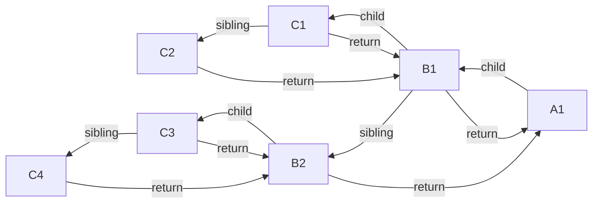
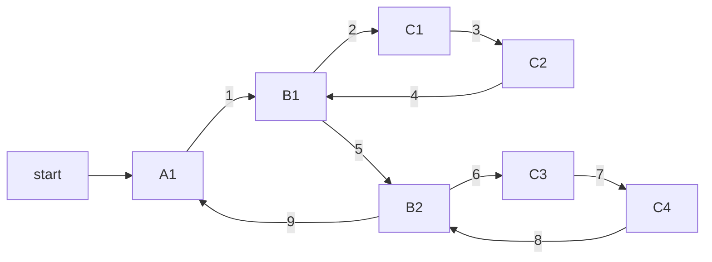
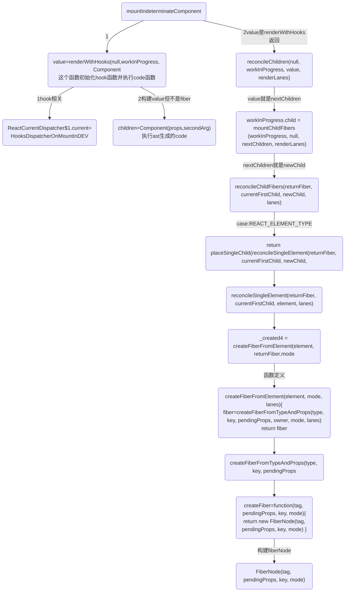
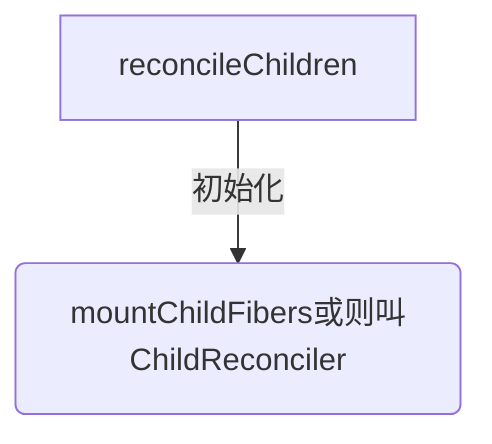

import Mermaid from '../../components/mermaid';
import CodeBlock from '../../components/codeBlock';
import HighlightText from '../HighlightText';
import { reactRenderCommit18 } from '../reactTestCode';
import CodePannel from '../CodePannel';
import ImageRender from '../ImageRender';

# render阶段-mountIndeterminateComponent构建fiber树

# A.render阶段
render阶段的执行是一个深度优先遍历的过程，它有两个核心函数，beginWork和completeUnitOfWork,

>参考：图的两种遍历:structure-algorithm/图-深度优先遍历-广度优先遍历/图的两种遍历

<HighlightText>
render阶段是在内存中构建一棵新的fiber树（称为workInProgress树）,构建过程是依照现有fiber树（current树）从root开始深度优先遍历再回溯到root的过程，`这个过程中每个fiber节点都会经历两个阶段：beginWork和completeWork。`
</HighlightText>

### A-0.render前置工作: 第一次渲染中调用performConcurrentWorkOnRoot()
`调用 ReactDOMRoot.prototype.render() 开始render阶段`

18中初始化调用`performSyncWorkOnRoot()`或`performConcurrentWorkOnRoot()`的调用,这取决于本次更新是同步更新还是异步更新.
<CodeBlock>
```js
// performConcurrentWorkOnRoot 调用 renderRootSync -->workLoopSync
function performConcurrentWorkOnRoot(root, didTimeout) {
  var exitStatus = shouldTimeSlice ? renderRootConcurrent(root, lanes) : renderRootSync(root, lanes);
  return null;
}

// 第一次渲染走这个 renderRootSync --> renderRootSync -->workLoopSync
function renderRootSync(root, lanes) {
  do {
    try {
      console.log('renderRootSync--->', root);
      workLoopSync();
      break;
    } catch (thrownValue) {
      handleError(root, thrownValue);
    }
  } while (true);
}

function renderRootConcurrent(root, lanes) {
do {
  try {
    workLoopConcurrent();
    break;
  } catch (thrownValue) {
    handleError(root, thrownValue);
  }
} while (true);
}
```
</CodeBlock>

<HighlightText>
第2步.渲染:workLoopSync()-->performUnitOfWork()
</HighlightText>
workLoopConcurrent()和workLoopSync()区别: 它们唯一的区别是是否调用shouldYield。如果当前浏览器帧没有剩余时间，shouldYield会中止循环，直到浏览器有空闲时间后再继续遍历。

<HighlightText>
workInProgress 代表当前已创建的 workInProgress fiber。
</HighlightText>

<CodeBlock>
```js
function workLoopConcurrent() {
  // Perform work until Scheduler asks us to yield
  while (workInProgress !== null && !shouldYield()) {
    performUnitOfWork(workInProgress);
  }
}

// 第一次渲染走这个
function workLoopSync() {
  // Already timed out, so perform work without checking if we need to yield.
  while (workInProgress !== null) {
    performUnitOfWork(workInProgress);
  }
}
```
</CodeBlock>

## 继续看看beginWork中是如何判断下一个工作单元的。
<CodeBlock>
```js
function performUnitOfWork(unitOfWork) {

  workInProgressNums = workInProgressNums + 1
  // The current, flushed, state of this fiber is the alternate. Ideally
  // nothing should rely on this, but relying on it here means that we don't
  // need an additional field on the work in progress.
  var current = unitOfWork.alternate;
  setCurrentFiber(unitOfWork);
  var next;

  if ((unitOfWork.mode & ProfileMode) !== NoMode) {
    startProfilerTimer(unitOfWork);
    //对当前节点进行协调，如果存在子节点，则返回子节点的引用
    next = beginWork$1(current, unitOfWork, subtreeRenderLanes);
    stopProfilerTimerIfRunningAndRecordDelta(unitOfWork, true);
  } else {
    next = beginWork$1(current, unitOfWork, subtreeRenderLanes);
  }

  resetCurrentFiber();
  unitOfWork.memoizedProps = unitOfWork.pendingProps;

  //如果无子节点，则代表当前的child链表已经遍历完
  if (next === null) {
    // If this doesn't spawn new work, complete the current work.
    //此函数内部会帮我们找到下一个可执行的节点
    console.log(`%c=无子节点，则代表当前的child链表已经遍历完,开启子组件链completeUnitOfWork`, 'color:black', { type: unitOfWork.type });
    completeUnitOfWork(unitOfWork);
  } else {
    workInProgress = next;
  }

  ReactCurrentOwner$2.current = null;
}

function getFiberName(unitOfWork) {
  if (unitOfWork === null) return null

  if (typeof unitOfWork.type === 'function') {
    var re = /function\s*(\w*)/i;
    var matches = re.exec(unitOfWork.type);
    // console.log('%c=getFiberName:', 'color:green', matches[1])
    return 'function ' + matches[1]
  } else {
    // console.log('%c=getFiberName:', 'color:green', unitOfWork.type)
    return unitOfWork.type
  }
}

function completeUnitOfWork(unitOfWork) {
  // Attempt to complete the current unit of work, then move to the next
  // sibling. If there are no more siblings, return to the parent fiber.
  var completedWork = unitOfWork;

  do {
    // The current, flushed, state of this fiber is the alternate. Ideally
    // nothing should rely on this, but relying on it here means that we don't
    // need an additional field on the work in progress.
    var current = completedWork.alternate;
    var returnFiber = completedWork.return; // Check if the work completed or if something threw.

    if ((completedWork.flags & Incomplete) === NoFlags) {
      setCurrentFiber(completedWork);
      var next = void 0;

      if ((completedWork.mode & ProfileMode) === NoMode) {
        // console.log(`%c=开始completeWork-1-${completedWork.type}`, 'color:black')
        console.log(`%c=开始completeWork-1-`, 'color:black', { getFiberName: getFiberName(completedWork) })
        next = completeWork(current, completedWork, subtreeRenderLanes);
      } else {
        console.log(`%c=开始completeWork-2`, 'color:black')
        startProfilerTimer(completedWork);
        next = completeWork(current, completedWork, subtreeRenderLanes); // Update render duration assuming we didn't error.

        stopProfilerTimerIfRunningAndRecordDelta(completedWork, false);
      }

      resetCurrentFiber();

      if (next !== null) {
        // Completing this fiber spawned new work. Work on that next.
        workInProgress = next;
        return;
      }
    } else {
      // This fiber did not complete because something threw. Pop values off
      // the stack without entering the complete phase. If this is a boundary,
      // capture values if possible.
      var _next = unwindWork(current, completedWork); // Because this fiber did not complete, don't reset its lanes.

      if (_next !== null) {
        // If completing this work spawned new work, do that next. We'll come
        // back here again.
        // Since we're restarting, remove anything that is not a host effect
        // from the effect tag.
        _next.flags &= HostEffectMask;
        workInProgress = _next;
        return;
      }

      if ((completedWork.mode & ProfileMode) !== NoMode) {
        // Record the render duration for the fiber that errored.
        stopProfilerTimerIfRunningAndRecordDelta(completedWork, false); // Include the time spent working on failed children before continuing.

        var actualDuration = completedWork.actualDuration;
        var child = completedWork.child;

        while (child !== null) {
          actualDuration += child.actualDuration;
          child = child.sibling;
        }

        completedWork.actualDuration = actualDuration;
      }

      if (returnFiber !== null) {
        // Mark the parent fiber as incomplete and clear its subtree flags.
        returnFiber.flags |= Incomplete;
        returnFiber.subtreeFlags = NoFlags;
        returnFiber.deletions = null;
      } else {
        // We've unwound all the way to the root.
        workInProgressRootExitStatus = RootDidNotComplete;
        workInProgress = null;
        return;
      }
    }

    //查看当前节点是否存在兄弟节点
    var siblingFiber = completedWork.sibling;

    if (siblingFiber !== null) {
      // If there is more work to do in this returnFiber, do that next.
      // 若存在，便把siblingFiber节点作为下一个工作单元，
      // 继续执行performUnitOfWork，执行当前节点并尝试遍历当前节点所在的child链表
      console.log(`%c=completeUnitOfWork--getFiberName:${getFiberName(completedWork)}存在兄弟节点,把siblingFiber:${getFiberName(siblingFiber)}节点作为下一个工作单元`, 'color:grey')
      console.log(`%c=siblingFiber:`, 'color:grey', siblingFiber)
      workInProgress = siblingFiber;
      return;
    } // Otherwise, return to the parent

    console.log(`%c=completeUnitOfWork-getFiberName:${getFiberName(completedWork)}不存在兄弟节点,则回溯到父节点:returnFiber:${getFiberName(returnFiber)},尝试查找父节点的兄弟节点`, 'color:grey')
    console.log(`%c=returnFiber:`, 'color:grey', { returnFiber })
    // 如果不存在兄弟节点，则回溯到父节点，尝试查找父节点的兄弟节点
    completedWork = returnFiber; // Update the next thing we're working on in case something throws.
    workInProgress = completedWork;
  } while (completedWork !== null); // We've reached the root.


  if (workInProgressRootExitStatus === RootInProgress) {
    workInProgressRootExitStatus = RootCompleted;
  }
}
```
</CodeBlock>

### A-0.第1步:接上面:performUnitOfWork()-->beginWork()
`performUnitOfWork()`将触发对 beginWork 的调用，进而实现对新 Fiber 节点的创建。
若 beginWork 所创建的 Fiber 节点不为空，则 performUniOfWork 会用这个新的 Fiber 节点来更新 workInProgress 的值，为下一次循环做准备。

通过循环调用`performUnitOfWork()`来触发 beginWork，新的 Fiber 节点就会被不断地创建。当 workInProgress 终于为空时，说明没有新的节点可以创建了，也就意味着已经完成对整棵 Fiber 树的构建。
```
performUnitOfWork 作用创建下一个 Fiber 节点，并赋值给workInProgress，同时把 workInProgress 与已创建的 Fiber 节点连接起来构成 Fiber 树。
```

react把每个fiber当成生成fiber最小单元,只要迭代所有fiber则到顶级Fiber时整颗FiberTree便生成了。
<CodeBlock>
```js
// performConcurrentWorkOnRoot会调用该方法
function workLoopConcurrent() {
  while (workInProgress !== null && !shouldYield()) {
    performUnitOfWork(workInProgress)
  }
}

// performSyncWorkOnRoot 会调用该方法,react 18 初始化调用这个
function workLoopSync() {
  while (workInProgress !== null) {
    performUnitOfWork(workInProgress)
  }
}
/*
它们唯一的区别是是否调用shouldYield。如果当前浏览器帧没有剩余时间，shouldYield会中止循环，直到浏览器有空闲时间后再继续遍历。

workInProgress代表当前已创建的 workInProgress fiber。
* */

function performUnitOfWork(unitOfWork) {
  workInProgressNums = workInProgressNums + 1
  // The current, flushed, state of this fiber is the alternate. Ideally
  // nothing should rely on this, but relying on it here means that we don't
  // need an additional field on the work in progress.
  var current = unitOfWork.alternate;
  setCurrentFiber(unitOfWork);
  var next;

  if ((unitOfWork.mode & ProfileMode) !== NoMode) {
    startProfilerTimer(unitOfWork);
    //对当前节点进行协调，如果存在子节点，则返回子节点的引用
    next = beginWork$1(current, unitOfWork, subtreeRenderLanes);
    stopProfilerTimerIfRunningAndRecordDelta(unitOfWork, true);
  } else {
    next = beginWork$1(current, unitOfWork, subtreeRenderLanes);
  }

  resetCurrentFiber();
  unitOfWork.memoizedProps = unitOfWork.pendingProps;

  //如果无子节点，则代表当前的child链表已经遍历完
  if (next === null) {
    // If this doesn't spawn new work, complete the current work.
    //此函数内部会帮我们找到下一个可执行的节点
    completeUnitOfWork(unitOfWork);
  } else {
    workInProgress = next;
  }

  ReactCurrentOwner$2.current = null;
}
```
</CodeBlock>

### A-1.beginWork阶段:将ast树转换为fiber 树
这些Fiber节点会被标记成带有'Placement'的副作用，说明它们是新增的节点，需要被插入到真实节点中了
* 执行部分生命周期和render，得到最新的 children
* 向下遍历调和 children ，复用 oldFiber
* 打不同的副作用标签effectTag，比如类组件的生命周期，或者元素的增加，删除，更新。

### A-2.beginWork-->completeUnitOfWork
**传入当前 Fiber 节点，创建子 Fiber 节点,**
beginWork的主要功能就是处理当前遍历到的fiber，经过一番处理之后返回它的子fiber，那么workInProgress树也就会被一点一点地构建出来;

首先从rootFiber开始向下深度优先遍历。为遍历到的每个Fiber节点调用beginWork方法。
* current：当前组件对应的 Fiber 节点在上一次更新时的 Fiber 节点，即 workInProgress.alternate；
* workInProgress：当前组件对应的 Fiber 节点；
* renderLanes：优先级相关，在讲解Scheduler时再讲解。

1. 从顶点开始遍历
2. 如果有子节点，先遍历子节点；
3. 如果没有子节点，则看有没有兄弟节点，有则遍历兄弟节点，并把effect向上归并
4. 如果没有兄弟节点，则看有没有父兄弟节点，有则遍历父兄弟节点
5. 如果没有都没有了，那么遍历结束

在遍历的过程中，会对每个遍历到的节点执行beginWork创建子fiber节点。若当前节点不存在子节点（next === null），则对其执行completeUnitOfWork。

**completeUnitOfWork方法内部会判断当前节点有无兄弟节点，有则进入兄弟节点的beginWork流程，否则进入父节点的completeUnitOfWork流程**
```
当beginWork返回值为空时，代表在遍历父->子链表的过程中发现当前链表已经无下一个节点了
（也就是已遍历完当前父->子链表），此时会进入到completeUnitOfWork函数。
```

**RootFiber结构遍历例子**
<Mermaid>

</Mermaid>

遍历过程:
<Mermaid>

</Mermaid>

### A-3.completeWork阶段:生成实例
completeUnitOfWork 的流程是自下向上的
* 1.将effectTag 的 Fiber 节点保存到 effectList 的单向链表中。 在 commit 阶段，将不再需要遍历每一个 fiber ，只需要执行更新 effectList 就可以了。
* 2.处理组件的context，初始化元素标签，生成真实DOM，处理props，等

正在构建Fiber树叫workInProgress Fiber，这两颗树的节点通过alternate相连.

真实dom对应在内存中的Fiber节点形成Fiber树，这颗Fiber树在react中叫current Fiber

组件的状态计算、diff的操作:通过 Diff 算法找出所有节点变更，例如节点新增、删除、属性变更等等, 获得需要更新的节点信息，以及render函数的执行，发生在beginWork阶段

effect链表的收集、被跳过的优先级的收集，发生在completeWork阶段。

render/reconciliation 协调阶段(可中断/异步)：

render 阶段：纯净且没有副作用，可能会被 React 暂停、终止或重新启动。

在 render 阶段，React 主要是在内存中做计算，明确 DOM 树的更新点；而 commit 阶段，则负责把 render 阶段生成的更新真正地执行掉。

在 render 阶段，一个庞大的更新任务被分解为了一个个的工作单元，这些工作单元有着不同的优先级，React 可以根据优先级的高低去实现工作单元的打断和恢复。

### A-4.update时
首次渲染， workInProgress fiber tree中除了根节点之外，所有节点的alternate都为空。所以在mount时，除了根节点fiberRootNode之外，其余节点调用beginWork时参数current等于null。

update时，workInProgress fiber tree所有节点都存在上一次更新时的fiber节点，所以current !== null。

当current和workInProgress满足一定条件时,可以复用current节点的子节点的作为workInProgress的子节点，
反之则需要进入对比（diff）的流程，根据比对的结果创建workInProgress的子节点。

beginWork在创建fiber节点的过程中中会依赖一个didReceiveUpdate变量来标识当前的current是否有更新。
在满足下面的几种情况时，didReceiveUpdate === false：
* 1.未使用forceUpdate，且oldProps === newProps && workInProgress.type === current.type && ！hasLegacyContextChanged() ，即props、fiber.type和context都未发生变化
* 2.未使用forceUpdate，且!includesSomeLane(renderLanes, updateLanes)，即当前fiber节点优先级低于当前更新的优先级
<CodeBlock>
```js
const updateLanes = workInProgress.lanes;
if (current !== null) {
  //update时
  const oldProps = current.memoizedProps;
  const newProps = workInProgress.pendingProps;
  if (
    oldProps !== newProps ||
    hasLegacyContextChanged() ||
    (__DEV__ ? workInProgress.type !== current.type : false)
  ) {
    didReceiveUpdate = true;
  } else if (!includesSomeLane(renderLanes, updateLanes)) {
    // 本次的渲染优先级renderLanes不包含fiber.lanes, 表明当前fiber节点优先级低于本次的渲染优先级，不需渲染
    didReceiveUpdate = false;
    //...
    // 虽然当前节点不需要更新，但需要使用bailoutOnAlreadyFinishedWork循环检测子节点是否需要更新
    return bailoutOnAlreadyFinishedWork(current, workInProgress, renderLanes);
  } else {
    if ((current.effectTag & ForceUpdateForLegacySuspense) !== NoEffect) {
      // forceUpdate产生的更新，需要强制渲染
      didReceiveUpdate = true;
    } else {
      didReceiveUpdate = false;
    }
  }
} else {
  //mount时
  //...
}
```
</CodeBlock>

## B.beginWork前置工作
### B-1.beginWork之前workInProgress根节点构建
<CodeBlock>
```js
function createWorkInProgress(current, pendingProps) {
  var workInProgress = current.alternate;
  // 区分是在mount时还是在update时
  if (workInProgress === null) {
    // We use a double buffering pooling technique because we know that we'll
    // only ever need at most two versions of a tree. We pool the "other" unused
    // node that we're free to reuse. This is lazily created to avoid allocating
    // extra objects for things that are never updated. It also allow us to
    // reclaim the extra memory if needed.
    console.log('==createWorkInProgress-->,没有就创建一个')
    workInProgress = createFiber(current.tag, pendingProps, current.key, current.mode);
    console.log('==createWorkInProgress-->,没有就创建一个返回值', workInProgress)
    debugger
    workInProgress.elementType = current.elementType;
    workInProgress.type = current.type;
    workInProgress.stateNode = current.stateNode;

    {
      // DEV-only fields
      workInProgress._debugSource = current._debugSource;
      workInProgress._debugOwner = current._debugOwner;
      workInProgress._debugHookTypes = current._debugHookTypes;
    }
    console.log('==createWorkInProgress-->,workInProgress.alternate指定为current')
    workInProgress.alternate = current;
    current.alternate = workInProgress;
  } else {
    // 复用属性
    workInProgress.pendingProps = pendingProps; // Needed because Blocks store data on type.

    workInProgress.type = current.type; // We already have an alternate.
    // Reset the effect tag.

    workInProgress.flags = NoFlags; // The effects are no longer valid.

    workInProgress.subtreeFlags = NoFlags;
    workInProgress.deletions = null;

    {
      // We intentionally reset, rather than copy, actualDuration & actualStartTime.
      // This prevents time from endlessly accumulating in new commits.
      // This has the downside of resetting values for different priority renders,
      // But works for yielding (the common case) and should support resuming.
      workInProgress.actualDuration = 0;
      workInProgress.actualStartTime = -1;
    }
  } // Reset all effects except static ones.
  // Static effects are not specific to a render.


  workInProgress.flags = current.flags & StaticMask;
  // 复用属性
  workInProgress.childLanes = current.childLanes;
  workInProgress.lanes = current.lanes;
  workInProgress.child = current.child;
  workInProgress.memoizedProps = current.memoizedProps;
  workInProgress.memoizedState = current.memoizedState;
  workInProgress.updateQueue = current.updateQueue; // Clone the dependencies object. This is mutated during the render phase, so
  // it cannot be shared with the current fiber.

  var currentDependencies = current.dependencies;
  workInProgress.dependencies = currentDependencies === null ? null : {
    lanes: currentDependencies.lanes,
    firstContext: currentDependencies.firstContext
  }; // These will be overridden during the parent's reconciliation

  workInProgress.sibling = current.sibling;
  workInProgress.index = current.index;
  workInProgress.ref = current.ref;

  {
    workInProgress.selfBaseDuration = current.selfBaseDuration;
    workInProgress.treeBaseDuration = current.treeBaseDuration;
  }

  {
    workInProgress._debugNeedsRemount = current._debugNeedsRemount;

    switch (workInProgress.tag) {
      case IndeterminateComponent:
      case FunctionComponent:
      case SimpleMemoComponent:
        workInProgress.type = resolveFunctionForHotReloading(current.type);
        break;

      case ClassComponent:
        workInProgress.type = resolveClassForHotReloading(current.type);
        break;

      case ForwardRef:
        workInProgress.type = resolveForwardRefForHotReloading(current.type);
        break;
    }
  }

  return workInProgress;
}
```
</CodeBlock>

### B-2.为workInProgress赋值-renderRootSync-->prepareFreshStack
<CodeBlock>
```js
function renderRootSync(root, lanes) {
  var prevExecutionContext = executionContext;
  executionContext |= RenderContext;
  var prevDispatcher = pushDispatcher(); // If the root or lanes have changed, throw out the existing stack
  // and prepare a fresh one. Otherwise we'll continue where we left off.

  if (workInProgressRoot !== root || workInProgressRootRenderLanes !== lanes) {
    {
      if (isDevToolsPresent) {
        var memoizedUpdaters = root.memoizedUpdaters;

        if (memoizedUpdaters.size > 0) {
          restorePendingUpdaters(root, workInProgressRootRenderLanes);
          memoizedUpdaters.clear();
        } // At this point, move Fibers that scheduled the upcoming work from the Map to the Set.
        // If we bailout on this work, we'll move them back (like above).
        // It's important to move them now in case the work spawns more work at the same priority with different updaters.
        // That way we can keep the current update and future updates separate.


        movePendingFibersToMemoized(root, lanes);
      }

    }

    workInProgressTransitions = getTransitionsForLanes();

    console.log('workInProgress', workInProgress, root)
    debugger
    console.log('render调用 prepareFreshStack前',workInProgress)
    prepareFreshStack(root, lanes);
    console.log('workInProgress', workInProgress, root)
    console.log('render调用 prepareFreshStack后',workInProgress)
  }
  // 省略
}

function prepareFreshStack(root, lanes) {
  root.finishedWork = null;
  root.finishedLanes = NoLanes;
  var timeoutHandle = root.timeoutHandle;

  if (timeoutHandle !== noTimeout) {
    // The root previous suspended and scheduled a timeout to commit a fallback
    // state. Now that we have additional work, cancel the timeout.
    root.timeoutHandle = noTimeout; // $FlowFixMe Complains noTimeout is not a TimeoutID, despite the check above

    cancelTimeout(timeoutHandle);
  }

  if (workInProgress !== null) {
    var interruptedWork = workInProgress.return;

    while (interruptedWork !== null) {
      var current = interruptedWork.alternate;
      unwindInterruptedWork(current, interruptedWork);
      interruptedWork = interruptedWork.return;
    }
  }

  console.log('=render阶段:prepareFreshStack=处理workInProgressRoot:workInProgressRoot = root')
  workInProgressRoot = root;
  var rootWorkInProgress = createWorkInProgress(root.current, null);
  workInProgress = rootWorkInProgress;
  workInProgressRootRenderLanes = subtreeRenderLanes = workInProgressRootIncludedLanes = lanes;
  workInProgressRootExitStatus = RootInProgress;
  workInProgressRootFatalError = null;
  workInProgressRootSkippedLanes = NoLanes;
  workInProgressRootInterleavedUpdatedLanes = NoLanes;
  workInProgressRootPingedLanes = NoLanes;
  workInProgressRootConcurrentErrors = null;
  workInProgressRootRecoverableErrors = null;
  enqueueInterleavedUpdates();

  {
    ReactStrictModeWarnings.discardPendingWarnings();
  }

  return rootWorkInProgress;
}
```
</CodeBlock>

## C.第一次beginWork调用updateHostRoot进行初始化:updateHostRoot
updateHostRoot-->reconcileChildren(current, workInProgress, nextChildren, renderLanes)-->reconcileChildren
<CodeBlock>
```js
  function beginWork(current, workInProgress, renderLanes) {
    console.log('workInProgress', workInProgress, root)
    debugger
    workInProgress.lanes = NoLanes;
    console.log('%c=beginWork()===start1-初始化', 'color:magenta', { getFiberName: getFiberName(workInProgress), current, renderLanes, workInProgress })
    switch (workInProgress.tag) {
      case IndeterminateComponent:
        {
          console.log('%c=beginWork()==end 2 mountIndeterminateComponent', 'color:magenta', workInProgress)
          console.log(`%c=探究初始和hook=调用mountIndeterminateComponent`, 'color:blueviolet', workInProgress.type)
          return mountIndeterminateComponent(current, workInProgress, workInProgress.type, renderLanes);
      }
      case HostRoot:
        console.log('%c=beginWork()=end 6第一次会走这里初始化workInProgress', 'color:magenta')
        console.log('%c=beginWork()=end 6 updateHostRoot', 'color:magenta')
        return updateHostRoot(current, workInProgress, renderLanes);
    }
  }
```
</CodeBlock>

### C-1.首次case进入HostRoot 更新updateHostRoot：
<CodeBlock>
```js
function updateHostRoot(current, workInProgress, renderLanes) {
  pushHostRootContext(workInProgress);

  if (current === null) {
    throw new Error('Should have a current fiber. This is a bug in React.');
  }

  var nextProps = workInProgress.pendingProps;
  var prevState = workInProgress.memoizedState;
  var prevChildren = prevState.element;
  cloneUpdateQueue(current, workInProgress);
  processUpdateQueue(workInProgress, nextProps, null, renderLanes);
  var nextState = workInProgress.memoizedState;
  var root = workInProgress.stateNode;
  // being called "element".


  var nextChildren = nextState.element;

  if (prevState.isDehydrated) {
  } else {
      // Root is not dehydrated. Either this is a client-only root, or it
      // already hydrated.
      resetHydrationState();

      if (nextChildren === prevChildren) {
        return bailoutOnAlreadyFinishedWork(current, workInProgress, renderLanes);
      }

      console.log('=reconcileChildren 9')
      debugger
      reconcileChildren(current, workInProgress, nextChildren, renderLanes);
      console.log('%c=updateHostRoot:构建之后workInProgress.child', 'color:black', { child })
  }
  console.log('%c=updateHostRoot:最后返回workInProgress.child', 'color:black', workInProgress.child)

  return workInProgress.child;
}

function reconcileChildren(current, workInProgress, nextChildren, renderLanes) {
  if (current === null) {
    // If this is a fresh new component that hasn't been rendered yet, we
    // won't update its child set by applying minimal side-effects. Instead,
    // we will add them all to the child before it gets rendered. That means
    // we can optimize this reconciliation pass by not tracking side-effects.
    console.log('%c=reconcileChildren mount', 'blueviolet');
    workInProgress.child = mountChildFibers(workInProgress, null, nextChildren, renderLanes);
    console.log('%c=reconcileChildren mount 返回值workInProgress.child', 'blueviolet', workInProgress.child);
  } else {
    // If the current child is the same as the work in progress, it means that
    // we haven't yet started any work on these children. Therefore, we use
    // the clone algorithm to create a copy of all the current children.
    // If we had any progressed work already, that is invalid at this point so
    // let's throw it out.
    console.log('%c=reconcileChildren update', 'yellow');
    workInProgress.child = reconcileChildFibers(workInProgress, current.child, nextChildren, renderLanes);
  }
}
```
</CodeBlock>

### C-2.很长的函数-ChildReconciler定义了reconcileChildFibers等很多函数
Reconciler模块的核心部分
* 对于 mount 的组件，他会创建新的子 Fiber 节点；
* 对于 update 的组件，他会将当前组件与该组件在上次更新时对应的 Fiber 节点比较-Diff算法，将比较的结果生成新 Fiber 节点。

不论走哪个逻辑，最终他会生成新的子 Fiber 节点并赋值给workInProgress.child，作为本次 beginWork 返回值，并作为下次performUnitOfWork执行时workInProgress的传参。

mountChildFibers与reconcileChildFibers这两个方法的逻辑基本一致。唯一的区别是：reconcileChildFibers 会为生成的 Fiber 节点带上effectTag属性，而 mountChildFibers 不会。
<CodeBlock>
```js
var mountChildFibers = ChildReconciler(false);
// 这个代码很长 1k,定义很多函数reconcileChildFibers()是其中一个
function ChildReconciler(shouldTrackSideEffects) {
  // 省略很多函数
  function reconcileChildFibers(returnFiber, currentFirstChild, newChild, lanes) {
    // This function is not recursive.
    // If the top level item is an array, we treat it as a set of children,
    // not as a fragment. Nested arrays on the other hand will be treated as
    // fragment nodes. Recursion happens at the normal flow.
    // Handle top level unkeyed fragments as if they were arrays.
    // This leads to an ambiguity between <>{[...]}</> and <>...</>.
    // We treat the ambiguous cases above the same.
    var isUnkeyedTopLevelFragment = typeof newChild === 'object' && newChild !== null && newChild.type === REACT_FRAGMENT_TYPE && newChild.key === null;

    // debugger
    console.log('%c=reconcileChildFibers A', 'blueviolet');

    if (isUnkeyedTopLevelFragment) {
      newChild = newChild.props.children;
    } // Handle object types


    if (typeof newChild === 'object' && newChild !== null) {
      switch (newChild.$$typeof) {
        case REACT_ELEMENT_TYPE:
          return placeSingleChild(reconcileSingleElement(returnFiber, currentFirstChild, newChild, lanes));

        case REACT_PORTAL_TYPE:
          return placeSingleChild(reconcileSinglePortal(returnFiber, currentFirstChild, newChild, lanes));

        case REACT_LAZY_TYPE:
          var payload = newChild._payload;
          var init = newChild._init; // TODO: This function is supposed to be non-recursive.

          return reconcileChildFibers(returnFiber, currentFirstChild, init(payload), lanes);
      }

      if (isArray(newChild)) {
        return reconcileChildrenArray(returnFiber, currentFirstChild, newChild, lanes);
      }

      if (getIteratorFn(newChild)) {
        return reconcileChildrenIterator(returnFiber, currentFirstChild, newChild, lanes);
      }

      throwOnInvalidObjectType(returnFiber, newChild);
    }

    if (typeof newChild === 'string' && newChild !== '' || typeof newChild === 'number') {
      return placeSingleChild(reconcileSingleTextNode(returnFiber, currentFirstChild, '' + newChild, lanes));
    }

    {
      if (typeof newChild === 'function') {
        warnOnFunctionType(returnFiber);
      }
    } // Remaining cases are all treated as empty.


    return deleteRemainingChildren(returnFiber, currentFirstChild);
  }

  return reconcileChildFibers;
}
```
</CodeBlock>

## D.第二次beginWork-case:mountIndeterminateComponent执行code()
执行完code()此时的workInProgress.type 才有值;

第二次beginWork进入case IndeterminateComponent 执行 mountIndeterminateComponent(),可见深度遍历从父级组件开始

首先要注意的是，虽然 App 是一个 FunctionComponent，但是在 first paint 的时候，React 判断其为 IndeterminateComponent

对于 FunctionComponent，在第一次识别的时候会被认为是 IndeterminateComponent
<CodeBlock>
```js
switch (workInProgress.tag) {
  case IndeterminateComponent:
    {
      console.log('%c=beginWork()==end 2 mountIndeterminateComponent', 'color:magenta')
      console.log(`%c=探究初始和hook=调用mountIndeterminateComponent`, 'color:blueviolet')
      return mountIndeterminateComponent(current, workInProgress, workInProgress.type, renderLanes);
    }
  }
```
</CodeBlock>

### D-1.重点-code函数初始化在mountIndeterminateComponent()调用renderWithHooks()和reconcileChildren()
* 1.重点1:mountIndeterminateComponent()函数
    * 调用  renderWithHooks 生成 value
    * 执行 reconcileChildren(null, workInProgress, value, renderLanes) 参数value
>关键的函数 renderWithHooks；而在 renderWithHooks 中，我们会根据组件处于不同的状态，给 ReactCurrentDispatcher.current 挂载不同的 dispatcher 。而在first paint 时，挂载的是HooksDispatcherOnMountInDEV
>HooksDispatcherOnMountInDEV 里就是组件 first paint 的时候所用到的各种 hooks
* 2.重点2,执行reconcileChildren()并传入value,就是code()返回的树结构
<CodeBlock>
```js
function mountIndeterminateComponent(_current, workInProgress, Component, renderLanes) {
  if (_current !== null) {
    // An indeterminate component only mounts if it suspended inside a non-
    // concurrent tree, in an inconsistent state. We want to treat it like
    // a new mount, even though an empty version of it already committed.
    // Disconnect the alternate pointers.
    _current.alternate = null;
    workInProgress.alternate = null; // Since this is conceptually a new fiber, schedule a Placement effect

    workInProgress.flags |= Placement;
  }

  var props = workInProgress.pendingProps;
  var context;

  {
    var unmaskedContext = getUnmaskedContext(workInProgress, Component, false);
    context = getMaskedContext(workInProgress, unmaskedContext);
  }

  prepareToReadContext(workInProgress, renderLanes);
  var value;
  var hasId;

  {
    markComponentRenderStarted(workInProgress);
  }

  {
    if (Component.prototype && typeof Component.prototype.render === 'function') {
    // 省略
    // debugger
    console.log(`%c=探究初始和hook=mountIndeterminateComponent调用renderWithHooks 1`, 'color:blueviolet', { workInProgress, Component, props, context, renderLanes })
    value = renderWithHooks(null, workInProgress, Component, props, context, renderLanes);
    console.log(`%c=探究初始和hook=mountIndeterminateComponent调用renderWithHooks 返回值`, 'color:blueviolet', { value })
    hasId = checkDidRenderIdHook();
    setIsRendering(false);
  }

  // 省略

  if ( // Run these checks in production only if the flag is off.
    // Eventually we'll delete this branch altogether.
    typeof value === 'object' && value !== null && typeof value.render === 'function' && value.$$typeof === undefined) {
      // 省略
  } else {
    // Proceed under the assumption that this is a function component
    workInProgress.tag = FunctionComponent;

    {

      if (workInProgress.mode & StrictLegacyMode) {
        setIsStrictModeForDevtools(true);

        try {
          console.log(`%c=探究初始和hook=mountIndeterminateComponent调用renderWithHooks 2`, 'color:blueviolet')
          value = renderWithHooks(null, workInProgress, Component, props, context, renderLanes);
          hasId = checkDidRenderIdHook();
        } finally {
          setIsStrictModeForDevtools(false);
        }
      }
    }

    if (getIsHydrating() && hasId) {
      pushMaterializedTreeId(workInProgress);
    }


    // debugger
    console.log('%c=reconcileChildren 12:重点，mountIndeterminateComponent调用reconcileChildren', 'color:red')
    reconcileChildren(null, workInProgress, value, renderLanes);

    {
      validateFunctionComponentInDev(workInProgress, Component);
    }

    return workInProgress.child;
  }
}
```
</CodeBlock>

### D-2.renderWithHooks 执行code()
<CodeBlock>
```js
function renderWithHooks(current, workInProgress, Component, props, secondArg, nextRenderLanes) {
    // 省略：
    console.log(`%c=探究初始和hook=renderWithHooks重点，调用函数组件，里面执行各种 React Hook==start并返回 ReactElement`, 'color:blueviolet', Component)
    var children = Component(props, secondArg); // Check if there was a render phase update
    console.log(`%c=探究初始和hook=renderWithHooks重点,返回 ReactElement==end`, 'color:blueviolet', { children })
    // 省略：
    return children;
}

function renderWithHooks(current, workInProgress, Component, props, secondArg, nextRenderLanes) {
    // 省略：
    console.log(`%c=探究初始和hook=renderWithHooks重点，调用函数组件，里面执行各种 React Hook==start并返回 ReactElement`, 'color:blueviolet', Component)
    var children = Component(props, secondArg); // Check if there was a render phase update
    console.log(`%c=探究初始和hook=renderWithHooks重点,返回 ReactElement==end`, 'color:blueviolet', { children })
    // 省略：
    return children;
}
```

code()函数和React.createElement
```js
return React.createElement(
  'div',
  { id: 'div1', className: 'c1' },
  React.createElement(
    'button',
    { onClick: onClickText, className: 'btn' },
    'Hello world,Click me'
  ),
  React.createElement(
    'span',
    null,
    data
  ),
  showDiv && React.createElement(
    'div',
    null,
    '\u88AB\u4F60\u53D1\u73B0\u4E86'
  ),
  React.createElement(
    'div',
    { id: 'div2', className: 'c2' },
    React.createElement(
      'p',
      null,
      '\u6D4B\u8BD5\u5B50\u8282\u70B9'
    )
  )
);

function createElement(type, config, children) {
  // console.log('=development调用createElement构建Ast树:', { type, config, children })
  console.log('%c=development调用createElement-1:type', 'color:blueviolet', type, { config, children })
  var propName; // Reserved names are extracted

  var props = {};
  var key = null;
  var ref = null;
  var self = null;
  var source = null;

  if (config != null) {
  }
}
```
</CodeBlock>

## E.流程图-构建fiber树流程
只要返回的是一个对象且对象中有 render 方法，就认为是 ClassComponent，否则就是 FunctionComponent,从mountIndeterminateComponent开始,这里以函数组件为例:

接[render阶段总览:流程图的mountIndeterminateComponent函数](./render阶段总览)
<Mermaid>

</Mermaid>

## F.reconcileChildren 重点函数
<CodeBlock>
```js
function reconcileChildren(current, workInProgress, nextChildren, renderLanes) {
  if (current === null) {
    // If this is a fresh new component that hasn't been rendered yet, we
    // won't update its child set by applying minimal side-effects. Instead,
    // we will add them all to the child before it gets rendered. That means
    // we can optimize this reconciliation pass by not tracking side-effects.
    console.log('%c=reconcileChildren mount', 'blueviolet');
    // 对于 mount 的组件
    workInProgress.child = mountChildFibers(workInProgress, null, nextChildren, renderLanes);
    console.log('%c=reconcileChildren mount 返回值workInProgress.child', 'blueviolet', workInProgress.child);
  } else {
    // If the current child is the same as the work in progress, it means that
    // we haven't yet started any work on these children. Therefore, we use
    // the clone algorithm to create a copy of all the current children.
    // If we had any progressed work already, that is invalid at this point so
    // let's throw it out.
    console.log('%c=reconcileChildren update', 'yellow');
    // 对于 update 的组件
    workInProgress.child = reconcileChildFibers(workInProgress, current.child, nextChildren, renderLanes);
  }
}
```
</CodeBlock>

## F-1.上面的reconcileChildren 调用 reconcileChildFibers
<CodeBlock>
```js
function reconcileChildFibers(returnFiber, currentFirstChild, newChild, lanes) {
  // This function is not recursive.
  // If the top level item is an array, we treat it as a set of children,
  // not as a fragment. Nested arrays on the other hand will be treated as
  // fragment nodes. Recursion happens at the normal flow.
  // Handle top level unkeyed fragments as if they were arrays.
  // This leads to an ambiguity between <>{[...]}</> and <>...</>.
  // We treat the ambiguous cases above the same.
  var isUnkeyedTopLevelFragment = typeof newChild === 'object' && newChild !== null && newChild.type === REACT_FRAGMENT_TYPE && newChild.key === null;

  // debugger
  console.log('%c=reconcileChildFibers A', 'blueviolet');

  if (isUnkeyedTopLevelFragment) {
    newChild = newChild.props.children;
  } // Handle object types


  if (typeof newChild === 'object' && newChild !== null) {
    switch (newChild.$$typeof) {
      case REACT_ELEMENT_TYPE:
        return placeSingleChild(reconcileSingleElement(returnFiber, currentFirstChild, newChild, lanes));

      case REACT_PORTAL_TYPE:
        return placeSingleChild(reconcileSinglePortal(returnFiber, currentFirstChild, newChild, lanes));

      case REACT_LAZY_TYPE:
        var payload = newChild._payload;
        var init = newChild._init; // TODO: This function is supposed to be non-recursive.

        return reconcileChildFibers(returnFiber, currentFirstChild, init(payload), lanes);
    }

    if (isArray(newChild)) {
      return reconcileChildrenArray(returnFiber, currentFirstChild, newChild, lanes);
    }

    if (getIteratorFn(newChild)) {
      return reconcileChildrenIterator(returnFiber, currentFirstChild, newChild, lanes);
    }

    throwOnInvalidObjectType(returnFiber, newChild);
  }

  if (typeof newChild === 'string' && newChild !== '' || typeof newChild === 'number') {
    return placeSingleChild(reconcileSingleTextNode(returnFiber, currentFirstChild, '' + newChild, lanes));
  }

  {
    if (typeof newChild === 'function') {
      warnOnFunctionType(returnFiber);
    }
  } // Remaining cases are all treated as empty.


  return deleteRemainingChildren(returnFiber, currentFirstChild);
}
```
</CodeBlock>

### F-2.上面的reconcileChildFibers 调用 reconcileSingleElement
<CodeBlock>
```js
function reconcileSingleElement(returnFiber, currentFirstChild, element, lanes) {
  var key = element.key;
  var child = currentFirstChild;

  while (child !== null) {
    // 省略
  }

  if (element.type === REACT_FRAGMENT_TYPE) {
    var created = createFiberFromFragment(element.props.children, returnFiber.mode, lanes, element.key);
    created.return = returnFiber;
    return created;
  } else {
    console.log('%c=ChildReconciler 中调用 createFiberFromElement 2', 'color:yellow');
    var _created4 = createFiberFromElement(element, returnFiber.mode, lanes);

    _created4.ref = coerceRef(returnFiber, currentFirstChild, element);
    _created4.return = returnFiber;
    return _created4;
  }
}
```
</CodeBlock>

### F-3.上面reconcileSingleElement 调用 createFiberFromElement
<CodeBlock>
```js
  function createFiberFromElement(element, mode, lanes) {
    var owner = null;

    {
      owner = element._owner;
    }

    var type = element.type;
    var key = element.key;
    var pendingProps = element.props;
    console.log('%c=createFiberFromElement 调用 createFiberFromTypeAndProps-->return fiber：', 'color:yellow')
    var fiber = createFiberFromTypeAndProps(type, key, pendingProps, owner, mode, lanes);
    console.log('%c=return fiber：', 'color:yellow', { fiber })
    {
      fiber._debugSource = element._source;
      fiber._debugOwner = element._owner;
    }

    return fiber;
  }
```
</CodeBlock>

### F-4.上面createFiberFromElement 调用 createFiberFromTypeAndProps
<CodeBlock>
```js
function createFiberFromElement(element, mode, lanes) {
  var owner = null;

  {
    owner = element._owner;
  }

  var type = element.type;
  var key = element.key;
  var pendingProps = element.props;
  console.log('%c=createFiberFromElement 调用 createFiberFromTypeAndProps-->return fiber：', 'color:yellow')
  var fiber = createFiberFromTypeAndProps(type, key, pendingProps, owner, mode, lanes);
  console.log('%c=return fiber：', 'color:yellow', { fiber })
  {
    fiber._debugSource = element._source;
    fiber._debugOwner = element._owner;
  }

  return fiber;
}
```
</CodeBlock>

### F-5.上面的 createFiberFromElement 调用 createFiberFromTypeAndProps
<CodeBlock>
```js
function createFiberFromTypeAndProps(type, // React$ElementType
  key, pendingProps, owner, mode, lanes) {
  var fiberTag = IndeterminateComponent; // The resolved type is set if we know what the final type will be. I.e. it's not lazy.

  var resolvedType = type;

  if (typeof type === 'function') {
    if (shouldConstruct$1(type)) {
      fiberTag = ClassComponent;

      {
        resolvedType = resolveClassForHotReloading(resolvedType);
      }
    } else {
      {
        resolvedType = resolveFunctionForHotReloading(resolvedType);
      }
    }
  } else if (typeof type === 'string') {
    fiberTag = HostComponent;
  } else {
    getTag: switch (type) {
      case REACT_FRAGMENT_TYPE:
        return createFiberFromFragment(pendingProps.children, mode, lanes, key);

      case REACT_STRICT_MODE_TYPE:
        fiberTag = Mode;
        mode |= StrictLegacyMode;

        if ((mode & ConcurrentMode) !== NoMode) {
          // Strict effects should never run on legacy roots
          mode |= StrictEffectsMode;
        }

        break;

      case REACT_PROFILER_TYPE:
        return createFiberFromProfiler(pendingProps, mode, lanes, key);

      case REACT_SUSPENSE_TYPE:
        return createFiberFromSuspense(pendingProps, mode, lanes, key);

      case REACT_SUSPENSE_LIST_TYPE:
        return createFiberFromSuspenseList(pendingProps, mode, lanes, key);

      case REACT_OFFSCREEN_TYPE:
        return createFiberFromOffscreen(pendingProps, mode, lanes, key);

      case REACT_LEGACY_HIDDEN_TYPE:

      // eslint-disable-next-line no-fallthrough

      case REACT_SCOPE_TYPE:

      // eslint-disable-next-line no-fallthrough

      case REACT_CACHE_TYPE:

      // eslint-disable-next-line no-fallthrough

      case REACT_TRACING_MARKER_TYPE:

      // eslint-disable-next-line no-fallthrough

      case REACT_DEBUG_TRACING_MODE_TYPE:

      // eslint-disable-next-line no-fallthrough

      default:
        {
          if (typeof type === 'object' && type !== null) {
            switch (type.$$typeof) {
              case REACT_PROVIDER_TYPE:
                fiberTag = ContextProvider;
                break getTag;

              case REACT_CONTEXT_TYPE:
                // This is a consumer
                fiberTag = ContextConsumer;
                break getTag;

              case REACT_FORWARD_REF_TYPE:
                fiberTag = ForwardRef;

                {
                  resolvedType = resolveForwardRefForHotReloading(resolvedType);
                }

                break getTag;

              case REACT_MEMO_TYPE:
                fiberTag = MemoComponent;
                break getTag;

              case REACT_LAZY_TYPE:
                fiberTag = LazyComponent;
                resolvedType = null;
                break getTag;
            }
          }

          var info = '';

          {
            if (type === undefined || typeof type === 'object' && type !== null && Object.keys(type).length === 0) {
              info += ' You likely forgot to export your component from the file ' + "it's defined in, or you might have mixed up default and " + 'named imports.';
            }

            var ownerName = owner ? getComponentNameFromFiber(owner) : null;

            if (ownerName) {
              info += '\n\nCheck the render method of `' + ownerName + '`.';
            }
          }

          throw new Error('Element type is invalid: expected a string (for built-in ' + 'components) or a class/function (for composite components) ' + ("but got: " + (type == null ? type : typeof type) + "." + info));
        }
    }
  }

  console.log('%c=createFiberFromTypeAndProps 中调用 createFiber return：', 'color:yellow')
  var fiber = createFiber(fiberTag, pendingProps, key, mode);
  console.log(`%c=retrun fiber`, 'color:grey', { fiber })
  fiber.elementType = type;
  fiber.type = resolvedType;
  fiber.lanes = lanes;

  {
    fiber._debugOwner = owner;
  }

  return fiber;
}
```
</CodeBlock>

## G.上面的 createFiberFromTypeAndProps 调用 createFiber-->FiberNode

<CodePannel code={reactRenderCommit18} name='reactRenderCommit18' height='500px' language='html' />

<br/>

<ImageRender alt='主要测试实例-render-commit-18-fiber构建' path='/react/主要测试实例-render-commit-18-fiber构建.png' />

<CodeBlock>
```js
var createFiber = function (tag, pendingProps, key, mode) {
  // $FlowFixMe: the shapes are exact here but Flow doesn't like constructors
  var fiberNode = new FiberNode(tag, pendingProps, key, mode)
  console.log('%c=createFiber中调用 new FiberNode-FiberNode返回值:', 'color:grey', { fiberNode })
  return fiberNode;
};

function FiberNode(tag, pendingProps, key, mode) {
  console.log('%c=FiberNode,fiber的协调,最底部开始赋值===', 'color:yellow', { tag, ...pendingProps })
  // Instance
  this.tag = tag;
  this.key = key;
  this.elementType = null;
  this.type = null;
  this.stateNode = null; // Fiber

  this.return = null;
  this.child = null;
  this.sibling = null;
  this.index = 0;
  this.ref = null;
  this.pendingProps = pendingProps;
  this.memoizedProps = null;
  this.updateQueue = null;
  this.memoizedState = null;
  this.dependencies = null;
  this.mode = mode; // Effects

  this.flags = NoFlags;
  this.subtreeFlags = NoFlags;
  this.deletions = null;
  this.lanes = NoLanes;
  this.childLanes = NoLanes;
  this.alternate = null;

  {
    // Note: The following is done to avoid a v8 performance cliff.
    //
    // Initializing the fields below to smis and later updating them with
    // double values will cause Fibers to end up having separate shapes.
    // This behavior/bug has something to do with Object.preventExtension().
    // Fortunately this only impacts DEV builds.
    // Unfortunately it makes React unusably slow for some applications.
    // To work around this, initialize the fields below with doubles.
    //
    // Learn more about this here:
    // https://github.com/facebook/react/issues/14365
    // https://bugs.chromium.org/p/v8/issues/detail?id=8538
    this.actualDuration = Number.NaN;
    this.actualStartTime = Number.NaN;
    this.selfBaseDuration = Number.NaN;
    this.treeBaseDuration = Number.NaN; // It's okay to replace the initial doubles with smis after initialization.
    // This won't trigger the performance cliff mentioned above,
    // and it simplifies other profiler code (including DevTools).

    this.actualDuration = 0;
    this.actualStartTime = -1;
    this.selfBaseDuration = 0;
    this.treeBaseDuration = 0;
  }

  {
    // This isn't directly used but is handy for debugging internals:
    this._debugSource = null;
    this._debugOwner = null;
    this._debugNeedsRemount = false;
    this._debugHookTypes = null;

    if (!hasBadMapPolyfill && typeof Object.preventExtensions === 'function') {
      Object.preventExtensions(this);
    }
  }
}
```
</CodeBlock>

## 第三次-beginWork-此时构建 code() 生成的节点
<CodeBlock>
```js
      case HostComponent:
        console.log(`%c=beginWork()=end 7 updateHostComponent$1,即原生 DOM 组件对应的 Fiber节点:`, 'color:magenta', { type: workInProgress.type })
        return updateHostComponent$1(current, workInProgress, renderLanes);
```
</CodeBlock>

此时 workInProgress
```js
{
  actualDuration:0
  actualStartTime:-1
  alternate:null
  child:null
  childLanes:0
  deletions: null
  dependencies: null
  elementType:"div"
  flags: 0
  index : 0
  key : null
  lanes : 0
  memoizedProps:null
  memoizedState:null
  mode:1
  pendingProps:{id: 'div1', className: 'c1', children: Array(4)}
  ref:null
  return:FiberNode {tag: 0, key: null, stateNode: null, elementType: ƒ, type: ƒ, …}
  selfBaseDuration:0,
  sibling:null
  stateNode:null
  subtreeFlags:0
  tag:5
  treeBaseDuration:0
  type:"div"
  updateQueue:null
}
```

<CodeBlock>
```js
function updateHostComponent$1(current, workInProgress, renderLanes) {
  pushHostContext(workInProgress);

  if (current === null) {
    tryToClaimNextHydratableInstance(workInProgress);
  }

  var type = workInProgress.type;
  var nextProps = workInProgress.pendingProps;
  var prevProps = current !== null ? current.memoizedProps : null;
  var nextChildren = nextProps.children;
  var isDirectTextChild = shouldSetTextContent(type, nextProps);

  if (isDirectTextChild) {
    // We special case a direct text child of a host node. This is a common
    // case. We won't handle it as a reified child. We will instead handle
    // this in the host environment that also has access to this prop. That
    // avoids allocating another HostText fiber and traversing it.
    nextChildren = null;
  } else if (prevProps !== null && shouldSetTextContent(type, prevProps)) {
    // If we're switching from a direct text child to a normal child, or to
    // empty, we need to schedule the text content to be reset.
    workInProgress.flags |= ContentReset;
  }

  markRef$1(current, workInProgress);
  console.log('=reconcileChildren 11')
  reconcileChildren(current, workInProgress, nextChildren, renderLanes);
  return workInProgress.child;
}
```
</CodeBlock>

## beginWork()总结
### beginWork()总结
该方法会根据传入的 Fiber 节点创建子 Fiber 节点，并将这两个 Fiber 节点连接起来。

当遍历到子节点（即没有子组件的组件）时就会进入"归"阶段。

其中传参：
* current：当前组件对应的 Fiber 节点在上一次更新时的 Fiber 节点，即 workInProgress.alternate；
* workInProgress：当前组件对应的 Fiber 节点；
* renderLanes：优先级相关，在讲解Scheduler时再讲解。

`通过 current === null 来区分组件是处于 mount 还是 update`
* 组件 mount 时，由于是首次渲染，是不存在当前组件对应的 Fiber节点在上一次更新时的 Fiber 节点，即 mount 时current === null。
* 组件 update 时，由于之前已经 mount 过，所以 current !== null。

基于此原因，beginWork 的工作可以分为两部分：
* mount 时：除 fiberRootNode 以外，current === null。会根据fiber.tag不同，创建不同类型的子 Fiber 节点。
* update 时：如果 current 存在，在满足一定条件时可以复用 current 节点，这样就能克隆 current.child 作为 workInProgress.child，而不需要新建 workInProgress.child。


我们可以看到，根据fiber.tag不同，进入不同类型 Fiber 的创建逻辑;

简略函数
<CodeBlock>
```js
function beginWork(current, workInProgress, renderLanes) {
  // mount current !== null 为null,不走以下逻辑
  if (current !== null) {
    console.log('%c=beginWork()===start1-更新', 'color:magenta', { getFiberName: getFiberName(workInProgress), current, renderLanes, workInProgress })
    // 通过一系列判断逻辑判断当前节点是否可复用，用didReceiveUpdate来标记，
  }{
  console.log('%c=beginWork()===start1-初始化', 'color:magenta', { getFiberName: getFiberName(workInProgress), current, renderLanes, workInProgress })
  workInProgress.lanes = NoLanes;

  switch (workInProgress.tag) {
    case IndeterminateComponent: 
      // ...省略
    case LazyComponent: 
      // ...省略
    case FunctionComponent: 
      // ...省略
    case ClassComponent: 
      // ...省略
    case HostRoot:
      // ...省略
    case HostComponent:
      console.log(`%c=beginWork()=end 7 updateHostComponent$1,即原生 DOM 组件对应的 Fiber节点:`, 'color:magenta', { type: workInProgress.type })
      return updateHostComponent$1(current, workInProgress, renderLanes);
    case HostText:
  }
  }
}
```
</CodeBlock>

### 当组件update时
我们可以看到,didReceiveUpdate === false（即可以直接复用前一次更新的子 Fiber，不需要新建子 Fiber），需满足如下情况：
* 1.oldProps === newProps && workInProgress.type === current.type，即 props 与 fiber.type 不变；
* 2.!includesSomeLane(renderLanes, updateLanes)，即当前 Fiber 节点优先级不够，会在讲解 Scheduler 时介绍。
* 3.attemptEarlyBailoutIfNoScheduledUpdate-->bailoutOnAlreadyFinishedWork=> cloneChildFibers 顾名思义，会直接克隆一个fiber节点并返回。

### beginWork()完整的函数
<CodeBlock>
```js
function beginWork(current, workInProgress, renderLanes) {
  {
    if (workInProgress._debugNeedsRemount && current !== null) {
      console.log('%c=beginWork()===end->结束', 'color:magenta')
      // This will restart the begin phase with a new fiber.
      console.log('%c=beginWork()调用 createFiberFromTypeAndProps(workInProgress.type, workInProgress,...)', 'color:yellow');
      return remountFiber(current, workInProgress, createFiberFromTypeAndProps(workInProgress.type, workInProgress.key, workInProgress.pendingProps, workInProgress._debugOwner || null, workInProgress.mode, workInProgress.lanes));
    }
  }

  // update时：如果current存在可能存在优化路径，可以复用current（即上一次更新的Fiber节点）
  if (current !== null) {
    console.log('%c=beginWork()===start1-更新', 'color:magenta', { getFiberName: getFiberName(workInProgress), current, renderLanes, workInProgress })

    // 通过一系列判断逻辑判断当前节点是否可复用，用didReceiveUpdate来标记，
    // 若可复用则走attemptEarlyBailoutIfNoScheduledUpdate。
    var oldProps = current.memoizedProps;
    var newProps = workInProgress.pendingProps;

    if (oldProps !== newProps || hasContextChanged() || ( // Force a re-render if the implementation changed due to hot reload:
      workInProgress.type !== current.type)) {
      // If props or context changed, mark the fiber as having performed work.
      // This may be unset if the props are determined to be equal later (memo).
      didReceiveUpdate = true;
    } else {
      // Neither props nor legacy context changes. Check if there's a pending
      // update or context change.
      var hasScheduledUpdateOrContext = checkScheduledUpdateOrContext(current, renderLanes);

      if (!hasScheduledUpdateOrContext && // If this is the second pass of an error or suspense boundary, there
        // may not be work scheduled on `current`, so we check for this flag.
        (workInProgress.flags & DidCapture) === NoFlags) {
        // No pending updates or context. Bail out now.
        didReceiveUpdate = false;
        console.log('%c=beginWork()end 1', 'color:magenta')
        // bailoutOnAlreadyFinishedWork=> cloneChildFibers 顾名思义，会直接克隆一个fiber节点并返回。
        return attemptEarlyBailoutIfNoScheduledUpdate(current, workInProgress, renderLanes);
      }

      if ((current.flags & ForceUpdateForLegacySuspense) !== NoFlags) {
        // This is a special case that only exists for legacy mode.
        // See https://github.com/facebook/react/pull/19216.
        didReceiveUpdate = true;
      } else {
        // An update was scheduled on this fiber, but there are no new props
        // nor legacy context. Set this to false. If an update queue or context
        // consumer produces a changed value, it will set this to true. Otherwise,
        // the component will assume the children have not changed and bail out.
        didReceiveUpdate = false;
      }
    }
  } else {
    didReceiveUpdate = false;

    if (getIsHydrating() && isForkedChild(workInProgress)) {
      // Check if this child belongs to a list of muliple children in
      // its parent.
      //
      // In a true multi-threaded implementation, we would render children on
      // parallel threads. This would represent the beginning of a new render
      // thread for this subtree.
      //
      // We only use this for id generation during hydration, which is why the
      // logic is located in this special branch.
      var slotIndex = workInProgress.index;
      var numberOfForks = getForksAtLevel();
      pushTreeId(workInProgress, numberOfForks, slotIndex);
    }
  } // Before entering the begin phase, clear pending update priority.
  // TODO: This assumes that we're about to evaluate the component and process
  // the update queue. However, there's an exception: SimpleMemoComponent
  // sometimes bails out later in the begin phase. This indicates that we should
  // move this assignment out of the common path and into each branch.


  workInProgress.lanes = NoLanes;
  console.log('%c=beginWork()===start1-初始化', 'color:magenta', { getFiberName: getFiberName(workInProgress), current, renderLanes, workInProgress })
  switch (workInProgress.tag) {
    case IndeterminateComponent:
      {
        console.log('%c=beginWork()==end 2 mountIndeterminateComponent', 'color:magenta')
        return mountIndeterminateComponent(current, workInProgress, workInProgress.type, renderLanes);
      }

    case LazyComponent:
      {
        var elementType = workInProgress.elementType;
        console.log('%c=beginWork()=end 3 mountLazyComponent', 'color:magenta')
        return mountLazyComponent(current, workInProgress, elementType, renderLanes);
      }

    case FunctionComponent:
      {
        var Component = workInProgress.type;
        var unresolvedProps = workInProgress.pendingProps;
        var resolvedProps = workInProgress.elementType === Component ? unresolvedProps : resolveDefaultProps(Component, unresolvedProps);
        console.log('%c=beginWork()=end 4 updateFunctionComponent', 'color:magenta')
        return updateFunctionComponent(current, workInProgress, Component, resolvedProps, renderLanes);
      }

    case ClassComponent:
      {
        var _Component = workInProgress.type;
        var _unresolvedProps = workInProgress.pendingProps;

        var _resolvedProps = workInProgress.elementType === _Component ? _unresolvedProps : resolveDefaultProps(_Component, _unresolvedProps);
        console.log('%c=beginWork()=end 5 updateClassComponent', 'color:magenta')
        return updateClassComponent(current, workInProgress, _Component, _resolvedProps, renderLanes);
      }

    case HostRoot:
      console.log('%c=beginWork()=end 6 updateHostRoot', 'color:magenta')
      return updateHostRoot(current, workInProgress, renderLanes);

    case HostComponent:
      console.log(`%c=beginWork()=end 7 updateHostComponent$1,即原生 DOM 组件对应的 Fiber节点:`, 'color:magenta', { type: workInProgress.type })
      return updateHostComponent$1(current, workInProgress, renderLanes);

    case HostText:
      console.log('%c=beginWork()=end 8 updateHostText$1', 'color:magenta')
      return updateHostText$1(current, workInProgress);

    case SuspenseComponent:
      console.log('%c=beginWork()=end 9 updateSuspenseComponent', 'color:magenta')
      return updateSuspenseComponent(current, workInProgress, renderLanes);

    case HostPortal:
      console.log('%c=beginWork()=end 10 updatePortalComponent', 'color:magenta')
      return updatePortalComponent(current, workInProgress, renderLanes);

    case ForwardRef:
      {
        var type = workInProgress.type;
        var _unresolvedProps2 = workInProgress.pendingProps;

        var _resolvedProps2 = workInProgress.elementType === type ? _unresolvedProps2 : resolveDefaultProps(type, _unresolvedProps2);

        console.log('%c=beginWork()=end 11 updateForwardRef', 'color:magenta')
        return updateForwardRef(current, workInProgress, type, _resolvedProps2, renderLanes);
      }

    case Fragment:
      console.log('%c=beginWork()=end 12 updateFragment', 'color:magenta')
      return updateFragment(current, workInProgress, renderLanes);

    case Mode:
      console.log('%c=beginWork()=end 13 updateMode', 'color:magenta')
      return updateMode(current, workInProgress, renderLanes);

    case Profiler:
      console.log('%c=beginWork()=end 14 updateProfiler', 'color:magenta')
      return updateProfiler(current, workInProgress, renderLanes);

    case ContextProvider:
      console.log('%c=beginWork()=end 15 updateContextProvider', 'color:magenta')
      return updateContextProvider(current, workInProgress, renderLanes);

    case ContextConsumer:
      console.log('%c=beginWork()=end 16 updateContextConsumer', 'color:magenta')
      return updateContextConsumer(current, workInProgress, renderLanes);

    case MemoComponent:
      {
        var _type2 = workInProgress.type;
        var _unresolvedProps3 = workInProgress.pendingProps; // Resolve outer props first, then resolve inner props.

        var _resolvedProps3 = resolveDefaultProps(_type2, _unresolvedProps3);

        {
          if (workInProgress.type !== workInProgress.elementType) {
            var outerPropTypes = _type2.propTypes;

            if (outerPropTypes) {
              checkPropTypes(outerPropTypes, _resolvedProps3, // Resolved for outer only
                'prop', getComponentNameFromType(_type2));
            }
          }
        }

        _resolvedProps3 = resolveDefaultProps(_type2.type, _resolvedProps3);
        console.log('%c=beginWork()=end 17 updateMemoComponent', 'color:magenta')
        return updateMemoComponent(current, workInProgress, _type2, _resolvedProps3, renderLanes);
      }

    case SimpleMemoComponent:
      {
        console.log('%c=beginWork()=end 18 updateSimpleMemoComponent', 'color:magenta')
        return updateSimpleMemoComponent(current, workInProgress, workInProgress.type, workInProgress.pendingProps, renderLanes);
      }

    case IncompleteClassComponent:
      {
        var _Component2 = workInProgress.type;
        var _unresolvedProps4 = workInProgress.pendingProps;

        var _resolvedProps4 = workInProgress.elementType === _Component2 ? _unresolvedProps4 : resolveDefaultProps(_Component2, _unresolvedProps4);
        console.log('%c=beginWork()=end 19 mountIncompleteClassComponent', 'color:magenta')
        return mountIncompleteClassComponent(current, workInProgress, _Component2, _resolvedProps4, renderLanes);
      }

    case SuspenseListComponent:
      {
        console.log('%c=beginWork()=end 20 updateSuspenseListComponent', 'color:magenta')
        return updateSuspenseListComponent(current, workInProgress, renderLanes);
      }

    case ScopeComponent:
      {

        break;
      }

    case OffscreenComponent:
      {
        console.log('%c=beginWork()=end 21 updateOffscreenComponent', 'color:magenta')
        return updateOffscreenComponent(current, workInProgress, renderLanes);
      }
  }
  throw new Error("Unknown unit of work tag (" + workInProgress.tag + "). This error is likely caused by a bug in " + 'React. Please file an issue.');
}
```
</CodeBlock>

## 以updateHostComponent原生的DOM元素节点为例分析
HostComponent代表原生的DOM元素节点(如div,span,p等节点)，这些节点的更新会进入updateHostComponent。

在各个updateXXX函数中，会判断当前节点是否需要更新，如果不需要更新则会进入bailoutOnAlreadyFinishedWork，

并使用bailoutOnAlreadyFinishedWork的结果作为beginWork的返回值，提前beginWork，而不需要进入diff阶段。

### 常见的不需要更新的情况
* 1.updateClassComponent时若!shouldUpdate && !didCaptureError
* 2.updateFunctionComponent时若current !== null && !didReceiveUpdate
* 3.updateMemoComponent时若compare(prevProps, nextProps) && current.ref === workInProgress.ref
* 4.updateHostRoot时若nextChildren === prevChildren
<CodeBlock>
```js
function updateHostComponent(
  current: Fiber | null,
  workInProgress: Fiber,
  renderLanes: Lanes,
) {
  //...

  //1. 状态计算, 由于HostComponent是无状态组件, 所以只需要收集 nextProps即可, 它没有 memoizedState
  const type = workInProgress.type;
  const nextProps = workInProgress.pendingProps;
  const prevProps = current !== null ? current.memoizedProps : null;
  // 2. 获取下级`ReactElement`对象
  let nextChildren = nextProps.children;
  const isDirectTextChild = shouldSetTextContent(type, nextProps);

  if (isDirectTextChild) {
    // 如果子节点只有一个文本节点, 不用再创建一个HostText类型的fiber
    nextChildren = null;
  } else if (prevProps !== null && shouldSetTextContent(type, prevProps)) {
  // 特殊操作需要设置fiber.effectTag 
    workInProgress.effectTag |= ContentReset;
  }
  // 特殊操作需要设置fiber.effectTag 
  markRef(current, workInProgress);
  // 3. 根据`ReactElement`对象, 调用`reconcilerChildren`生成`fiber`子节点，并将第一个子fiber节点赋值给workInProgress.child。
  reconcileChildren(current, workInProgress, nextChildren, renderLanes);
  return workInProgress.child;
}
```
</CodeBlock>

### bailoutOnAlreadyFinishedWork
bailoutOnAlreadyFinishedWork内部先会判断!includesSomeLane(renderLanes, workInProgress.childLanes)是否成立。

若!includesSomeLane(renderLanes, workInProgress.childLanes)成立则所有的子节点都不需要更新,或更新的优先级都低于当前更新的渲染优先级。

此时以此节点为头节点的整颗子树都可以直接复用。此时会跳过整颗子树，并使用null作为beginWork的返回值（进入回溯的逻辑）；

若不成立，则表示虽然当前节点不需要更新，但当前节点存在某些fiber子节点需要在此次渲染中进行更新，则复用current fiber
生成workInProgress的次级节点；
<CodeBlock>
```js
function bailoutOnAlreadyFinishedWork(
  current: Fiber | null,
  workInProgress: Fiber,
  renderLanes: Lanes,
): Fiber | null {
  //...

  if (!includesSomeLane(renderLanes, workInProgress.childLanes)) {
    // renderLanes 不包含 workInProgress.childLanes
    // 所有的子节点都不需要在本次更新进行更新操作，直接跳过，进行回溯
    return null;
  } 

  //...

  // 虽然此节点不需要更新，此节点的某些子节点需要更新，需要继续进行协调
  cloneChildFibers(current, workInProgress);
  return workInProgress.child;
}
```
</CodeBlock>

### effectTag 用于保存要执行DOM操作的具体类型
上面介绍到在updateXXX的主要逻辑中，在获取下级ReactElement以及根据ReactElement对象, 调用reconcileChildren生成fiber子节点时，
都会根据实际情况，进行effectTag的设置。那么effectTag的作用到底是什么呢？

reconciler 的目的之一就是负责找出变化的组件，随后通知Renderer需要执行的DOM操作，effectTag正是用于保存要执行DOM操作的具体类型。

effectTag通过二进制表示：
```js
//...
// 意味着该Fiber节点对应的DOM节点需要插入到页面中。
export const Placement = /*                    */ 0b000000000000010;
//意味着该Fiber节点需要更新。
export const Update = /*                       */ 0b000000000000100;
export const PlacementAndUpdate = /*           */ 0b000000000000110;
//意味着该Fiber节点对应的DOM节点需要从页面中删除。
export const Deletion = /*                     */ 0b000000000001000;
//...
```
通过这种方式保存effectTag可以方便的使用位操作为fiber赋值多个effect以及判断当前fiber是否存在某种effect。
> React 的优先级 lane 模型中同样使用了二进制的方式来表示优先级。

## beginWork第3步-Reconciliation-双缓存-diff,这个代码很长 1k
[render阶段-completeWork中的diff](./render阶段-completeWork中的diff)

了解了遍历流程与任务调度方法之后，接下来就是就是我们熟知的Reconciliation阶段了（为了方便理解，这里不区分Diff和Reconciliation, 两者是同一个东西）。思路和 Fiber 重构之前差别不大，只不过这里不会再递归去比对、而且不会马上提交变更。

对于我们常见的组件类型，如（FunctionComponent/ClassComponent/HostComponent），最终会进入 reconcileChildren 方法,从该函数名就能看出这是Reconciler模块的核心部分。那么他究竟做了什么呢？

和 beginWork 一样，他也是通过 current === null ? 区分 mount 与 update。
* 对于 mount 的组件，他会创建新的子 Fiber 节点；
* 对于 update 的组件，他会将当前组件与该组件在上次更新时对应的 Fiber 节点比较（也就是俗称的Diff 算法），将比较的结果生成新 Fiber 节点。

updateXXX函数中，会根据获取到的下级ReactElement对象, 调用reconcileChildren
生成当前workInProgress fiber节点的下级fiber子节点。

### 双缓存机制-diff算法
在协调阶段，React利用diff算法，将产生update的ReactElement与current fiber tree中对应的节点进行比较，并最终在内存中生成workInProgress fiber tree。随后Renderer会依据workInProgress fiber tree将update渲染到页面上。

同时根节点的current属性会指向workInProgress fiber tree，此时workInProgress fiber tree就变为current fiber tree。

### reconcileChildren简略函数
不论走哪个逻辑，最终他会生成新的子 Fiber 节点并赋值给workInProgress.child，作为本次 beginWork 返回值，并作为下次performUnitOfWork执行时workInProgress的传参。

mountChildFibers与reconcileChildFibers这两个方法的逻辑基本一致。唯一的区别是：reconcileChildFibers 会为生成的 Fiber 节点带上effectTag属性，而 mountChildFibers 不会。
<CodeBlock>
```js
export function reconcileChildren(
  current: Fiber | null,
  workInProgress: Fiber,
  nextChildren: any,
  renderLanes: Lanes
) {
  if (current === null) {
    // 对于 mount 的组件
    workInProgress.child = mountChildFibers(
      workInProgress,
      null,
      nextChildren,
      renderLanes,
    );
  } else {
    // 对于 update 的组件
    workInProgress.child = reconcileChildFibers(
      workInProgress,
      current.child,
      nextChildren,
      renderLanes,
    );
  }
}
```
</CodeBlock>

具体过程如下（以组件节点为例）：
* 1.如果当前节点不需要更新，直接把子节点clone过来，跳到5；要更新的话打个tag
* 2.更新当前节点状态（props, state, context等）
* 3.调用shouldComponentUpdate()，false的话，跳到5
* 4.调用render()获得新的子节点，并为子节点创建fiber（创建过程会尽量复用现有fiber，子节点增删也发生在这里）
* 5.如果没有产生child fiber，该工作单元结束，把effect list归并到return，并把当前节点的sibling作为下一个工作单元；否则把child作为下一个工作单元
* 6.如果没有剩余可用时间了，等到下一次主线程空闲时才开始下一个工作单元；否则，立即开始做
* 7.如果没有下一个工作单元了（回到了workInProgress tree的根节点），第1阶段结束，进入pendingCommit状态

实际上是1-6的工作循环，7是出口，工作循环每次只做一件事，做完看要不要喘口气。工作循环结束时，workInProgress tree的根节点身上的effect list就是收集到的所有side effect（因为每做完一个都向上归并）

接以上代码：
对于我们常见的组件类型，如（FunctionComponent/ClassComponent/HostComponent），最终会进入 reconcileChildren 方法。

从该函数名就能看出这是Reconciler模块的核心部分。那么他究竟做了什么呢？
* 对于 mount 的组件，他会创建新的子 Fiber 节点；
* 对于 update 的组件，他会将当前组件与该组件在上次更新时对应的 Fiber 节点比较（也就是俗称的Diff 算法），将比较的结果生成新 Fiber 节点。

不论走哪个逻辑，最终他会生成新的子 Fiber 节点并赋值给workInProgress.child，作为本次 beginWork 返回值，并作为下次performUnitOfWork执行时workInProgress的传参。

mountChildFibers与reconcileChildFibers这两个方法的逻辑基本一致。唯一的区别是：reconcileChildFibers 会为生成的 Fiber 节点带上effectTag属性，而 mountChildFibers 不会。

### reconcileChildren简略函数
<CodeBlock>
```js
var reconcileChildFibers = ChildReconciler(true);
var mountChildFibers = ChildReconciler(false);
function reconcileChildren(current, workInProgress, nextChildren, renderLanes) {
  if (current === null) {
    console.log('%c reconcileChildren mount', 'yellow');
    workInProgress.child = mountChildFibers(workInProgress, null, nextChildren, renderLanes);
  } else {
    console.log('%c reconcileChildren update', 'yellow');
    workInProgress.child = reconcileChildFibers(workInProgress, current.child, nextChildren, renderLanes);
  }
}

// 这个代码很长 1k
function ChildReconciler(shouldTrackSideEffects) {

}
```
</CodeBlock>

流程开打印比较直观，画图太复杂：
<Mermaid>

</Mermaid>

### 要执行 DOM 操作的具体类型就保存在fiber.effectTag中
render 阶段的工作是在内存中进行，当工作结束后会通知Renderer需要执行的 DOM 操作。

通过二进制表示 effectTag，可以方便的使用位操作为 fiber.effectTag 赋值多个 effect。
<CodeBlock>
```js
// DOM 需要插入到页面中
export const Placement = /*                */ 0b00000000000010;
// DOM 需要更新
export const Update = /*                   */ 0b00000000000100;
// DOM 需要插入到页面中并更新
export const PlacementAndUpdate = /*       */ 0b00000000000110;
// DOM 需要删除
export const Deletion = /*                 */ 0b00000000001000;
```
</CodeBlock>

那么，如果要通知 Renderer 将 Fiber 节点对应的 DOM 节点插入页面中，需要满足两个条件：
* fiber.stateNode 存在，即 Fiber 节点中保存了对应的 DOM 节点；
* (fiber.effectTag & Placement) !== 0，即 Fiber 节点存在 Placement effectTag。

我们知道，mount 时，fiber.stateNode === null，且在 reconcileChildren 中调用的 mountChildFibers 不会为 Fiber 节点赋值 effectTag。那么首屏渲染如何完成呢？

针对第一个问题，fiber.stateNode 会在 completeWork 中创建，我们会在下一节介绍。


假设 mountChildFibers 也会赋值 effectTag，那么可以预见 mount 时整棵 Fiber 树所有节点都会有Placement effectTag。那么commit 阶段在执行 DOM 操作时每个节点都会执行一次插入操作，这样大量的 DOM 操作是极低效的。

总结:为了解决这个问题，在mount 时只有 rootFiber 会赋值 Placement effectTag，在 commit 阶段只执行一次插入操作。
