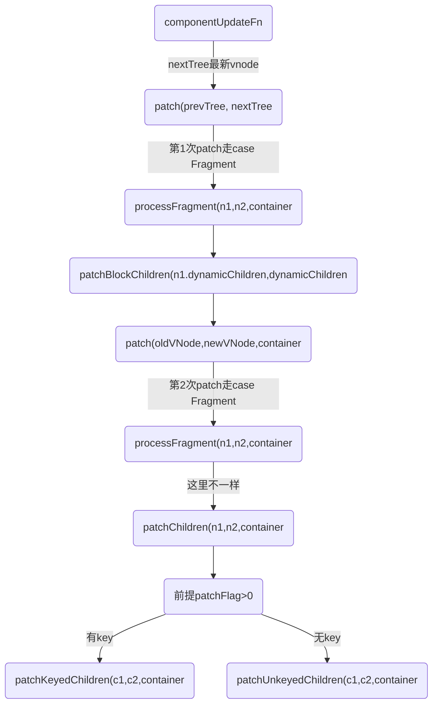

import Mermaid from '../../components/mermaid';
import CodeBlock from '../../components/codeBlock';

## 通过 key 管理状态
总结：添加key以后，vue会通过key来执行diff算法匹配新旧结点，计算出结点最大的复用，效率更高。

key给 Vue 一个提示，以便它可以跟踪每个节点的标识，从而重用和重新排序现有的元素;Vue 默认按照“就地更新”的策略来更新通过 v-for 渲染的元素列表。

### 有key无key的区别
* 每个循环渲染的元素都有一个唯一的key属性，这有助于Vue跟踪每个元素的身份。当数据列表发生变化时，Vue将会尽力将旧的元素与新的元素进行匹配，而不是重新创建和销毁元素。这意味着，如果您对数据列表进行了重新排序或更新，Vue会尽量保持元素的身份不变，从而提高性能。

* 在没有key的情况下，Vue将无法区分列表中的各个元素，因此在更新时，Vue将会销毁旧的元素并创建新的元素。这可能会导致性能下降，尤其是在大型列表的情况下，因为每次更新都需要重新渲染整个列表。

* 用index做key
>不稳定：如果数据列表的顺序发生变化，索引作为key的元素可能会出现不稳定的行为，可能导致性能问题或UI问题。
不适合有删除操作：如果您的列表中存在删除操作，使用索引作为key可能导致不正确的元素被删除。

例子：
<CodeBlock>
```html
<!DOCTYPE html>
<html>

<head>
  <meta charset="UTF-8">
</head>
<style>
  .btn {
    margin-right: 10px;
    border: 0px;
    color: white;
    background-color: rgb(99, 99, 242);
  }
</style>

<body>
  <script src="./vue3.global.js"></script>
  <div id="root">
    <li v-for="item in list" :key="item.key">
      <!-- <li v-for="item in list"> -->
      {{item.val}}{{item.key}}
    </li>
    <button v-on:click='onAdd' class="btn">Add</button>
    <button v-on:click='onChangeVal(0)' class="btn">Change</button>
  </div>
  <script>
    const { ref, reactive, nextTick } = Vue
    /*
   有a,b,c,d一个数组，我们对它进行v-for遍历渲染，然后我们在b后面插入一个新的值f。
   数组变为a,b,f,c,d；通过ul列表进行渲染，分析有key和无key的情况。 
    */

    Vue.createApp({
      data() {
        return {
          // msg: '改变我',
          // showDiv: false,
          list: [
            {
              key: 1,
              val: 'li a',
              isshow: true
            },
            // {
            //   key: 2,
            //   val: 'li b',
            //   isshow: false
            // },
            // {
            //   key: 3,
            //   val: 'li c',
            //   isshow: false
            // },

            // {
            //   key: 4,
            //   val: 'li d',
            //   isshow: true
            // },
          ]
        }
      },
      methods: {
        onAdd() {
          console.log('=点击了按钮:', this.list)
          this.list.push({
            key: 4,
            val: 'li d',
            isshow: true
          })
        },
        onChangeVal(index) {
          console.log('=点击了按钮:', index)
          this.list[index].val = 'li zzz'

          this.list.push({
            key: 4,
            val: 'li d',
            isshow: true
          })
        }
      },

      setup(props) {
        // return {
        //   info,
        //   refData
        // };
      },

    }).mount('#root')
  </script>
</body>

</html>
```
</CodeBlock>

## 相关函数
* 有key-->patchKeyedChildren
* 无key-->patchUnkeyedChildren
<CodeBlock>
```html
<div id="root">
	<li v-for="item in list" :key="item.key">
		{{item.val}}{{item.key}}
	</li>
	<button v-on:click='onAdd' class="btn">Add</button>
	<button v-on:click='onChangeVal(0)' class="btn">Change</button>
</div>
<script>
Vue.createApp({
	data() {
		return {
			list: [
				{
					key: 1,
					val: 'li a',
					isShow: true
				},
			]
		}
	},
	methods: {
		onAdd() {
			console.log('=点击了按钮:', this.list)
			this.list.push({
				key: 4,
				val: 'li d',
				isShow: true
			})
		},
		onChangeVal(index) {
			console.log('=点击了按钮:', index)
			this.list[index].val = 'li zzz'
			this.list.push({
				key: 4,
				val: 'li d',
				isShow: true
			})
		}
	},
}).mount('#root')
</script>
```
</CodeBlock>

## 更新流程:
<Mermaid>

</Mermaid>

<CodeBlock>
```js
const processFragment = (n1, n2, container, anchor, parentComponent, parentSuspense, isSVG, slotScopeIds, optimized) => {
	// 省略..
	if (n1 == null) {
		// 初始化流程省略..
		mountChildren(n2.children, container, fragmentEndAnchor, parentComponent, parentSuspense, isSVG, slotScopeIds, optimized);
	}
	else {
		if (patchFlag > 0 &&
			patchFlag & 64 /* PatchFlags.STABLE_FRAGMENT */ &&
			dynamicChildren &&
			n1.dynamicChildren) {
			console.log('=processFragment调用patchBlockChildren=更新')
			patchBlockChildren(n1.dynamicChildren, dynamicChildren, container, parentComponent, parentSuspense, isSVG, slotScopeIds);
			if (parentComponent && parentComponent.type.__hmrId) {
				traverseStaticChildren(n1, n2);
			}
			else if (
				n2.key != null ||
				(parentComponent && n2 === parentComponent.subTree)) {
				traverseStaticChildren(n1, n2, true /* shallow */);
			}
		}
		else {
			patchChildren(n1, n2, container, fragmentEndAnchor, parentComponent, parentSuspense, isSVG, slotScopeIds, optimized);
		}
	}
}; 
```
</CodeBlock>

## patchChildren执行有key和无key
<CodeBlock>
```js
const patchChildren = (n1, n2, container, anchor, parentComponent, parentSuspense, isSVG, slotScopeIds, optimized = false) => {
		const c1 = n1 && n1.children;
		const prevShapeFlag = n1 ? n1.shapeFlag : 0;
		const c2 = n2.children;
		const { patchFlag, shapeFlag } = n2;
		// fast path
		if (patchFlag > 0) {
			if (patchFlag & 128 /* PatchFlags.KEYED_FRAGMENT */) {
				// this could be either fully-keyed or mixed (some keyed some not)
				// presence of patchFlag means children are guaranteed to be arrays
				console.log('=patchChildren调用1,有key->patchKeyedChildren',)
				patchKeyedChildren(c1, c2, container, anchor, parentComponent, parentSuspense, isSVG, slotScopeIds, optimized);
				return;
			}
			else if (patchFlag & 256 /* PatchFlags.UNKEYED_FRAGMENT */) {
				// unkeyed
				console.log('=patchChildren调用2,没key->patchUnkeyedChildren',)
				patchUnkeyedChildren(c1, c2, container, anchor, parentComponent, parentSuspense, isSVG, slotScopeIds, optimized);
				return;
			}
		}
		// children has 3 possibilities: text, array or no children.
		if (shapeFlag & 8 /* ShapeFlags.TEXT_CHILDREN */) {
			// text children fast path
			if (prevShapeFlag & 16 /* ShapeFlags.ARRAY_CHILDREN */) {
				unmountChildren(c1, parentComponent, parentSuspense);
			}
			if (c2 !== c1) {
				hostSetElementText(container, c2);
			}
		}
		else {
			if (prevShapeFlag & 16 /* ShapeFlags.ARRAY_CHILDREN */) {
				// prev children was array
				if (shapeFlag & 16 /* ShapeFlags.ARRAY_CHILDREN */) {
					// two arrays, cannot assume anything, do full diff
					patchKeyedChildren(c1, c2, container, anchor, parentComponent, parentSuspense, isSVG, slotScopeIds, optimized);
				}
				else {
					// no new children, just unmount old
					unmountChildren(c1, parentComponent, parentSuspense, true);
				}
			}
			else {
				// prev children was text OR null
				// new children is array OR null
				if (prevShapeFlag & 8 /* ShapeFlags.TEXT_CHILDREN */) {
					hostSetElementText(container, '');
				}
				// mount new if array
				if (shapeFlag & 16 /* ShapeFlags.ARRAY_CHILDREN */) {
					console.log('mountChildren=2')
					mountChildren(c2, container, anchor, parentComponent, parentSuspense, isSVG, slotScopeIds, optimized);
				}
			}
		}
	};
```
</CodeBlock>

## nextTick
使用场景
1. 有时需要根据数据动态的为页面某些dom元素添加事件，这就要求在dom元素渲染完毕时去设置，但是created与mounted函数执行时一般dom并没有渲染完毕，nextTick的回调函数是一个微任务,这意味着 nextTick 中的回调会在当前宏任务执行完毕后，但在浏览器进行下一轮 GUI 渲染之前执行。
所以就会出现获取不到，添加不了事件的问题，这回就要用到nextTick处理,
2. 数据改变后获取焦点
3. 获取元素宽度

例子
```js
mounted (){
    this.$nextTick(() => {
        this.$refs.index.style.paddingBottom = this.$refs.sus.clientHeight + 'px';
    });
}
```

### 定义
定义: 在下次 DOM 更新循环结束之后执行延迟回调。在修改数据之后立即使用这个方法，获取更新后的 DOM

nextTick是 vue 中的更新策略，也是性能优化手段，基于JS执行机制实现
vue 中我们改变数据时不会立即触发视图，如果需要实时获取到最新的DOM，可以手动调用 nextTick。

运行顺序：
onUpdated-->nextTick

vue是依靠数据驱动视图更新的，该更新的过程是异步的。即：当侦听到你的数据发生变化时， Vue将开启一个队列（该队列被Vue官方称为异步更新队列）。
视图需要等队列中所有数据变化完成之后，再统一进行更新。

## 源码分析
在 Vue 2.x 中，nextTick 的回调函数通常是微任务，因为它会使用 Promise

nextTick的回调函数是一个微任务,基于promise实现,用于将回调延迟到下次DOM更新周期之后执行,这个API就是基于事件循环实现的,是微任务

nextTick 接受一个函数为参数，同时会创建一个Promise微任务。所以，页面调用 nextTick 的时候，会把的参数 fn 赋值给 p.then(fn)，在队列currentFlushPromise || resolvedPromise的任务完成后，执行fn。

`实现很简单，完全是基于语言执行机制实现，直接创建一个异步任务，那么​​nextTick​​自然就达到在同步任务后执行的目的`

dom更新，同步js执行等都是在主线程进行的，等主线程执行完毕，异步任务才会执行

前面我们猜想的 ​​DOM​​ 更新也是异步任务，那他们的这个执行顺序如何保证呢？

**vue3中nextTick的队列由几个方法维护，基本执行顺序是这样的：**

queueJob -> queueFlush -> flushJobs -> nextTick参数的 fn

```js
function nextTick(fn) {
  const p = currentFlushPromise || resolvedPromise;
  return fn ? p.then(this ? fn.bind(this) : fn) : p;
}
```

​nextTick​​还有几个兄弟函数
queueJob and queuePostFlushCb

​​queueJob​​​ 维护job列队，有去重逻辑，保证任务的唯一性，每次调用去执行 

​​queueFlush​​​​​​queuePostFlushCb​​​ 维护cb列队，被调用的时候去重，每次调用去执行 ​​queueFlush​​

queueFlush:
开启异步任务(nextTick)处理 ​​flushJobs​​
```js
function queueFlush() {
  // 避免重复调用flushJobs
  if (!isFlushing && !isFlushPending) {
    isFlushPending = true;
    currentFlushPromise = resolvedPromise.then(flushJobs);
  }
}

function queueJob(job) {
  // the dedupe search uses the startIndex argument of Array.includes()
  // by default the search index includes the current job that is being run
  // so it cannot recursively trigger itself again.
  // if the job is a watch() callback, the search will start with a +1 index to
  // allow it recursively trigger itself - it is the user's responsibility to
  // ensure it doesn't end up in an infinite loop.
  // 去重 
  if (!queue.length ||
    !queue.includes(job, isFlushing && job.allowRecurse ? flushIndex + 1 : flushIndex)) {
    if (job.id == null) {
      queue.push(job);
    }
    else {
      queue.splice(findInsertionIndex(job.id), 0, job);
    }
    queueFlush();
  }
}

function queuePostFlushCb(cb) {
  if (!isArray(cb)) {
    if (!activePostFlushCbs ||
      !activePostFlushCbs.includes(cb, cb.allowRecurse ? postFlushIndex + 1 : postFlushIndex)) {
      pendingPostFlushCbs.push(cb);
    }
  }
  else {
    // if cb is an array, it is a component lifecycle hook which can only be
    // triggered by a job, which is already deduped in the main queue, so
    // we can skip duplicate check here to improve perf
    pendingPostFlushCbs.push(...cb);
  }
  queueFlush();
}
```

flushJobs:
处理列队，先对列队进行排序，执行​​queue​​​中的​​job​​​，处理完后再处理​​postFlushCbs​​​, 如果队列没有被清空会递归调用​​flushJobs​​清空队列
```js
function flushJobs(seen) {
  isFlushPending = false;
  isFlushing = true;
  {
    seen = seen || new Map();
  }
  // Sort queue before flush.
  // This ensures that:
  // 1. Components are updated from parent to child. (because parent is always
  //    created before the child so its render effect will have smaller
  //    priority number)
  // 2. If a component is unmounted during a parent component's update,
  //    its update can be skipped.
  queue.sort(comparator);
  // conditional usage of checkRecursiveUpdate must be determined out of
  // try ... catch block since Rollup by default de-optimizes treeshaking
  // inside try-catch. This can leave all warning code unshaked. Although
  // they would get eventually shaken by a minifier like terser, some minifiers
  // would fail to do that (e.g. https://github.com/evanw/esbuild/issues/1610)
  const check = (job) => checkRecursiveUpdates(seen, job)
    ;
  try {
    for (flushIndex = 0; flushIndex < queue.length; flushIndex++) {
      const job = queue[flushIndex];
      if (job && job.active !== false) {
        if (true && check(job)) {
          continue;
        }
        // console.log(`running:`, job.id)
        callWithErrorHandling(job, null, 14 /* ErrorCodes.SCHEDULER */);
      }
    }
  }
  finally {
    flushIndex = 0;
    queue.length = 0;
    flushPostFlushCbs(seen);
    isFlushing = false;
    currentFlushPromise = null;
    // some postFlushCb queued jobs!
    // keep flushing until it drains.
    if (queue.length || pendingPostFlushCbs.length) {
      flushJobs(seen);
    }
  }
}
```

好了，实现全在上面了，好像还没有解开我们的疑问，我们需要搞清楚 ​​queueJob​​​ 及 ​​queuePostFlushCb​​ 是怎么被调用的


入口函数 queueJob 是在componentUpdateFn函数中调用：
在 ReactiveEffect 这边接收过来的第二个形参就是 scheduler，最终被用到响应式源码的派发更新。

原来当响应式对象发生改变后，执行 ​​effect​​​ 如果有 ​​scheduler​​​ 这个参数，会执行这个 ​​scheduler​​​ 函数，并且把 ​​effect​​ 当做参数传入

绕口了，简单点就是 ​​queueJob(effect)​​，嗯，清楚了，这也是数据发生改变后页面不会立即更新的原因
```js
const componentUpdateFn = () => {

  console.log('%c=队列1', 'color:black')
  const effect = (instance.effect = new ReactiveEffect(componentUpdateFn, () => queueJob(update), instance.scope // track it in component's effect scope
  ));
}

class ReactiveEffect {
  constructor(fn, scheduler = null, scope) {
    console.log('依赖收集==>ReactiveEffect constructor')
    // 传入一个副作用函数
    this.fn = fn;
    this.scheduler = scheduler;
    // 是否活跃
    this.active = true;
    // dep 数组，在响应式对象收集依赖时也会将对应的依赖项添加到这个数组中
    this.deps = [];
    // 上一个 ReactiveEffect 的实例
    this.parent = undefined;
    // 标记作用域
    recordEffectScope(this, scope);
  }
  // 省略
}

function recordEffectScope(effect, scope = activeEffectScope) {
  console.log('%c=队列2', 'color:black')
  if (scope && scope.active) {
    console.log('%c=队列3', 'color:black')
    scope.effects.push(effect);
  }
}
```

当响应式对象发生改变后，如果执行 effect 有 scheduler 这个参数，会执行这个 scheduler 函数，并且把 effect 当做参数传入:

绕口了，简单点就是 ​​queueJob(effect)​​，嗯，清楚了，这也是数据发生改变后页面不会立即更新的原因
```js
function triggerEffect(effect, debuggerEventExtraInfo) {
  if (effect !== activeEffect || effect.allowRecurse) {
    if (effect.onTrigger) {
      effect.onTrigger(extend({ effect }, debuggerEventExtraInfo));
    }
    // 实际触发更新的地方
    if (effect.scheduler) {
      console.log('%c触发更新:1,triggerEffect调用effect.scheduler', 'color:chartreuse')
      console.log('%c=队列4:triggerEffect调用effect.scheduler()', 'color:black')
      effect.scheduler();
    }
    else {
      console.log('%c触发更新:2,triggerEffect调用effect.run', 'color:chartreuse')
      effect.run();
    }
  }
}
```