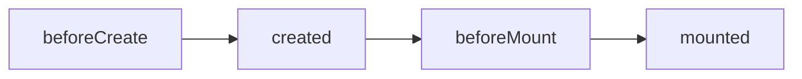
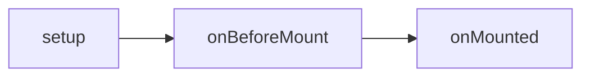

import Mermaid from '../../components/mermaid';
import CodeBlock from '../../components/codeBlock';

## api-lifecycle-vue3-vue2区别
- 性能提升 1：Vue.js 3 通过更好的模板编译器和优化算法，Vue3 编译器中增加了静态提升技术。
- 性能提升 2：Vue.js 3 的响应式系统进行了升级，现在支持 Proxy，可以更加精细地控制响应式数据。
>[理解reactive和effect](./理解reactive和effect)
[proxy-defineProperty区别](./proxy-defineProperty区别)

- 更好的 TypeScript 支持

- 更好的组合 API,Vue3 的设计模式给予开发者们按需引入需要使用的依赖包。这样一来就不需要多余的引用导致性能或者打包后太大的问题。
>全新的合成式 API（Composition API）可以提升代码的解耦程度 —— 特别是大型的前端应用，效果会更加明显。还有就是按需引用的有了更细微的可控性，让项目的性能和打包大小有更好的控制。

- Tree-shaking 优化：Vue3 中对于 Tree-shaking 做了优化，使得只有使用到的代码会被打包，减小应用程序的体积。

- Fragments（片段）：Vue3 中支持使用 Fragments（片段）来包裹多个子组件，而无需创建额外的包装器 div。只需要在 template 中使用`<template>`标签来包裹即可
<CodeBlock>
```js
<template>
  <div>
    <h1>Hello World</h1>
    <template v-if="showSubTitle">
      <h2>Sub Title</h2>
    </template>
    <p>Some content here</p>
  </div>
</template>
```
</CodeBlock>

- Teleport 组件：Vue3 中增加了 Teleport 组件，它可以让你将组件插入到 DOM 的任意位置，这对于模态框和弹出菜单等组件非常有用。<br/>
  Teleport 组件有两个属性：to 和 disabled。to 属性指定了 Teleport 组件的目标元素，可以是 CSS 选择器字符串、DOM 元素或一个返回 DOM 元素的函数。
<CodeBlock>
```html
<template>
  <div>
    <button @click="showModal = true">Show Modal</button>
    <teleport to="body" v-if="showModal">
      <div class="modal">
        <h2>Modal Title</h2>
        <p>Modal Content</p>
        <button @click="showModal = false">Close Modal</button>
      </div>
    </teleport>
  </div>
</template>
```
</CodeBlock>

## vue2 和 vue3 生命周期钩子
vue2:
<CodeBlock>

</CodeBlock>

vue3:
<CodeBlock>

</CodeBlock>

对比：vue3基本加了onXX
<CodeBlock>
```js
beforeCreate()    <--> setup()
created()         <--> setup()
beforeMount()     <--> onBeforeMount()
mounted()         <--> onMounted()

// 界面还没更新 但是data里面的数据是最新的。即页面尚未和最新的data里面的数据包同步
beforeUpdate()    <--> onBeforeUpdate()
// 表示页面和data里面的数据已经保持同步了 都是最新的
updated()         <--> onUpdated()

// 当执行这个生命周期钩子的时候 vue的实例从运行阶段进入销毁阶段 此时实例身上的data 还有 methods处于可用的状态
beforeDestroy()   <--> onBeforeUnmount()
// 表示组件已经完全被销毁了 组件中所有的实例方法都是不能用了
destroyed()       <--> onUnmounted()
errorCaptured()   <--> onErrorCaptured()
```
</CodeBlock>

vue3 完整钩子:
<CodeBlock>
```js
onBeforeMount(() => {
  console.log("组件挂载前onBeforeMount");
});

onMounted(() => {
  console.log("组件挂载后onMounted");
});

onBeforeUpdate(() => {
  console.log("初次渲染不会执行:组件更新前onBeforeUpdate");
});

onUpdated(() => {
  console.log("初次渲染不会执行:组件更新后onUpdated");
});

onBeforeUnmount(() => {
  console.log("组件销毁前onBeforeUnmount");
});
onUnmounted(() => {
  console.log("组件销毁后onUnmounted");
});
```
</CodeBlock>

### vue2:beforeCreate -> created:初始化 vue 实例，进行数据观测
created:
```
完成数据观测，属性与方法的运算，watch、event事件回调的配置

可调用methods中的方法，访问和修改data数据触发响应式渲染dom，可通过computed和watch完成数据计算

此时vm.$el 并没有被创建
```

- vue2 专有:beforeCreate()和 created()

```
1. 运行生命周期钩子函数 beforeCreate,在执行的时候，data还有methods都没有被初始化
2. 进入注入流程，处理属性，computed，methods，data，provide，inject，最后使用代理模式将这些属性挂载到实例中。
```

- vue3 专有:setup()，在组件被挂载之前被调用。创建的是 data 和 method

```
setup相当于组件编译的入口，setup在beforeCreate钩子执行前运行，此时只初始化了prop（属性）和context等，而data是在beforeCreate钩子之后created之前执行的。

注意：onMounted虽然写在setup函数中，但却是在组件挂载到父组件时才被调用的。

由于setup中不能使用this，因此需要使用getCurrentInstance 方法获得当前活跃的组件
```

### vue2-beforemount 在组件实例创建之前执行

此阶段 vm.el 已完成 DOM 初始化，但并未挂载在 el 选项上,组件的模板尚未渲染到 DOM 中。

作用:在渲染之前对组件进行必要的初始化工作。

- 组件挂载前 vue3:onBeforeMount()/vue2:beforeMount()
  updateComponent，该函数会运行 render 函数，并把 render 函数的返回结果 vnode 作为参数给

```
onBeforeMount()/beforeMount() 表示模板已经在内存中编辑完成了，但是尚未渲染到模板页面中。即页面中的元素，没有被真正的替换过来，只是之前写的一些模板字符串。
```

### vue2-mounted 在组件实例创建完成后立即执行

vm.el 已完成 DOM 的挂载与渲染, 此时组件的模板已经渲染到 DOM 中。

作用:在组件的渲染完成后对组件进行必要的初始化工作。

- 组件挂载后 vue3:onMounted()/ vue2:mounted()

```
表示内存中模板已经真实的挂载到页面中去了，用户可以看到渲染好的界面了
执行完这个函数表示 整个vue实例已经初始化完成了，组件脱离了创建阶段，进入运行阶段。
```

## 按需引用的有了更细微的可控性，让项目的性能和打包大小有更好的控制

## 接收 Props 不同,setup,this

接收组件 props 参数传递这一块为我们带来了 Vue2 和 Vue3 之间最大的区别。
—this 在 vue3 中与 vue2 代表着完全不一样的东西。

在 Vue2，this 代表的是当前组件，不是某一个特定的属性。所以我们可以直接使用 this 访问 prop 属性值。就比如下面的例子在挂载完成后打印处当前传入组件的参数 title。

<CodeBlock>
```js
mounted () {
    console.log('title: ' + this.title)
}
```
</CodeBlock>

但是在 Vue3 中，this 无法直接拿到 props 属性，emit events（触发事件）和组件内的其他属性。setup()方法可以接收两个参数：

1. props - 不可变的组件参数
2. context - Vue3 暴露出来的属性（emit，slots，attrs）

<CodeBlock>
```js
<template>
  <div>{{ props.text }}</div>
</template>

<script>
import { defineComponent } from 'vue';

export default defineComponent({
  props: {
    text: { type: String, required: true },
    listSubProject: {
      type: Array,
      default: () => [],
    },
    isPm: {
      type: Boolean,
      default: false,
    },
  },
  setup(props) {
    // do something with `props.text` here
    onMounted(() => {
      console.log('title: ' + props.type)
    })
  }
})
</script>
```
</CodeBlock>

## 事件-emit

在 Vue2 中自定义事件是非常直接的，但是在 Vue3 的话，我们会有更多的控制的自由度。
举例，现在我们想在点击提交按钮时触发一个 login 的事件。

### 在 Vue2 中我们会调用到`this.$emit`然后传入事件名和参数对象

<CodeBlock>
```js
login () {
  this.$emit('login', {
    username: this.username,
    password: this.password
  })
}
```
</CodeBlock>

### Vue3 中使用 emit

this 已经不是和 vue2 代表着这个组件了，所以我们需要不一样的自定义事件的方式

在 setup()中的第二个参数 content 对象中就有 emit，这个是和 this.$emit 是一样的。那么我们只要在 setup()接收第二个参数中使用分解对象法取出 emit 就可以在 setup 方法中随意使用了。

<CodeBlock>
```js
setup (props, { emit }) {
    const login = () => {
      emit('login', {
        username: state.username,
        password: state.password
      })
    }
}
```
</CodeBlock>

## Vue.use 是干什么的?
Vue.use 是用来使用插件的。我们可以在插件中扩展全局组件、指令、原型方法等。 会调用 install 方法将 Vue 的构建函数默认传入，在插件中可以使用 vue，无需依赖 vue 库

增加 name 属性，会在 components 属性中增加组件本身，实现组件的递归调用。

可以表示组件的具体名称，方便调试和查找对应的组件。

## 如何理解自定义指令?

在生成 ast 语法树时，遇到指令会给当前元素添加 directives 属性

通过 genDirectives 生成指令代码

在 patch 前，将指令的钩子提取到 cbs 中，在 patch 过程中调用对应的钩子

当执行 cbs 对应的钩子时，调用对应指令定义方法

## vue3:v-if 比 v-for 的优先级更高
当它们同时存在于一个节点上时，v-if 比 v-for 的优先级更高。
- 这意味着 v-if 的条件将无法访问到 v-for 作用域内定义的变量别名;

注意：
* 在 Vue 2.x 中，`<template>`标签不能拥有 key，
* 在 Vue 3.x 中，key 则应该被设置在`<template>`标签上 

vue3 中：
在外新包装一层`<template>`再在其上使用 v-for 可以解决这个问题 (这也更加明显易读)：
<CodeBlock>
```html
<template v-for="item in formSchema" :key="item.id">
  <el-form-item class="mr10" :prop="item.id" :label="renderLabel(item)" v-if="isRenderFormItem(item, formData)">
    <DynamicFormItem :formItem="item" :formData="formData" />
  </el-form-item>
</template>
```
</CodeBlock>

### 扩展：vue2中:v-for比v-if优先，即每一次都需要遍历整个数组，影响速度:
根据 eslint 指出的方法进行改进：
将 v-if 和 v-for 分别放在不同标签中
<CodeBlock>
```vue
<ul v-if="active">
	<li v-for="item in list" :key="item.id">
		{{ item.title }}
	</li>
</ul>
```
</CodeBlock>

## 指令
* v-once:只渲染元素和组件一次。随后的重新渲染，元素/组件及其所有的子节点将被视为静态内容并跳过。这可以用于优化更新性能。
* v-show：------->切换元素的 display CSS 属性。block为显示，none为隐藏
* v-if：------->控制dom节点的存在与否来控制元素的显隐
* v-text：更新元素的 textContent。如果要更新部分的 textContent ，需要使用`{{ Mustache }}`插值。
* v-html：更新元素的 innerHTML
```html
<template>
  <div>
    <div v-html="rawHtml"></div>
  </div>
</template>
```
* v-else/v-else-if：表示否则（与编程语言中的else是同样的意思）
* v-for：可以循环数组，对象，字符串，数字，
* v-on：绑定事件监听器。事件类型由参数指定。
* v-bind：动态地绑定一个或多个属性（特性），或一个组件 prop 到表达式。主要作用是将组件的数据绑定到DOM元素的属性上，使数据能够实时反映在DOM中。您可以使用v-bind来设置元素的属性，例如src、href、class、style等
```
:attribute 和 v-bind:attribute 是等价的。使用简写更加简洁和直观，是Vue.js中常用的方式。


```
* v-model：在表单控件或者组件上创建双向绑定
* v-pre：跳过这个元素和它的子元素的编译过程。可以用来显示原始`Mustache`标签。跳过大量没有指令的节点会加快编译。
* v-cloak：这个指令保持在元素上直到关联实例结束编译。和 CSS 规则如 `[v-cloak] { display: none }` 一起用时，这个指令可以隐藏未编译的`Mustach`标签直到实例准备完毕。

## vue 的修饰符有哪些?
```
.stop

.prevent

.capture

.self

.once

.passive

.right

.center

.middle

.alt
```

## keep-alive原理是什么?

使用 keep-alive 包裹动态组件时，会对组件进行缓存，避免组件重新创建

使用有两个场景，一个是动态组件，一个是 router-view

```
如果不需要缓存，直接返回虚拟节点。

如果需要缓存，就用组件的id和标签名，生成一个key，把当前vnode的instance作为value，存成一个对象。这就是缓存列表

如果设置了最大的缓存数，就删除第0个缓存。新增最新的缓存。

并且给组件添加一个keepAlive变量为true，当组件初始化的时候，不再初始化。
```

- include 使该标签作用于所有 name 属性的值跟此标签 include 的属性值一致的 vue 页面
- exclude 使该标签不作用于所有 name 属性的值跟此标签 exclude 的属性值一致的 vue 页面

### 注意：

- activated,deactivated 这两个生命周期函数一定是要在使用了 keep-alive 组件后才会有的，否则则不存在。
- exclude 不是用 route 的 name；而是组件的 name;

注意一定要给需要缓存的组件都写 name 属性的值。我一开始还以为是路由的 name 值，后来发现搞错了
当引入 keep-alive 的时候，页面第一次进入，钩子的触发顺序 created-> mounted-> activated，退出时触发 deactivated。
当再次进入（前进或者后退）时，只触发 activated。

<CodeBlock>
```js
使用include/exclude 属性需要给所有vue类的name赋值（注意不是给route的name赋值），否则 include/exclude不生效。
export default {
 name:'a', // include 或 exclude所使用的name
 data () {
 return{
    }
  },
}
```
</CodeBlock>

<CodeBlock>
```html
<!-- 缓存name为a和b的组件 -->
<keep-alive include="a,b">
  <router-view />
</keep-alive>
```
</CodeBlock>

### 实例：
<CodeBlock>
```html
<keep-alive include="test-keep-alive">
  <!-- 将缓存name为test-keep-alive的组件 -->
  <component />
</keep-alive>

<keep-alive include="a,b">
  <!-- 将缓存name为a或者b的组件，结合动态组件使用 -->
  <component :is="view" />
</keep-alive>

<!-- 使用正则表达式，需使用v-bind -->
<keep-alive :include="/a|b/">
  <component :is="view" />
</keep-alive>

<!-- 动态判断 -->
<keep-alive :include="includedComponents">
  <router-view></router-view>
</keep-alive>

<keep-alive exclude="test-keep-alive">
  <!-- 将不缓存name为test-keep-alive的组件 -->
  <component />
</keep-alive>
```
</CodeBlock>

## Vue-router
### Vue-router跳转和location.href有什么区别
使用location.href='/url'来跳转，简单方便，但是刷新了页面；

使用history.pushState('/url')，无刷新页面，静态跳转；
   
引进router，然后使用router.push('/url')来跳转，使用了diff算法，实现了按需加载，减少了dom的消耗。

其实使用router跳转和使用history.pushState()没什么差别的，因为vue-router就是用了history.pushState()，尤其是在history模式下。

### hash 模式 
路由路径以 # 开头，例如 http://localhost:8080/#/user。当 URL 中的 hash 值发生变化时，浏览器不会向服务器发送请求，而是触发浏览器的 hashchange 事件，Vue Router 监听该事件并根据新的 hash 值来更新路由状态。

使用 hash 模式的路由非常适合在前端实现单页面应用程序，因为它可以避免在路由切换时向服务器发送请求

### History 模式
当 URL 发生变化时，浏览器会向服务器发送请求，服务器返回对应的 HTML 页面，Vue Router 解析 HTML 页面中的路由配置来更新路由状态。

使用 history 模式的路由可以实现更加自然的 URL，但需要注意的是，在使用 history 模式时，必须确保服务器能够正确地响应路由路径，否则会出现 404 错误。

### Router 和 Route 是vue-router中的两个核心组件
* 1.Router 是路由器的核心组件，用于定义路由的基本配置和管理功能。一个应用程序中通常只需要一个 Router 实例，它包含了所有路由规则的集合，以及路由器的全局配置项。
```js
import Vue from 'vue'
import Router from 'vue-router'
import Home from './views/Home.vue'
import About from './views/About.vue'

Vue.use(Router)

export default new Router({
  mode: 'history',
  routes: [
    {
      path: '/',
      name: 'home',
      component: Home
    },
    {
      path: '/about',
      name: 'about',
      component: About
    }
  ]
})
```

2. Route 用于定义单个路由的属性，包括路径、组件、参数等。在路由跳转时，每个 Route 对象都会根据当前 URL 进行匹配，以确定应该渲染哪个组件。

例子：定义了一个路径为 /about/:id 的路由规则，它对应的组件是 About，并且将路由参数传递给组件的 props 中。
```js
export default new Router({
  mode: 'history',
  routes: [
    {
      path: '/',
      name: 'home',
      component: Home
    },
    {
      path: '/about/:id',
      name: 'about',
      component: About,
      props: true
    }
  ]
})
```

在组件中，我们可以通过 $route 对象来获取当前路由的信息，例如：
```js
export default {
  props: ['id'],
  created () {
    console.log(this.$route.params.id) // 访问路由参数
    console.log(this.$route.query.page) // 访问查询参数
  }
}
```

### vue-router 有几种钩子函数?执行流程如何?

钩子函数有三种：

全局守卫

路由守卫

组件守卫

### 1.beforeEach(to, from, next)：全局前置守卫，在每次路由跳转前被调用，用于做路由鉴权等操作
如何使用 beforeEach 实现登录鉴权：

在路由器中使用 beforeEach 定义一个全局的导航守卫，用于在每个路由跳转前进行登录鉴权。在导航到非登录页面时，我们检查本地存储中是否存在 token，如果不存在则跳转到登录页面；否则，继续执行路由跳转。

注意，next 函数是必须调用的，它用于控制路由跳转的行为。如果要中断路由跳转，可以调用 next(false)；如果要跳转到指定路由，可以调用`next({ name: 'xxx' })`
```js
import Vue from 'vue'
import Router from 'vue-router'
import Home from './views/Home.vue'
import Login from './views/Login.vue'

Vue.use(Router)

const router = new Router({
  mode: 'history',
  routes: [
    {
      path: '/',
      name: 'home',
      component: Home
    },
    {
      path: '/login',
      name: 'login',
      component: Login
    }
  ]
})

router.beforeEach((to, from, next) => {
  const isLogin = localStorage.getItem('token')
  if (to.name !== 'login' && !isLogin) {
    next({ name: 'login' })
  } else {
    next()
  }
})

export default router
```
### 2.afterEach(to, from)：全局后置钩子，在每次路由跳转完成后被调用
常用于记录路由跳转日志等操作

### 3.beforeRouteEnter(to, from, next)
路由独享的守卫,用于在路由进入前获取组件实例，常用于异步获取数据等操作。

### 4.beforeRouteUpdate(to, from, next),在当前路由改变时调用
路由独享的守卫,用于在当前路由改变时，路由被复用时调用，常用于异步获取数据等操作。

但是该组件实例的 props 或者路由参数发生了变化时调用。与 beforeRouteEnter 类似，此时我们也可以通过访问 this 访问到组件实例，如下所示：
```js
export default {
  beforeRouteUpdate(to, from, next) {
    // get updated props or params
    const { id } = to.params

    // do something with updated props or params
    this.loadData(id)

    // call next to continue updating
    next()
  },

  methods: {
    loadData(id) {
      // load data with updated id
    }
  }
}
```

### 5.beforeRouteLeave(to, from, next)
路由独享的守卫，在当前路由离开前被调用，可以用于提示用户是否离开当前编辑页面等操作。 
 
### 6.演示
* 使用了 beforeEach 方法来进行路由鉴权，只有当用户已经登录才能进入 /about 页面；
* 使用 beforeRouteEnter 方法来在路由进入前获取数据；
* 使用 beforeRouteLeave 方法来在路由离开前提示用户是否离开当前编辑页面。
```js
import Vue from 'vue'
import Router from 'vue-router'
import Home from './views/Home.vue'
import About from './views/About.vue'

Vue.use(Router)

const router = new Router({
  mode: 'history',
  routes: [
    {
      path: '/',
      name: 'home',
      component: Home
    },
    {
      path: '/about',
      name: 'about',
      component: About,
      meta: {
        requiresAuth: true
      }
    }
  ]
})

router.beforeEach((to, from, next) => {
  const isAuthenticated = localStorage.getItem('user')

  if (to.matched.some(record => record.meta.requiresAuth) && !isAuthenticated) {
    next('/login')
  } else {
    next()
  }
})

router.beforeRouteEnter((to, from, next) => {
  axios.get('/api/data').then(response => {
    next(vm => {
      vm.data = response.data
    })
  })
})

router.beforeRouteLeave((to, from, next) => {
  if (confirm('Are you sure you want to leave this page?')) {
    next()
  } else {
    next(false)
  }
})

export default router
```

### vue路由传参的三种方式
### 跳转1：
```js
getDescribe(id) {
// 直接调用$router.push 实现携带参数的跳转
this.$router.push({
  path: `/describe/${id}`,
})

// 配置：
{
  path: '/describe/:id',
  name: 'Describe',
  component: Describe
}
// 读取：
// 很显然，需要在path中添加/:id来对应 $router.push 中path携带的参数。在子组件中可以使用来获取传递的参数值。
this.$route.params.id
```

### 跳转2：
父组件中：通过路由属性中的name来确定匹配的路由，通过params来传递参数。
```js
this.$router.push({
  name: 'Describe',
  params: {
    id: id
  }
})
// 配置：
// 对应路由配置: 注意这里不能使用:/id来传递参数了，因为父组件中，已经使用params来携带参数了。
{
  path: '/describe',
  name: 'Describe',
  component: Describe
}
// 读取：
this.$route.params.id
```

## 跳转3：
父组件：使用path来匹配路由，然后通过query来传递参数
这种情况下 query传递的参数会显示在url后面?id=？
```js
this.$router.push({
          path: '/describe',
          query: {
            id: id
          }
})

// 对应路由配置：

{
  path: '/describe',
  name: 'Describe',
  component: Describe
}

// 读取：
this.$route.query.id
```

## 路由传参
### 查询参数（query）
使用 query 传递参数，将参数附加在 URL 后面，以 ? 开头，使用 & 分隔多个参数。例如：
```js
// 跳转到路由 /user，传递参数 id=123
this.$router.push({ path: '/user', query: { id: 123 }})
```

在目标组件中，可以通过 $route.query 访问传递的参数，例如：
```js
console.log(this.$route.query.id); // 输出 123
```

### 动态路由（params）
使用 params 传递参数，将参数添加到 URL 中，作为路由的一部分。例如：
```js
// 定义带参数的路由
{ path: '/user/:id', component: User }

// 跳转到路由 /user/123
this.$router.push({ path: '/user/123' })
```

在目标组件中，可以通过 $route.params 访问传递的参数，例如：
```js
console.log(this.$route.params.id); // 输出 123
```

### 命名路由（name）：在定义路由时指定名称，使用 name 传递参数。例如：
```js
// 定义带参数的命名路由
{ path: '/user/:id', name: 'user', component: User }

// 跳转到命名路由 /user，并传递参数 id=123
this.$router.push({ name: 'user', params: { id: 123 }})
```

在目标组件中，可以通过 $route.params 访问传递的参数，例如：
```js
console.log(this.$route.params.id); // 输出 123
```